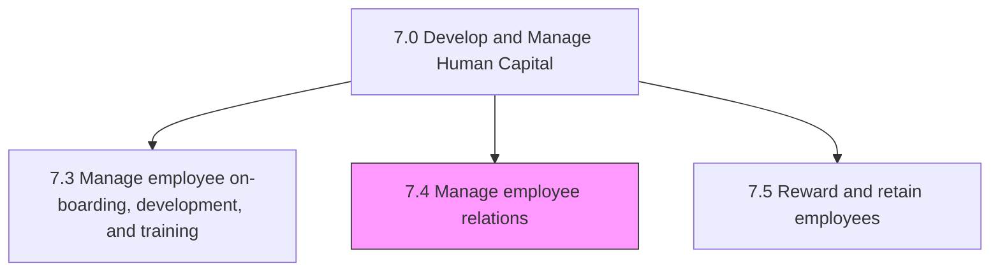
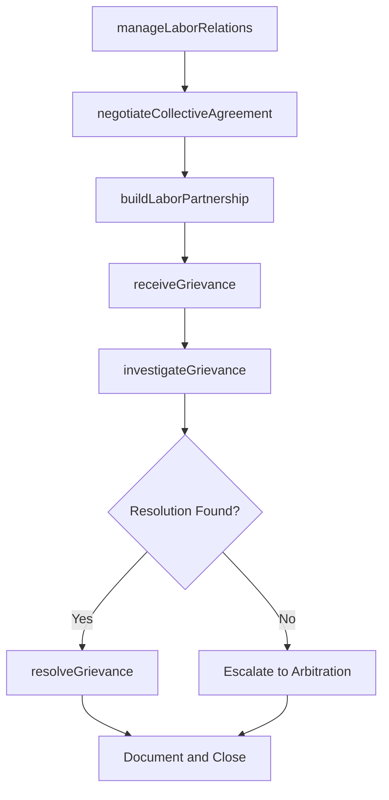

# Manage employee relations

> Business-as-Code definition for employee relations management. Models labor relations, collective bargaining, labor-management partnerships, and grievance resolution processes.

## Overview

Assisting general management in developing, maintaining, and improving employee relationships. This is accomplished through communication, performance management, processing grievances, and/or dispute. Interpret and convey organizational policies.

## Process Hierarchy



## GraphDL

```yaml
manage:
  object: Employee Relations
  actor: EmployeeRelationsManager
  result: RelationsOutcome
```

## Actions

| Action | Description |
|--------|-------------|
| manageLaborRelations | Maintain relationships between the organization and labor unions |
| negotiateCollectiveAgreement | Conduct collective bargaining negotiations with union representatives |
| buildLaborPartnership | Develop collaborative labor-management partnership programs |
| receiveGrievance | Accept and log employee grievances for investigation |
| investigateGrievance | Research grievance claims and gather relevant evidence |
| resolveGrievance | Determine grievance outcome and implement resolution |

## Events

| Event | Description |
|-------|-------------|
| laborRelationsManaged | Labor relations review or engagement completed |
| collectiveAgreementNegotiated | Collective bargaining agreement reached or updated |
| laborPartnershipBuilt | Labor-management partnership initiative established |
| grievanceReceived | Employee grievance formally filed and documented |
| grievanceInvestigated | Grievance investigation completed with findings |
| grievanceResolved | Grievance outcome determined and communicated |

## Searches

| Search | Description |
|--------|-------------|
| getGrievances | List employee grievances by status, type, or department |
| getCollectiveAgreements | Retrieve collective bargaining agreements by union or expiration date |
| getLaborRelationsHistory | Query labor relations events and outcomes by period |
| getPartnershipPrograms | List active labor-management partnership initiatives |

## Process Flow



## RACI Matrix

| Activity | Responsible | Accountable | Consulted | Informed |
|----------|-------------|-------------|-----------|----------|
| manageLaborRelations | Employee Relations Manager | VP Human Resources | Legal | Executive Team |
| negotiateCollectiveAgreement | Labor Relations Specialist | VP Human Resources | Legal, Finance | CEO |
| buildLaborPartnership | Employee Relations Manager | VP Human Resources | Union Representatives | Department Heads |
| receiveGrievance | HR Coordinator | Employee Relations Manager | Department Manager | Legal |
| resolveGrievance | Employee Relations Manager | VP Human Resources | Legal, Union Rep | Employee |

## Sub-Processes

| ID | Name | Description |
|----|------|-------------|
| 7.4.1 | Manage labor relations | Managing labor relations, the collective bargaining process, and the relationships between the labor |
| 7.4.2 | Manage collective bargaining process | Managing any negotiations between an employer and a group of employees that determine the conditions |
| 7.4.3 | Manage labor management partnerships | Handling partnerships between labor and management. Develop a lasting two-way relationship that is b |
| 7.4.4 | Manage employee grievances | Taking care or resolving any complaint raised by an employee by procedures provided for in a collect |

## Related Processes

| Process | Relationship |
|---------|-------------|
| 7.1 Develop and manage HR planning, policies, and strategies | Upstream - HR policies set the framework for employee relations |
| 7.8 Manage employee communication | Parallel - communication supports positive relations |
| 7.5 Reward and retain employees | Parallel - compensation disputes may become grievances |

## Related Departments

| Department | Role |
|-----------|------|
| Human Resources | Owns employee relations processes and grievance management |
| Legal | Provides counsel on labor law, arbitration, and compliance |
| Operations | Primary stakeholder in labor-management partnerships |
| Executive Leadership | Approves collective bargaining mandates and resolutions |

## Related Occupations

| Occupation | Involvement |
|-----------|-------------|
| Employee Relations Specialist | Handles day-to-day labor relations and grievance processing |
| Labor Relations Manager | Leads collective bargaining and union negotiations |
| Employment Attorney | Advises on legal compliance and dispute resolution |

## KPIs

| KPI | Description | Unit |
|-----|-------------|------|
| Grievance Resolution Time | Average days from grievance filing to resolution | Days |
| Grievance Rate | Number of grievances per 1000 employees per year | Per 1000 Employees |
| Collective Agreement Compliance | Percentage of collective bargaining terms met | % |
| Labor Dispute Frequency | Number of formal labor disputes per year | Count |

## Usage

```typescript
import { manageEmployeeRelations } from '@headlessly/manage-employee-relations'

const relations = manageEmployeeRelations()

// Receive and investigate a grievance
const grievance = await relations.receiveGrievance({
  employeeId: 'emp_34567',
  type: 'workplace-safety',
  description: 'Inadequate PPE provided for hazardous material handling',
  unionRepId: 'rep_001'
})

// Resolve the grievance
const resolution = await relations.resolveGrievance({
  grievanceId: grievance.id,
  outcome: 'upheld',
  remedialAction: 'Provide compliant PPE within 5 business days'
})
```
