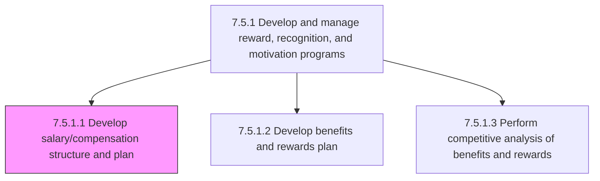
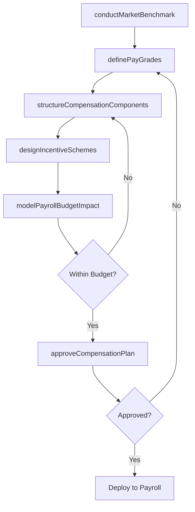

# Develop salary/compensation structure and plan

> Business-as-Code definition for developing salary and compensation structure and plan. Models the process of designing the pay architecture including job grades, salary bands, variable pay, bonuses, and allowances that form the organization's total cash compensation framework.

## Overview

Creating the framework for the provision of salary/compensation to employees. Conduct market benchmarking studies to establish competitive pay positioning. Define job grades and salary bands with appropriate range spreads and midpoint progressions. Structure compensation into components including fixed pay, variable pay, bonuses, and allowances such as medical allowance and housing allowance. Design performance-based incentive schemes tied to individual and organizational goals. Model the financial impact of proposed compensation structures on total payroll budget. Obtain executive approval and publish the compensation plan for organizational implementation.

## Process Hierarchy



## GraphDL

```yaml
develop:
  object: Salary/compensation Structure And Plan
  actor: CompensationManager
  result: CompensationStructure
```

## Actions

| Action | Description |
|--------|-------------|
| conductMarketBenchmark | Gather salary survey data and benchmark compensation levels against industry peers and geographic markets |
| definePayGrades | Establish job grades, salary bands, and pay ranges with midpoint progressions for each career level |
| structureCompensationComponents | Decompose total cash compensation into fixed pay, variable pay, bonuses, and allowances |
| designIncentiveSchemes | Create performance-based variable pay plans tied to individual, team, and organizational targets |
| modelPayrollBudgetImpact | Analyze the financial impact of proposed compensation structures on total payroll expense |
| approveCompensationPlan | Present the completed salary structure for executive and board approval before deployment |

## Events

| Event | Description |
|-------|-------------|
| marketBenchmarkConducted | Salary survey data collected and competitive positioning analysis completed |
| payGradesDefined | Job grades and salary bands established for all career levels and job families |
| compensationComponentsStructured | Fixed pay, variable pay, bonus, and allowance breakdowns finalized |
| incentiveSchemesDesigned | Performance-based variable pay plans created with target payouts and metrics |
| payrollBudgetImpactModeled | Financial projection of proposed compensation structure completed |
| compensationPlanApproved | Salary structure and compensation plan approved by executive leadership |

## Searches

| Search | Description |
|--------|-------------|
| findPayGrades | List pay grades filtered by job family, career level, location, or effective date |
| getMarketBenchmark | Retrieve compensation benchmarking data for specific roles and geographic markets |
| getIncentivePlanStructure | Access incentive plan rules, target payouts, and performance metrics by plan type |
| getCompensationHistory | Retrieve historical salary band adjustments, pay grade changes, and policy updates |

## Process Flow



## RACI Matrix

| Activity | Responsible | Accountable | Consulted | Informed |
|----------|-------------|-------------|-----------|----------|
| conductMarketBenchmark | CompensationAnalyst | CompensationManager | HRBusinessPartner | Finance |
| definePayGrades | CompensationManager | VP TotalRewards | HRBusinessPartner | PayrollManager |
| modelPayrollBudgetImpact | CompensationAnalyst | VP TotalRewards | Finance | CFO |
| approveCompensationPlan | VP TotalRewards | CHRO | ExecutiveTeam | AllManagers |

## Related Processes

| Process | Relationship |
|---------|-------------|
| 7.5.1.2 Develop benefits and rewards plan | Downstream - benefits plan builds on the salary structure to form total compensation |
| 7.5.1.3 Perform competitive analysis of benefits and rewards | Upstream - market data informs compensation structure positioning |
| 7.4.2 Manage collective bargaining process | Parallel - compensation structure must align with bargained economic terms |
| 7.5.1 Develop and manage reward, recognition, and motivation programs | Parent - governing process group |

## Related Departments

| Department | Role |
|-----------|------|
| Compensation and Benefits | Designs and administers the salary structure and pay plans |
| Finance | Validates budget feasibility and models total payroll expense |
| Human Resources | Integrates compensation structure into hiring and promotion processes |
| Payroll | Implements approved compensation changes in payroll systems |

## Related Occupations

| Occupation | Involvement |
|-----------|-------------|
| Compensation Manager | Leads salary structure design, market benchmarking, and plan approval |
| Compensation Analyst | Conducts survey analysis, pay modeling, and budget impact projections |
| Total Rewards Director | Oversees compensation philosophy and ensures alignment with talent strategy |

## KPIs

| KPI | Description | Unit |
|-----|-------------|------|
| Compensation Competitiveness Ratio | Organization's pay positioning relative to market median (compa-ratio) | Ratio |
| Pay Equity Index | Variance in compensation across demographic groups for comparable roles | % |
| Payroll Cost as Revenue Percentage | Total compensation expense as a share of organizational revenue | % |
| Offer Acceptance Rate | Percentage of job offers accepted, indicating compensation competitiveness | % |

## Usage

```typescript
import { developSalaryCompensationStructure } from '@headlessly/develop-salary-compensation-structure'

const compensation = developSalaryCompensationStructure()

// Benchmark salaries against market data for target roles
const benchmark = await compensation.conductMarketBenchmark({
  roles: ['Software Engineer', 'Product Manager', 'Data Scientist'],
  regions: ['US-West', 'US-East', 'EU-West'],
  dataSources: ['radford', 'mercer', 'levels-fyi'],
  targetPercentile: 75
})

// Define pay grades based on benchmark results
const grades = await compensation.definePayGrades({
  benchmarkId: benchmark.id,
  gradeCount: 12,
  bandWidthPercent: 40,
  midpointProgression: 15
})
```
