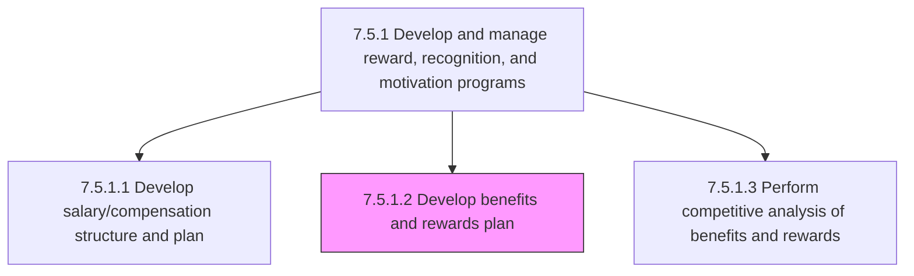
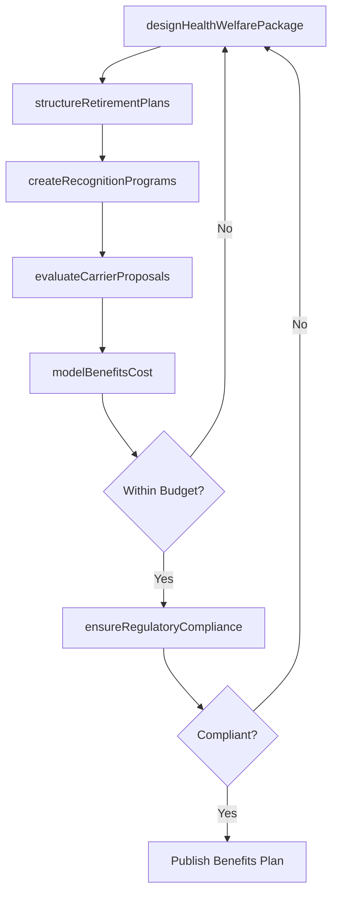

# Develop benefits and rewards plan

> Business-as-Code definition for developing benefits and rewards plan. Models the process of designing the non-cash and indirect compensation offerings including health insurance, retirement plans, recognition programs, and perquisites that complement the salary structure to form total rewards.

## Overview

Developing a plan for provision of rewards, commission, and benefits to employees. Design health and welfare benefit packages including medical, dental, vision, life, and disability insurance. Structure retirement benefit plans such as defined contribution, pension, and deferred compensation programs. Create non-monetary reward programs including recognition awards, flexible work arrangements, professional development subsidies, and wellness programs. Evaluate benefit plan funding models and carrier partnerships. Ensure compliance with regulatory requirements (ERISA, ACA, COBRA) across all benefit offerings. Develop employee communication materials that clearly explain the total rewards value proposition.

## Process Hierarchy



## GraphDL

```yaml
develop:
  object: Benefits And Rewards Plan
  actor: BenefitsManager
  result: BenefitsPlanPortfolio
```

## Actions

| Action | Description |
|--------|-------------|
| designHealthWelfarePackage | Structure medical, dental, vision, life, and disability insurance offerings with plan tiers and cost sharing |
| structureRetirementPlans | Define retirement benefit options including contribution matching, vesting schedules, and investment choices |
| createRecognitionPrograms | Design non-monetary reward programs for peer recognition, milestone awards, and performance spotlights |
| evaluateCarrierProposals | Analyze insurance carrier bids for coverage quality, network adequacy, and cost competitiveness |
| modelBenefitsCost | Project total benefits expense under enrollment scenarios and cost-sharing configurations |
| ensureRegulatoryCompliance | Validate all benefit plan designs against ERISA, ACA, COBRA, and other applicable regulations |

## Events

| Event | Description |
|-------|-------------|
| healthWelfarePackageDesigned | Medical, dental, vision, and insurance plan tiers and cost sharing finalized |
| retirementPlansStructured | Retirement benefit options, matching formulas, and vesting schedules defined |
| recognitionProgramsCreated | Non-monetary reward and recognition program framework established |
| carrierProposalsEvaluated | Insurance carrier bids analyzed and recommended carriers selected |
| benefitsCostModeled | Total benefits expense projected under planned enrollment and cost-sharing scenarios |
| regulatoryComplianceEnsured | Benefit plan designs validated against all applicable regulatory requirements |

## Searches

| Search | Description |
|--------|-------------|
| findBenefitPlans | List active benefit plans filtered by type, carrier, enrollment status, or plan year |
| getCarrierComparison | Retrieve side-by-side comparison of insurance carrier proposals and network coverage |
| getBenefitsEnrollmentData | Access employee enrollment counts and selections by plan and coverage tier |
| getRecognitionProgramActivity | Retrieve recognition award frequency, distribution, and participation metrics |

## Process Flow



## RACI Matrix

| Activity | Responsible | Accountable | Consulted | Informed |
|----------|-------------|-------------|-----------|----------|
| designHealthWelfarePackage | BenefitsManager | VP TotalRewards | BenefitsBroker | HRBusinessPartner |
| evaluateCarrierProposals | BenefitsAnalyst | BenefitsManager | Procurement | Finance |
| modelBenefitsCost | BenefitsAnalyst | VP TotalRewards | Finance | CFO |
| ensureRegulatoryCompliance | BenefitsManager | LegalCounsel | ComplianceOfficer | VP TotalRewards |

## Related Processes

| Process | Relationship |
|---------|-------------|
| 7.5.1.1 Develop salary/compensation structure and plan | Upstream - salary structure forms the base on which benefits are layered |
| 7.5.1.3 Perform competitive analysis of benefits and rewards | Upstream - competitive analysis informs benefit design decisions |
| 7.4.2 Manage collective bargaining process | Parallel - bargained benefit terms must be reflected in plan design |
| 7.5.1 Develop and manage reward, recognition, and motivation programs | Parent - governing process group |

## Related Departments

| Department | Role |
|-----------|------|
| Compensation and Benefits | Designs and administers benefit plans and recognition programs |
| Finance | Models benefit costs and manages plan funding and reserves |
| Legal / Compliance | Ensures regulatory compliance for all benefit plan designs |
| Payroll | Processes benefit deductions and employer contributions |

## Related Occupations

| Occupation | Involvement |
|-----------|-------------|
| Benefits Manager | Leads benefit plan design, carrier negotiation, and regulatory compliance |
| Benefits Analyst | Conducts cost modeling, enrollment analysis, and carrier comparison |
| Benefits Broker | Provides market intelligence and facilitates carrier negotiations |

## KPIs

| KPI | Description | Unit |
|-----|-------------|------|
| Benefits Cost Per Employee | Total annual benefits spend divided by eligible headcount | USD |
| Benefits Utilization Rate | Percentage of employees enrolled in each benefit offering | % |
| Employee Satisfaction with Benefits | Average satisfaction score from benefits-specific survey questions | Score (1-5) |
| Plan Renewal Cost Change | Year-over-year change in insurance carrier premium costs | % |

## Usage

```typescript
import { developBenefitsRewardsPlan } from '@headlessly/develop-benefits-and-rewards-plan'

const benefits = developBenefitsRewardsPlan()

// Design health and welfare package with plan tiers
const healthPlan = await benefits.designHealthWelfarePackage({
  planYear: 2027,
  tiers: ['employee-only', 'employee-spouse', 'employee-children', 'family'],
  costSharingModel: 'premium-sharing',
  employerContributionPercent: 80
})

// Evaluate insurance carrier proposals for next plan year
const carriers = await benefits.evaluateCarrierProposals({
  coverageType: 'medical',
  planYear: 2027,
  bidders: ['carrier-a', 'carrier-b', 'carrier-c'],
  evaluationCriteria: ['network-adequacy', 'premium-cost', 'claims-experience', 'member-satisfaction']
})
```
