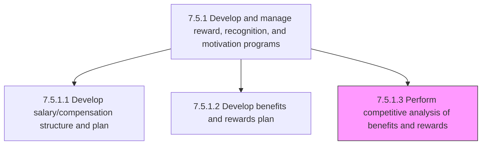
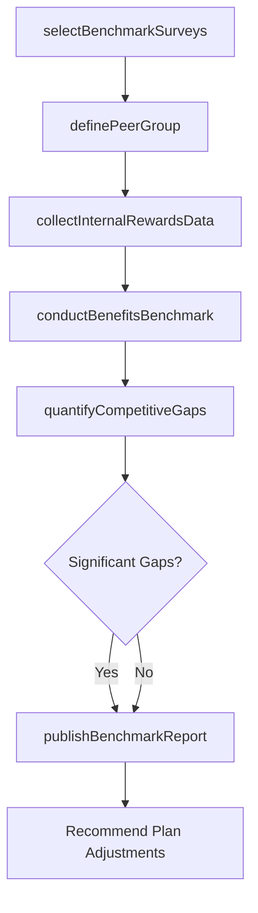

# Perform competitive analysis of benefits and rewards

> Business-as-Code definition for performing competitive analysis of benefits and rewards. Models the process of benchmarking the organization's total rewards offerings against peer companies and industry standards to identify competitive gaps, inform plan design, and support talent attraction and retention strategies.

## Overview

Analyzing and evaluating the organization's benefits and rewards plan. Benchmark the total rewards package against peer organizations, industry norms, and regional market data. Participate in and purchase compensation and benefits survey data from recognized providers. Compare specific benefit elements including health plan design, retirement contributions, paid time off, recognition programs, and perquisites. Identify areas where the organization leads, matches, or trails the competitive market. Quantify the cost of closing competitive gaps. Produce executive-ready benchmarking reports with recommendations for plan adjustments. Ensure benchmarking data adheres to antitrust safe harbor guidelines.

## Process Hierarchy



## GraphDL

```yaml
perform:
  object: Competitive Analysis Of Benefits And Rewards
  actor: CompensationAnalyst
  result: BenefitsBenchmarkReport
```

## Actions

| Action | Description |
|--------|-------------|
| selectBenchmarkSurveys | Identify and procure compensation and benefits survey data from recognized industry providers |
| definePeerGroup | Establish the set of comparator organizations by industry, size, geography, and talent competitor profile |
| collectInternalRewardsData | Compile the organization's current total rewards offerings into a standardized benchmarking format |
| conductBenefitsBenchmark | Compare organizational benefits against peer group data element by element |
| quantifyCompetitiveGaps | Calculate the cost and magnitude of gaps where the organization trails the competitive market |
| publishBenchmarkReport | Produce an executive-ready analysis with competitive positioning and recommended adjustments |

## Events

| Event | Description |
|-------|-------------|
| benchmarkSurveysSelected | Compensation and benefits survey sources identified and data procured |
| peerGroupDefined | Comparator organizations established for benchmarking analysis |
| internalRewardsDataCollected | Organization's current total rewards compiled in standardized benchmarking format |
| benefitsBenchmarkConducted | Element-by-element comparison of organizational benefits against peer data completed |
| competitiveGapsQuantified | Cost and magnitude of competitive gaps calculated with closure cost estimates |
| benchmarkReportPublished | Executive analysis with competitive positioning and recommendations delivered |

## Searches

| Search | Description |
|--------|-------------|
| findSurveyData | List available compensation and benefits surveys filtered by provider, industry, or region |
| getPeerGroupComparison | Retrieve benchmarking results compared against the defined peer group |
| getCompetitivePosition | Access the organization's percentile ranking for specific benefit elements |
| getGapAnalysis | Retrieve identified competitive gaps with estimated closure costs |

## Process Flow



## RACI Matrix

| Activity | Responsible | Accountable | Consulted | Informed |
|----------|-------------|-------------|-----------|----------|
| selectBenchmarkSurveys | CompensationAnalyst | CompensationManager | BenefitsBroker | VP TotalRewards |
| definePeerGroup | CompensationManager | VP TotalRewards | TalentAcquisition | HRBusinessPartner |
| conductBenefitsBenchmark | CompensationAnalyst | CompensationManager | BenefitsManager | Finance |
| publishBenchmarkReport | CompensationManager | VP TotalRewards | CHRO | ExecutiveTeam |

## Related Processes

| Process | Relationship |
|---------|-------------|
| 7.5.1.1 Develop salary/compensation structure and plan | Downstream - benchmark data informs salary structure positioning decisions |
| 7.5.1.2 Develop benefits and rewards plan | Downstream - competitive gaps drive benefit plan design changes |
| 7.4.2 Manage collective bargaining process | Parallel - benchmark data supports economic proposals during bargaining |
| 7.5.1 Develop and manage reward, recognition, and motivation programs | Parent - governing process group |

## Related Departments

| Department | Role |
|-----------|------|
| Compensation and Benefits | Leads the benchmarking analysis and produces competitive positioning reports |
| Talent Acquisition | Provides insight on offer competitiveness and candidate market expectations |
| Finance | Validates cost projections for closing competitive gaps |
| Executive Leadership | Consumes benchmark reports to inform total rewards investment decisions |

## Related Occupations

| Occupation | Involvement |
|-----------|-------------|
| Compensation Analyst | Conducts survey analysis, peer comparisons, and gap quantification |
| Compensation Manager | Defines peer group, interprets results, and authors benchmark recommendations |
| Benefits Broker | Provides market intelligence and external survey access |

## KPIs

| KPI | Description | Unit |
|-----|-------------|------|
| Benchmark Freshness | Age of the most recent completed benefits benchmarking analysis | Months |
| Peer Group Relevance | Percentage of peer group companies that are confirmed talent competitors | % |
| Competitive Position Score | Average percentile ranking across all benchmarked benefit elements | Percentile |
| Gap Closure Rate | Percentage of identified competitive gaps addressed in the next plan year | % |

## Usage

```typescript
import { performCompetitiveAnalysis } from '@headlessly/perform-competitive-analysis'

const analysis = performCompetitiveAnalysis()

// Define peer group for benchmarking
const peerGroup = await analysis.definePeerGroup({
  industry: 'technology',
  revenueRange: { min: 500000000, max: 5000000000 },
  regions: ['US-West', 'US-East'],
  talentCompetitors: ['company-a', 'company-b', 'company-c'],
  minimumPeerCount: 15
})

// Conduct element-by-element benefits benchmark
const benchmark = await analysis.conductBenefitsBenchmark({
  peerGroupId: peerGroup.id,
  elements: ['medical-plan', 'dental-plan', '401k-match', 'pto-policy', 'equity-grants'],
  surveySources: ['mercer', 'radford', 'shrm'],
  targetPercentile: 75
})
```
