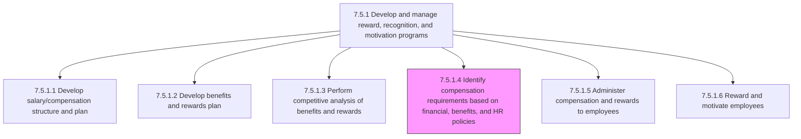
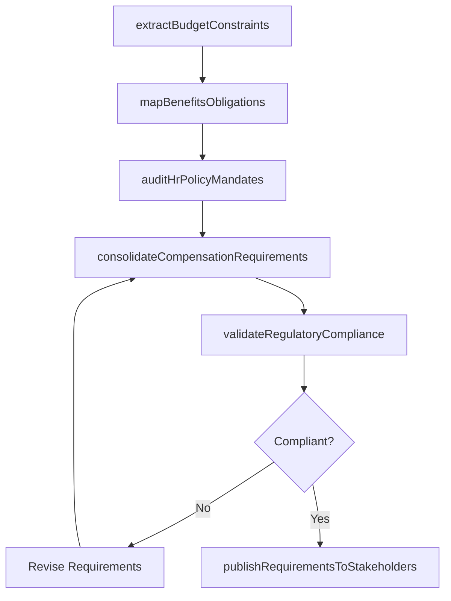

# Identify compensation requirements based on financial, benefits, and HR policies

> Business-as-Code definition for compensation requirements identification. Models the process of analyzing financial constraints, benefits obligations, and HR policy mandates to determine the compensation framework that governs pay structures across the organization.

## Overview

Recognizing the employee requirements for compensation on the basis of the financial, benefits, and HR policies of the organization. This includes reviewing budget allocations and labor cost targets, mapping benefits obligations such as statutory and voluntary programs, and aligning compensation structures with HR policies covering equity, pay transparency, and regulatory compliance. The output is a consolidated compensation requirements document that informs salary structure design, benefits planning, and total rewards strategy.

## Process Hierarchy



## GraphDL

```yaml
identify:
  object: CompensationRequirements
  actor: CompensationAnalyst
  result: CompensationRequirementsFramework
```

## Actions

| Action | Description |
|--------|-------------|
| extractBudgetConstraints | Pull labor cost ceilings, departmental budgets, and financial planning targets from the finance function |
| mapBenefitsObligations | Catalog statutory requirements (FICA, FMLA, ACA) and voluntary benefits costs that constrain available compensation spend |
| auditHrPolicyMandates | Review internal HR policies on pay equity, minimum pay ratios, geographic differentials, and pay transparency |
| consolidateCompensationRequirements | Merge financial, benefits, and HR policy inputs into a unified compensation requirements document |
| validateRegulatoryCompliance | Confirm that identified requirements satisfy federal, state, and local wage-and-hour and equal pay regulations |
| publishRequirementsToStakeholders | Distribute the finalized compensation requirements to compensation designers, benefits planners, and HR leadership |

## Events

| Event | Description |
|-------|-------------|
| budgetConstraintsExtracted | Labor cost ceilings and departmental budget allocations captured from finance |
| benefitsObligationsMapped | Statutory and voluntary benefits cost obligations cataloged and quantified |
| hrPolicyMandatesAudited | Internal HR policies on pay equity, differentials, and transparency reviewed |
| compensationRequirementsConsolidated | Unified compensation requirements document assembled from all policy inputs |
| regulatoryComplianceValidated | Requirements confirmed compliant with applicable wage, hour, and equal pay laws |
| requirementsPublished | Finalized compensation requirements distributed to downstream process owners |

## Searches

| Search | Description |
|--------|-------------|
| findCompensationRequirements | List compensation requirements documents by fiscal year, business unit, or status |
| getBudgetConstraintsByUnit | Retrieve labor budget ceilings and cost targets for a specific department or division |
| getPolicyMandates | Query active HR policy mandates affecting compensation by jurisdiction or employee class |
| getComplianceGaps | Identify requirements that have open regulatory compliance issues or pending review |

## Process Flow



## RACI Matrix

| Activity | Responsible | Accountable | Consulted | Informed |
|----------|-------------|-------------|-----------|----------|
| extractBudgetConstraints | CompensationAnalyst | VP TotalRewards | FinanceBudgetManager | CHRO |
| mapBenefitsObligations | BenefitsAnalyst | VP TotalRewards | LegalCounsel | CompensationAnalyst |
| auditHrPolicyMandates | HRPolicySpecialist | VP TotalRewards | ComplianceOfficer | HRBusinessPartner |
| consolidateCompensationRequirements | CompensationAnalyst | VP TotalRewards | BenefitsAnalyst | PayrollManager |
| validateRegulatoryCompliance | ComplianceOfficer | VP TotalRewards | LegalCounsel | CompensationAnalyst |

## Related Processes

| Process | Relationship |
|---------|-------------|
| 7.5.1.1 Develop salary/compensation structure and plan | Downstream - uses requirements to define pay grades and salary ranges |
| 7.5.1.2 Develop benefits and rewards plan | Downstream - benefits obligations feed plan design |
| 7.5.1.3 Perform competitive analysis of benefits and rewards | Parallel - market data validates requirements feasibility |
| 7.5.1.5 Administer compensation and rewards to employees | Downstream - requirements govern ongoing compensation administration |
| 7.5.1 Develop and manage reward, recognition, and motivation programs | Parent - governing process group |

## Related Departments

| Department | Role |
|-----------|------|
| Compensation and Benefits | Authors and owns the compensation requirements framework |
| Finance | Provides budget constraints and labor cost targets |
| Legal and Compliance | Validates regulatory compliance of compensation requirements |
| Human Resources | Supplies HR policy mandates and pay equity standards |

## Related Occupations

| Occupation | Involvement |
|-----------|-------------|
| Compensation Analyst | Consolidates financial, benefits, and policy inputs into requirements |
| Benefits Analyst | Maps statutory and voluntary benefits obligations |
| HR Policy Specialist | Audits internal HR policies affecting compensation |
| Compliance Officer | Validates regulatory alignment of compensation requirements |

## KPIs

| KPI | Description | Unit |
|-----|-------------|------|
| Requirements Completeness | Percentage of policy domains (financial, benefits, HR) addressed in requirements | % |
| Compliance Gap Count | Number of open regulatory compliance issues in the requirements framework | Count |
| Budget Alignment Variance | Deviation between identified compensation requirements and approved budget | % |
| Requirements Cycle Time | Days from requirements initiation to stakeholder publication | Days |

## Usage

```typescript
import { identifyCompensationRequirements } from '@headlessly/identify-compensation-requirements'

const requirements = identifyCompensationRequirements()

// Extract budget constraints from finance for upcoming fiscal year
const budget = await requirements.extractBudgetConstraints({
  fiscalYear: 2026,
  businessUnit: 'engineering',
  includeHeadcountProjections: true
})

// Consolidate all inputs into a unified requirements document
const framework = await requirements.consolidateCompensationRequirements({
  fiscalYear: 2026,
  budgetConstraints: budget.id,
  benefitsObligations: 'BEN-OBL-2026',
  hrPolicyVersion: 'v4.2'
})
```
