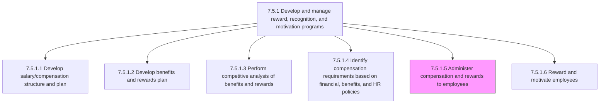
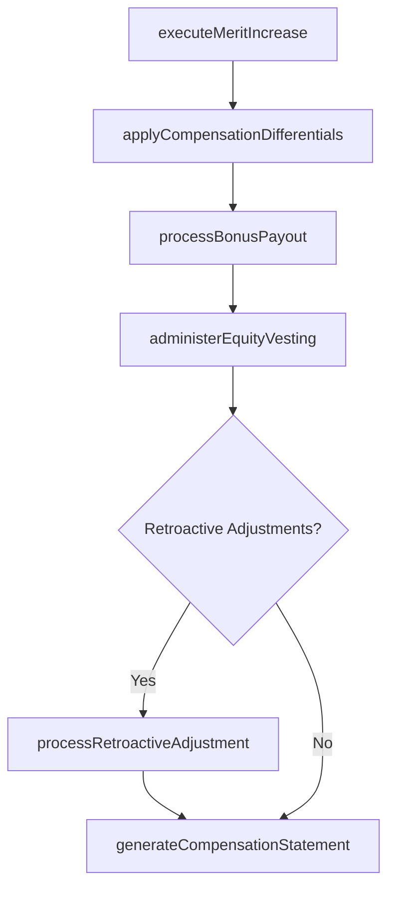

# Administer compensation and rewards to employees

> Business-as-Code definition for compensation and rewards administration. Models the ongoing execution of compensation plans including base salary disbursements, variable pay calculations, equity vest processing, and rewards distribution in compliance with approved compensation frameworks.

## Overview

Managing the provision of compensations and rewards to the employees while maintaining consistency with the compensation and benefits plan. This includes executing merit increases, processing bonus payouts, administering equity vesting schedules, applying geographic and role-based differentials, and ensuring all disbursements align with the approved compensation structure. The process also handles retroactive adjustments, off-cycle payments, and maintains audit trails for SOX and regulatory compliance.

## Process Hierarchy



## GraphDL

```yaml
administer:
  object: CompensationAndRewards
  actor: CompensationAdministrator
  result: CompensationDisbursementRecord
```

## Actions

| Action | Description |
|--------|-------------|
| executeMeritIncrease | Apply approved annual merit increases to employee base salary records effective on the cycle date |
| processBonusPayout | Calculate and disburse performance bonuses, spot bonuses, and signing bonuses per approved plan formulas |
| administerEquityVesting | Process restricted stock unit (RSU) vests, stock option exercises, and ESPP share purchases on schedule |
| applyCompensationDifferentials | Apply geographic, shift, hazard, or skill-based pay differentials to qualifying employee records |
| processRetroactiveAdjustment | Calculate and disburse back-pay for salary corrections, reclassifications, or delayed approvals |
| generateCompensationStatement | Produce total compensation statements showing base, variable, equity, and benefits value for each employee |

## Events

| Event | Description |
|-------|-------------|
| meritIncreaseExecuted | Annual merit increases applied to employee salary records for the compensation cycle |
| bonusPayoutProcessed | Performance or spot bonus calculated and queued for payroll disbursement |
| equityVestingAdministered | RSU vest, option exercise, or ESPP purchase processed and shares released |
| compensationDifferentialApplied | Geographic, shift, or skill-based differential applied to employee pay record |
| retroactiveAdjustmentProcessed | Back-pay calculated and disbursed for salary correction or reclassification |
| compensationStatementGenerated | Total compensation statement produced and delivered to employee |

## Searches

| Search | Description |
|--------|-------------|
| findPendingMeritIncreases | List employees with approved but unprocessed merit increases by department or cycle |
| getBonusPayoutQueue | Retrieve bonus payments pending calculation or disbursement by program or period |
| getEquityVestingSchedule | Query upcoming equity vesting events by employee, grant, or vest date |
| getCompensationHistory | Retrieve full compensation change history for an employee including base, variable, and equity |

## Process Flow



## RACI Matrix

| Activity | Responsible | Accountable | Consulted | Informed |
|----------|-------------|-------------|-----------|----------|
| executeMeritIncrease | CompensationAdministrator | CompensationManager | HRBusinessPartner | PayrollManager |
| processBonusPayout | CompensationAdministrator | CompensationManager | DepartmentManager | Finance |
| administerEquityVesting | EquityAdministrator | CompensationManager | StockPlanCounsel | Employee |
| processRetroactiveAdjustment | CompensationAdministrator | CompensationManager | Payroll | InternalAudit |
| generateCompensationStatement | CompensationAdministrator | CompensationManager | BenefitsAnalyst | Employee |

## Related Processes

| Process | Relationship |
|---------|-------------|
| 7.5.1.4 Identify compensation requirements based on financial, benefits, and HR policies | Upstream - requirements framework governs administration rules |
| 7.5.1.6 Reward and motivate employees | Downstream - administered compensation supports recognition delivery |
| 7.5.4 Administer payroll | Downstream - compensation disbursements feed payroll processing |
| 7.5.1.1 Develop salary/compensation structure and plan | Upstream - salary structure defines merit increase ranges and grade assignments |
| 7.5.1 Develop and manage reward, recognition, and motivation programs | Parent - governing process group |

## Related Departments

| Department | Role |
|-----------|------|
| Compensation and Benefits | Executes compensation administration and maintains records |
| Payroll | Processes compensation disbursements through payroll cycles |
| Finance | Monitors compensation spend against budget |
| Equity Administration | Manages stock plan vesting and exercise processing |

## Related Occupations

| Occupation | Involvement |
|-----------|-------------|
| Compensation Administrator | Executes merit increases, bonus payouts, and adjustments |
| Equity Plan Administrator | Processes RSU vests and stock option exercises |
| Payroll Specialist | Disburses compensation through payroll system |
| Compensation Manager | Oversees administration accuracy and compliance |

## KPIs

| KPI | Description | Unit |
|-----|-------------|------|
| Merit Increase Processing Accuracy | Percentage of merit increases applied correctly without rework | % |
| Bonus Disbursement Timeliness | Percentage of bonuses paid within the target disbursement window | % |
| Compensation Statement Delivery Rate | Percentage of employees receiving annual total compensation statements | % |
| Retroactive Adjustment Volume | Number of retroactive pay corrections processed per quarter | Count |

## Usage

```typescript
import { administerCompensationAndRewards } from '@headlessly/administer-compensation-and-rewards'

const compensation = administerCompensationAndRewards()

// Execute merit increases for the annual cycle
const meritRun = await compensation.executeMeritIncrease({
  compensationCycle: '2026-annual',
  effectiveDate: '2026-04-01',
  department: 'engineering',
  budgetPoolId: 'MERIT-ENG-2026'
})

// Process a spot bonus payout
const bonus = await compensation.processBonusPayout({
  employeeId: 'EMP-3891',
  bonusType: 'spot',
  amount: 2500,
  justification: 'Critical product launch contribution',
  approvedBy: 'MGR-1022'
})
```
