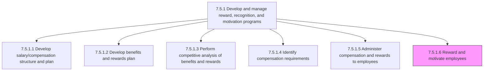
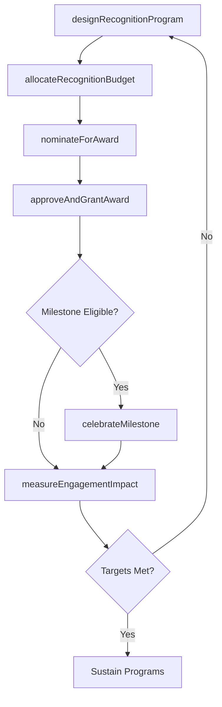

# Reward and motivate employees

> Business-as-Code definition for employee reward and motivation. Models the design, delivery, and measurement of monetary and non-monetary recognition programs that drive employee engagement, reinforce desired behaviors, and improve retention.

## Overview

Rewarding and stimulating the performance efforts of employees through structured recognition programs. This includes designing peer-to-peer recognition platforms, administering milestone awards (tenure, achievement), delivering spot recognition for above-and-beyond contributions, managing non-monetary perks such as extra PTO or development stipends, and measuring program effectiveness through engagement surveys and participation analytics. The goal is to drive both extrinsic motivation through tangible rewards and intrinsic motivation through meaningful recognition and growth opportunities.

## Process Hierarchy



## GraphDL

```yaml
reward:
  object: Employees
  actor: RecognitionProgramManager
  result: EmployeeRewardOutcome
```

## Actions

| Action | Description |
|--------|-------------|
| designRecognitionProgram | Create structured recognition programs including peer-to-peer, manager-driven, and company-wide award categories |
| allocateRecognitionBudget | Distribute annual recognition budgets across departments, program tiers, and award categories |
| nominateForAward | Submit a formal nomination for an employee or team to receive a specific recognition award |
| approveAndGrantAward | Review nominations, approve qualifying entries, and issue the monetary or non-monetary award |
| celebrateMilestone | Deliver tenure-based, project completion, or career milestone recognition events |
| measureEngagementImpact | Analyze recognition program participation rates, engagement survey scores, and retention correlation |

## Events

| Event | Description |
|-------|-------------|
| recognitionProgramDesigned | New recognition program structure approved with categories, criteria, and reward tiers |
| recognitionBudgetAllocated | Annual recognition budget distributed across departments and award categories |
| awardNominated | Employee or team formally nominated for a recognition award |
| awardGranted | Recognition award approved and monetary or non-monetary reward issued to recipient |
| milestoneCelebrated | Tenure, achievement, or project milestone recognition event completed |
| engagementImpactMeasured | Recognition program effectiveness analysis completed with participation and retention metrics |

## Searches

| Search | Description |
|--------|-------------|
| findActiveRecognitionPrograms | List active recognition programs by type, department, or award category |
| getEmployeeRewardHistory | Retrieve all awards and recognitions received by a specific employee |
| getRecognitionBudgetUtilization | Query current budget spend versus allocation by department or program |
| getNominationsPendingApproval | List award nominations awaiting manager or committee approval |

## Process Flow



## RACI Matrix

| Activity | Responsible | Accountable | Consulted | Informed |
|----------|-------------|-------------|-----------|----------|
| designRecognitionProgram | RecognitionProgramManager | VP TotalRewards | HRBusinessPartner | DepartmentManagers |
| allocateRecognitionBudget | RecognitionProgramManager | VP TotalRewards | Finance | CHRO |
| approveAndGrantAward | DepartmentManager | RecognitionProgramManager | HRBusinessPartner | Employee |
| measureEngagementImpact | HRAnalyst | VP TotalRewards | RecognitionProgramManager | ExecutiveTeam |

## Related Processes

| Process | Relationship |
|---------|-------------|
| 7.5.1.5 Administer compensation and rewards to employees | Upstream - compensation administration provides monetary reward infrastructure |
| 7.5.1.2 Develop benefits and rewards plan | Upstream - rewards plan defines available recognition categories |
| 7.5.3.3 Review retention and motivation indicators | Downstream - reward program outcomes feed retention indicator analysis |
| 7.5.3.1 Deliver programs to support work/life balance | Parallel - non-monetary rewards complement work/life balance programs |
| 7.5.1 Develop and manage reward, recognition, and motivation programs | Parent - governing process group |

## Related Departments

| Department | Role |
|-----------|------|
| Human Resources | Designs and manages recognition program strategy |
| Finance | Approves recognition budgets and monitors spend |
| Department Management | Nominates employees and approves awards within their teams |
| Internal Communications | Promotes recognition programs and celebrates award recipients |

## Related Occupations

| Occupation | Involvement |
|-----------|-------------|
| Recognition Program Manager | Designs programs and oversees award administration |
| HR Business Partner | Facilitates nominations and ensures equitable distribution |
| Department Manager | Nominates employees and delivers in-person recognition |
| HR Analyst | Measures program effectiveness and engagement impact |

## KPIs

| KPI | Description | Unit |
|-----|-------------|------|
| Recognition Participation Rate | Percentage of employees who gave or received recognition in the period | % |
| Award Budget Utilization | Percentage of allocated recognition budget actually distributed | % |
| Post-Recognition Engagement Lift | Change in engagement survey score for recognized employees versus baseline | Points |
| Voluntary Turnover of Recognized Employees | Turnover rate of employees who received recognition versus those who did not | % |

## Usage

```typescript
import { rewardEmployees } from '@headlessly/reward-employees'

const rewards = rewardEmployees()

// Nominate an employee for a spot recognition award
const nomination = await rewards.nominateForAward({
  employeeId: 'EMP-7234',
  awardCategory: 'innovation',
  nominatedBy: 'MGR-1105',
  justification: 'Led cross-functional initiative that reduced onboarding time by 40%',
  suggestedReward: 'spot-bonus-1000'
})

// Measure engagement impact of recognition programs for the quarter
const impact = await rewards.measureEngagementImpact({
  programIds: ['peer-recognition', 'quarterly-excellence', 'tenure-awards'],
  period: 'Q4-2025',
  includeRetentionCorrelation: true
})
```
