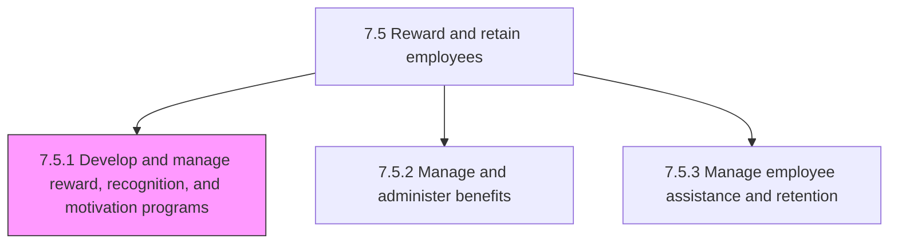
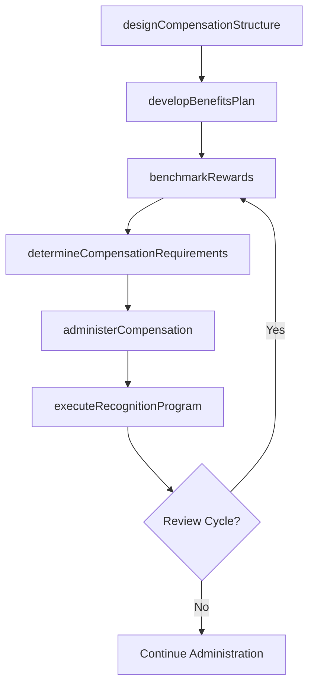

# Develop and manage reward, recognition, and motivation programs

> Business-as-Code definition for reward, recognition, and motivation program management. Models compensation structure design, benefits planning, competitive benchmarking, and employee reward administration.

## Overview

Developing a salary/compensation structure and plan; developing a benefits and reward plan; develop commission plan; performing competitive analyses of benefits and rewards; identifying compensation requirements based on compensation, benefits, and HR policies; administering compensation, commission, and rewards to employees; and rewarding and motivating employees.

## Process Hierarchy



## GraphDL

```yaml
develop:
  object: And Manage Reward, Recognition, And Motivation Programs
  actor: CompensationManager
  result: TotalRewardsProgram
```

## Actions

| Action | Description |
|--------|-------------|
| designCompensationStructure | Create salary grades, pay bands, and variable compensation frameworks |
| developBenefitsPlan | Design health, retirement, and supplemental benefits packages |
| benchmarkRewards | Compare total rewards against market data and peer organizations |
| determineCompensationRequirements | Align compensation decisions with financial policies and HR guidelines |
| administerCompensation | Process salary adjustments, bonuses, and commission payments |
| executeRecognitionProgram | Deliver formal and informal recognition and motivational rewards |

## Events

| Event | Description |
|-------|-------------|
| compensationStructureDesigned | Salary grades and pay band framework established |
| benefitsPlanDeveloped | Benefits package designed and approved for implementation |
| rewardsBenchmarked | Competitive compensation analysis completed |
| compensationRequirementsDetermined | Pay decisions aligned with policy and budget constraints |
| compensationAdministered | Salary, bonus, or commission payments processed |
| recognitionProgramExecuted | Employee recognition or motivational reward delivered |

## Searches

| Search | Description |
|--------|-------------|
| getCompensationStructure | Retrieve salary bands and pay grades by role family or level |
| getBenefitsEnrollment | Query employee benefits enrollment data by plan type |
| getMarketBenchmarks | Retrieve compensation benchmarking data by role and market |
| getRecognitionHistory | List recognition awards by employee, department, or program |
| getRewardsBudgetUtilization | Query rewards spend against budget allocation by department |

## Process Flow



## RACI Matrix

| Activity | Responsible | Accountable | Consulted | Informed |
|----------|-------------|-------------|-----------|----------|
| designCompensationStructure | Compensation Manager | VP HR | Finance, Legal | Department Heads |
| developBenefitsPlan | Benefits Manager | VP HR | Brokers, Legal | All Employees |
| benchmarkRewards | Compensation Analyst | Compensation Manager | External Consultants | Executive Team |
| administerCompensation | Payroll Manager | VP HR | Finance | All Employees |
| executeRecognitionProgram | HR Business Partner | VP HR | Department Heads | All Employees |

## Sub-Processes

| ID | Name | Description |
|----|------|-------------|
| 7.5.1.1 | Develop salary/compensation structure and plan | Creating the framework for the provision of salary/compensation to employees. Break down the salary  |
| 7.5.1.2 | Develop benefits and rewards plan | Developing a plan for provision of rewards, commission, and benefits to employees. Plan health benef |
| 7.5.1.3 | Perform competitive analysis of benefits and rewards | Analyzing and evaluating the organization's benefits and rewards plan. Compare/Benchmark the benefit |
| 7.5.1.4 | Identify compensation requirements based on financial, benefits, and HR policies | Recognizing the employee requirements for compensation on the basis of the financial, benefits, and  |
| 7.5.1.5 | Administer compensation and rewards to employees | Managing the provision of compensations and rewards to the employees while maintaining consistency w |
| 7.5.1.6 | Reward and motivate employees | Rewarding and stimulating the performance efforts of employees. Create methods for motivating employ |

## Related Processes

| Process | Relationship |
|---------|-------------|
| 7.3.2 Manage employee performance | Upstream - performance ratings inform merit and bonus decisions |
| 7.5.2 Manage and administer benefits | Downstream - benefits plan implemented through administration |
| 7.5.3 Manage employee assistance and retention | Parallel - rewards contribute to retention strategy |
| 7.1.2.3 Develop compensation plan | Upstream - compensation plan defines reward framework |

## Related Departments

| Department | Role |
|-----------|------|
| Compensation and Benefits | Designs and administers total rewards programs |
| Finance | Approves compensation budgets and monitors spend |
| Human Resources | Implements recognition programs and policy compliance |
| Legal | Ensures compensation practices comply with labor regulations |

## Related Occupations

| Occupation | Involvement |
|-----------|-------------|
| Compensation Manager | Designs pay structures and manages benchmarking |
| Benefits Manager | Develops and administers benefits programs |
| Compensation Analyst | Conducts market analysis and pay equity reviews |

## KPIs

| KPI | Description | Unit |
|-----|-------------|------|
| Compensation Competitiveness Ratio | Organization pay relative to market median | Ratio |
| Benefits Participation Rate | Percentage of eligible employees enrolled in benefits | % |
| Total Rewards Cost per Employee | Total compensation and benefits cost per headcount | USD |
| Recognition Program Utilization | Percentage of managers actively using recognition tools | % |
| Pay Equity Index | Variance in compensation across demographic groups for similar roles | % |

## Usage

```typescript
import { developAndManageRewardRecognitionAndMotivationPrograms } from '@headlessly/develop-and-manage-reward-recognition-and-motivation-programs'

const rewards = developAndManageRewardRecognitionAndMotivationPrograms()

// Benchmark rewards against market
const benchmark = await rewards.benchmarkRewards({
  roleFamily: 'engineering',
  markets: ['san-francisco', 'new-york', 'austin'],
  dataSource: 'radford-2025'
})

// Administer compensation adjustments
await rewards.administerCompensation({
  cycle: 'annual-merit-2025',
  adjustments: [
    { employeeId: 'emp_12345', meritIncrease: 0.04, bonus: 15000 },
    { employeeId: 'emp_67890', meritIncrease: 0.06, bonus: 20000 }
  ]
})
```
