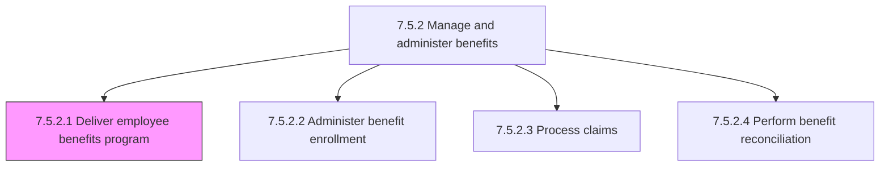
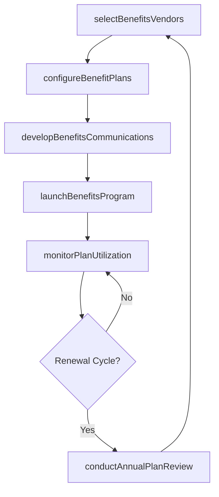

# Deliver employee benefits program

> Business-as-Code definition for employee benefits program delivery. Models the implementation and ongoing operation of employee benefits programs including health insurance, retirement plans, disability coverage, life insurance, and voluntary supplemental benefits.

## Overview

Implementing the programs that specify employee benefits beyond salary, including medical, dental, and vision insurance, retirement savings plans (401k, pension), short-term and long-term disability, life insurance, and voluntary supplemental benefits such as HSA, FSA, and commuter benefits. This process covers vendor selection and contracting, plan configuration in the HRIS platform, employee communication and education, and ongoing plan administration to ensure benefits are delivered accurately, cost-effectively, and in compliance with ERISA, ACA, and COBRA regulations.

## Process Hierarchy



## GraphDL

```yaml
deliver:
  object: EmployeeBenefitsProgram
  actor: BenefitsManager
  result: BenefitsProgramDeliveryRecord
```

## Actions

| Action | Description |
|--------|-------------|
| selectBenefitsVendors | Evaluate and contract with insurance carriers, third-party administrators, and retirement plan providers |
| configureBenefitPlans | Set up plan details including coverage tiers, contribution structures, eligibility rules, and waiting periods in the HRIS |
| developBenefitsCommunications | Create benefits guides, comparison tools, FAQ documents, and educational materials for employees |
| launchBenefitsProgram | Activate benefit plans, open enrollment access, and deploy communication campaigns to eligible employees |
| monitorPlanUtilization | Track claims volume, utilization rates, and cost trends across all benefit plan categories |
| conductAnnualPlanReview | Evaluate plan performance, vendor service levels, cost trends, and employee satisfaction to inform renewal decisions |

## Events

| Event | Description |
|-------|-------------|
| benefitsVendorsSelected | Insurance carriers and plan administrators evaluated, scored, and contracted |
| benefitPlansConfigured | Plan details including tiers, contributions, and eligibility rules activated in HRIS |
| benefitsCommunicationsDeployed | Benefits guides, comparison tools, and educational materials distributed to employees |
| benefitsProgramLaunched | Benefit plans activated and enrollment access opened for eligible employees |
| planUtilizationReviewed | Claims volume, utilization rates, and cost trends analyzed across benefit categories |
| annualPlanReviewCompleted | Plan performance, vendor SLAs, and employee satisfaction evaluated for renewal cycle |

## Searches

| Search | Description |
|--------|-------------|
| findActiveBenefitPlans | List active benefit plans by category (medical, dental, retirement), carrier, or plan year |
| getPlanUtilizationMetrics | Retrieve utilization rates, claims volume, and cost-per-employee by plan |
| getVendorPerformance | Query vendor service level metrics including claims turnaround, accuracy, and member satisfaction |
| getEmployeeBenefitsSummary | Retrieve a specific employee's enrolled benefits with coverage details and contribution amounts |

## Process Flow



## RACI Matrix

| Activity | Responsible | Accountable | Consulted | Informed |
|----------|-------------|-------------|-----------|----------|
| selectBenefitsVendors | BenefitsManager | VP TotalRewards | Procurement | Finance |
| configureBenefitPlans | BenefitsAdministrator | BenefitsManager | HRISTeam | Payroll |
| developBenefitsCommunications | BenefitsManager | VP TotalRewards | InternalComms | AllEmployees |
| monitorPlanUtilization | BenefitsAnalyst | BenefitsManager | Finance | VP TotalRewards |
| conductAnnualPlanReview | BenefitsManager | VP TotalRewards | BenefitsConsultant | CHRO |

## Related Processes

| Process | Relationship |
|---------|-------------|
| 7.5.2.2 Administer benefit enrollment | Downstream - program delivery enables enrollment for employees |
| 7.5.2.3 Process claims | Downstream - delivered plans generate claims for processing |
| 7.5.2.4 Perform benefit reconciliation | Downstream - plan data feeds reconciliation with carrier invoices |
| 7.5.1.2 Develop benefits and rewards plan | Upstream - plan design defines the programs to be delivered |
| 7.5.2 Manage and administer benefits | Parent - governing process group |

## Related Departments

| Department | Role |
|-----------|------|
| Benefits Administration | Manages vendor relationships and plan configuration |
| HRIS | Configures benefits platform and maintains enrollment systems |
| Finance | Monitors benefits costs and approves vendor contracts |
| Internal Communications | Develops and distributes benefits education materials |

## Related Occupations

| Occupation | Involvement |
|-----------|-------------|
| Benefits Manager | Oversees vendor selection, plan design, and program delivery |
| Benefits Administrator | Configures plans in HRIS and manages day-to-day operations |
| Benefits Analyst | Monitors utilization trends and models cost projections |
| Benefits Consultant | Advises on plan design, market positioning, and compliance |

## KPIs

| KPI | Description | Unit |
|-----|-------------|------|
| Benefits Participation Rate | Percentage of eligible employees enrolled in at least one benefit plan | % |
| Benefits Cost Per Employee | Total annual benefits spend divided by enrolled headcount | USD |
| Vendor SLA Compliance | Percentage of vendor service-level metrics met or exceeded | % |
| Employee Benefits Satisfaction | Average satisfaction score from annual benefits survey | Score (1-5) |

## Usage

```typescript
import { deliverEmployeeBenefitsProgram } from '@headlessly/deliver-employee-benefits-program'

const benefits = deliverEmployeeBenefitsProgram()

// Configure a new medical plan for the upcoming plan year
const plan = await benefits.configureBenefitPlans({
  planYear: 2026,
  planType: 'medical',
  carrier: 'BlueCross',
  tiers: ['employee-only', 'employee-spouse', 'employee-children', 'family'],
  employerContributionPercent: 80,
  waitingPeriodDays: 30
})

// Monitor utilization across all active benefit plans
const utilization = await benefits.monitorPlanUtilization({
  planYear: 2026,
  quarter: 'Q1',
  groupBy: 'planType',
  includeCostTrends: true
})
```
