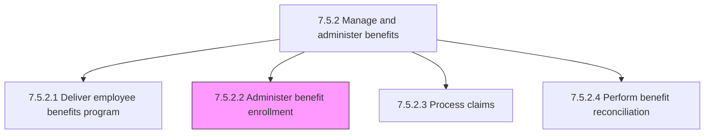
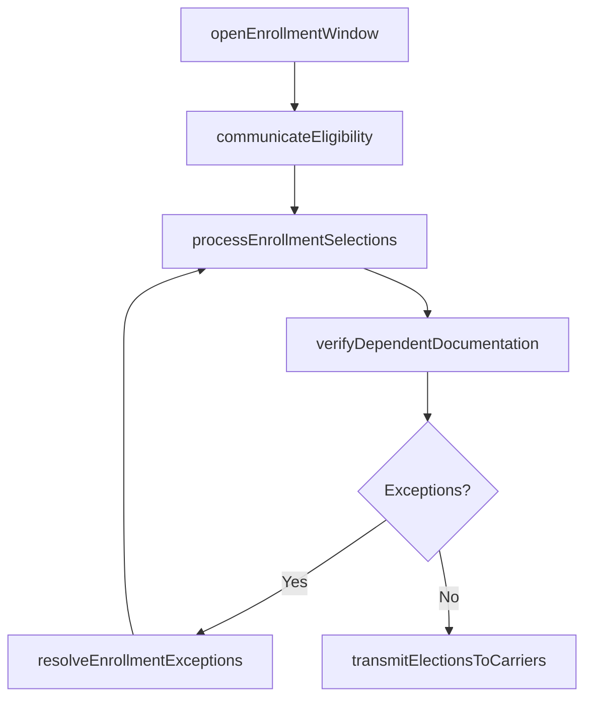

# Administer benefit enrollment

> Business-as-Code definition for benefit enrollment administration. Models the end-to-end enrollment lifecycle including open enrollment windows, qualifying life event processing, eligibility verification, dependent documentation, and carrier file transmission.

## Overview

Handling the employee enrollment for obtaining benefits. This covers configuring and activating annual open enrollment and special enrollment periods, notifying eligible employees of available plans, capturing and validating benefit elections across medical, dental, vision, retirement, and voluntary plans, verifying dependent eligibility through required documentation, handling qualifying life events (marriage, birth, adoption, loss of coverage), resolving enrollment exceptions and disputes, and transmitting finalized elections to insurance carriers and third-party administrators for activation.

## Process Hierarchy



## GraphDL

```yaml
administer:
  object: BenefitEnrollment
  actor: BenefitsAdministrator
  result: EnrollmentConfirmation
```

## Actions

| Action | Description |
|--------|-------------|
| openEnrollmentWindow | Configure and activate the annual or special enrollment period with plan options, deadlines, and eligibility rules |
| communicateEligibility | Notify eligible employees of available benefit plans, contribution rates, deadlines, and enrollment instructions |
| processEnrollmentSelections | Capture and validate employee benefit elections including health, dental, vision, retirement, and voluntary plans |
| verifyDependentDocumentation | Confirm dependent eligibility by reviewing required documentation such as birth certificates, marriage records, and court orders |
| resolveEnrollmentExceptions | Handle late enrollments, qualifying life events, and eligibility disputes through established exception workflows |
| transmitElectionsToCarriers | Send finalized benefit elections to insurance carriers and third-party administrators via EDI 834 files for activation |

## Events

| Event | Description |
|-------|-------------|
| enrollmentWindowOpened | Annual or special enrollment period activated and accessible to employees |
| eligibilityCommunicated | Eligible employees notified of benefit options, contribution rates, and enrollment deadlines |
| enrollmentSelectionsProcessed | Employee benefit elections captured, validated, and confirmed in the system |
| dependentDocumentationVerified | Dependent eligibility documentation reviewed, approved, or rejected with reason |
| enrollmentExceptionResolved | Late enrollment, qualifying life event, or eligibility dispute adjudicated |
| electionsTransmittedToCarriers | Finalized benefit elections sent to insurance carriers via EDI 834 for plan activation |

## Searches

| Search | Description |
|--------|-------------|
| getEnrollmentStatus | Retrieve enrollment completion status for employees by department, plan type, or enrollment window |
| findPendingEnrollments | List employees who have not yet completed enrollment before the deadline |
| getCarrierTransmissionStatus | Query the status of EDI 834 benefit election files sent to insurance carriers |
| getQualifyingLifeEvents | List pending qualifying life event enrollment requests requiring review |

## Process Flow



## RACI Matrix

| Activity | Responsible | Accountable | Consulted | Informed |
|----------|-------------|-------------|-----------|----------|
| openEnrollmentWindow | BenefitsAdministrator | BenefitsManager | HRISTeam | AllEmployees |
| processEnrollmentSelections | BenefitsAdministrator | BenefitsManager | Payroll | Employee |
| verifyDependentDocumentation | BenefitsAdministrator | BenefitsManager | LegalCompliance | Employee |
| transmitElectionsToCarriers | BenefitsAdministrator | BenefitsManager | InsuranceCarrier | Payroll |

## Related Processes

| Process | Relationship |
|---------|-------------|
| 7.5.2.1 Deliver employee benefits program | Upstream - program design defines available plans for enrollment |
| 7.5.2.3 Process claims | Downstream - enrolled employees begin submitting benefit claims |
| 7.5.2.4 Perform benefit reconciliation | Downstream - enrollment data feeds carrier invoice reconciliation |
| 7.5.4 Administer payroll | Downstream - enrollment elections drive payroll deduction calculations |
| 7.5.2 Manage and administer benefits | Parent - governing process group |

## Related Departments

| Department | Role |
|-----------|------|
| Benefits Administration | Manages enrollment windows, processes elections, and verifies documentation |
| HRIS | Maintains the enrollment platform, eligibility rules, and data feeds |
| Payroll | Adjusts payroll deductions based on enrollment elections |
| Legal and Compliance | Ensures enrollment practices comply with ERISA, ACA, and HIPAA regulations |

## Related Occupations

| Occupation | Involvement |
|-----------|-------------|
| Benefits Administrator | Processes enrollments, verifies dependent documentation, and resolves exceptions |
| Benefits Manager | Oversees enrollment operations and carrier relationships |
| HRIS Analyst | Configures enrollment platform and manages carrier EDI transmissions |
| Payroll Specialist | Updates payroll deductions based on finalized enrollment elections |

## KPIs

| KPI | Description | Unit |
|-----|-------------|------|
| Enrollment Participation Rate | Percentage of eligible employees who complete enrollment by the deadline | % |
| Enrollment Processing Accuracy | Percentage of elections processed correctly without rework | % |
| Carrier Transmission Timeliness | Percentage of EDI 834 election files transmitted to carriers on schedule | % |
| Exception Resolution Time | Average business days to resolve enrollment exceptions and disputes | Days |

## Usage

```typescript
import { administerBenefitEnrollment } from '@headlessly/administer-benefit-enrollment'

const enrollment = administerBenefitEnrollment()

// Open the annual enrollment window
const window = await enrollment.openEnrollmentWindow({
  enrollmentType: 'annual',
  startDate: '2025-11-01',
  endDate: '2025-11-30',
  eligiblePopulation: 'all-active-employees',
  planYear: 2026
})

// Process an employee's enrollment selections
const selection = await enrollment.processEnrollmentSelections({
  employeeId: 'EMP-2847',
  enrollmentWindowId: window.id,
  elections: [
    { planType: 'medical', planId: 'PPO-500', tier: 'employee-spouse' },
    { planType: 'dental', planId: 'DPPO-Basic', tier: 'employee-only' },
    { planType: '401k', contributionPercent: 6, catchUpEligible: false }
  ]
})
```
