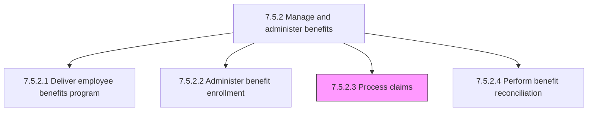
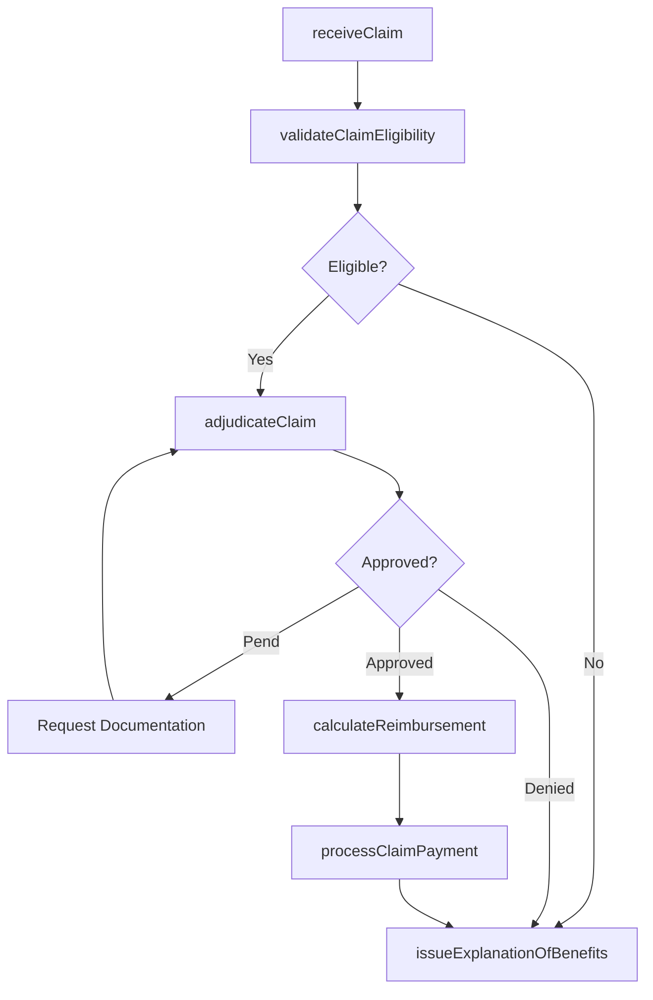

# Process claims

> Business-as-Code definition for benefits claims processing. Models the end-to-end lifecycle of employee benefit claims from intake through adjudication, reimbursement calculation, payment, and decision communication, ensuring compliance with plan terms and regulatory requirements.

## Overview

Processing formal requests from employees claiming entitlement to benefits under their enrolled plans. This includes receiving claims with supporting documentation, validating employee enrollment status and plan coverage, adjudicating claims against plan terms and benefit schedules, calculating reimbursement amounts accounting for deductibles, co-pays, and out-of-pocket maximums, processing payments to employees or healthcare providers, and communicating decisions with explanation of benefits (EOB) statements. The process handles medical, dental, vision, disability, and voluntary benefit claims while maintaining compliance with ERISA, HIPAA, and state insurance regulations.

## Process Hierarchy



## GraphDL

```yaml
process:
  object: Claims
  actor: ClaimsAdjudicator
  result: ClaimsDecisionRecord
```

## Actions

| Action | Description |
|--------|-------------|
| receiveClaim | Accept an employee benefit claim submission with supporting documentation including invoices, receipts, and provider statements |
| validateClaimEligibility | Verify the employee's active enrollment status, plan coverage dates, and that the claim type is covered under the enrolled plan |
| adjudicateClaim | Review claim details against plan terms, benefit schedules, and exclusions to determine approved, denied, or pended status |
| calculateReimbursement | Compute the reimbursement amount applying deductible status, co-pay percentages, coinsurance, and annual out-of-pocket maximums |
| processClaimPayment | Initiate payment to the employee or directly to the healthcare provider for approved claim amounts |
| issueExplanationOfBenefits | Generate and deliver the EOB statement to the employee detailing the claim decision, amounts applied, and appeal rights |

## Events

| Event | Description |
|-------|-------------|
| claimReceived | Employee benefit claim submission accepted with supporting documentation into the claims system |
| claimEligibilityValidated | Employee enrollment status, plan coverage, and claim type eligibility confirmed |
| claimAdjudicated | Claim reviewed against plan terms and adjudicated as approved, denied, or pended for additional information |
| reimbursementCalculated | Payment amount determined after applying deductible, co-pay, coinsurance, and out-of-pocket maximum rules |
| claimPaymentProcessed | Reimbursement payment issued to employee or healthcare provider |
| explanationOfBenefitsIssued | EOB statement generated and delivered to employee with claim decision details and appeal rights |

## Searches

| Search | Description |
|--------|-------------|
| findClaimsByEmployee | List all claims for a specific employee filtered by plan type, claim status, or date of service |
| getPendingClaims | Retrieve claims awaiting adjudication or additional documentation by age or priority |
| getClaimPaymentHistory | Query reimbursement payment history for an employee or provider including amounts and dates |
| getClaimDenialAnalysis | Retrieve denial reason codes and frequency for trend analysis and process improvement |

## Process Flow



## RACI Matrix

| Activity | Responsible | Accountable | Consulted | Informed |
|----------|-------------|-------------|-----------|----------|
| receiveClaim | BenefitsAdministrator | BenefitsManager | HRServiceCenter | Employee |
| validateClaimEligibility | ClaimsAdjudicator | BenefitsManager | EnrollmentSpecialist | Employee |
| adjudicateClaim | ClaimsAdjudicator | BenefitsManager | PlanAdministrator | LegalCompliance |
| calculateReimbursement | ClaimsAdjudicator | BenefitsManager | Finance | Payroll |
| processClaimPayment | PayrollSpecialist | BenefitsManager | Finance | Employee |
| issueExplanationOfBenefits | BenefitsAdministrator | BenefitsManager | ClaimsAdjudicator | Employee |

## Related Processes

| Process | Relationship |
|---------|-------------|
| 7.5.2.2 Administer benefit enrollment | Upstream - enrollment data determines claim eligibility and plan coverage |
| 7.5.2.4 Perform benefit reconciliation | Downstream - processed claims feed carrier invoice reconciliation |
| 7.5.2.1 Deliver employee benefits program | Upstream - plan terms define adjudication rules and benefit schedules |
| 7.5.4 Administer payroll | Downstream - approved claim payments may be processed through payroll |
| 7.5.2 Manage and administer benefits | Parent - governing process group |

## Related Departments

| Department | Role |
|-----------|------|
| Benefits Administration | Receives claims, adjudicates decisions, and communicates outcomes |
| Finance | Processes claim payments and monitors claims cost trends |
| Payroll | Disburses claim reimbursements through payroll system when applicable |
| Legal and Compliance | Ensures claims processing complies with ERISA and state insurance regulations |

## Related Occupations

| Occupation | Involvement |
|-----------|-------------|
| Claims Adjudicator | Reviews and adjudicates benefit claims against plan terms and benefit schedules |
| Benefits Administrator | Receives claims, manages documentation, and communicates decisions to employees |
| Payroll Specialist | Processes approved claim reimbursement payments |
| Benefits Manager | Oversees claims operations, denial trends, and process improvement |

## KPIs

| KPI | Description | Unit |
|-----|-------------|------|
| Claims Processing Time | Average business days from claim submission to payment or decision | Days |
| Auto-Adjudication Rate | Percentage of claims processed without manual intervention | % |
| Claims Denial Rate | Percentage of submitted claims denied | % |
| Claims Processing Accuracy | Percentage of claims adjudicated correctly without rework or appeal reversal | % |

## Usage

```typescript
import { processClaims } from '@headlessly/process-claims'

const claims = processClaims()

// Receive and register an employee benefit claim
const claim = await claims.receiveClaim({
  employeeId: 'EMP-5678',
  claimType: 'medical',
  providerName: 'Metro Health Partners',
  providerNpi: '1234567890',
  amount: 1250.00,
  dateOfService: '2025-08-15',
  diagnosisCode: 'J06.9'
})

// Adjudicate the claim against plan terms
const decision = await claims.adjudicateClaim({
  claimId: claim.id,
  planId: 'medical-ppo-2025',
  applyDeductible: true,
  checkOutOfPocketMax: true
})
```
