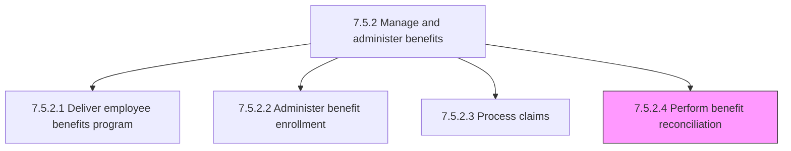
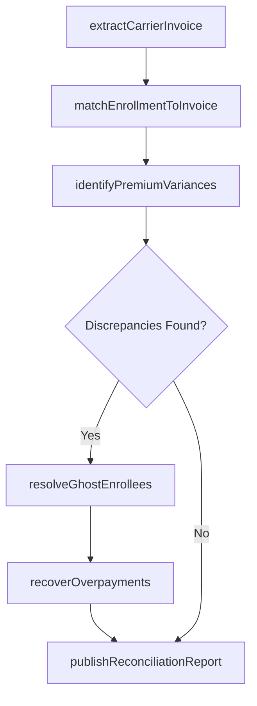

# Perform benefit reconciliation

> Business-as-Code definition for benefit reconciliation. Models the process of comparing internal enrollment records, payroll deductions, and carrier invoices to identify and resolve discrepancies in benefit plan billing, ensuring accurate premium payments and enrollment synchronization.

## Overview

Carrying out reconciliation of benefits delivered to employees by comparing internal HRIS enrollment records against carrier invoices, validating payroll deduction accuracy against premium amounts, identifying discrepancies such as ghost enrollees (employees on carrier invoice but not in HRIS), missing enrollees (employees in HRIS but not on carrier invoice), and premium calculation errors. The process resolves variances through adjustments to carrier records or payroll deductions, recovers overpayments, and produces audit-ready reconciliation reports for finance and compliance. Reconciliation is performed monthly for active plans and annually for plan year close-out.

## Process Hierarchy



## GraphDL

```yaml
perform:
  object: BenefitReconciliation
  actor: BenefitsReconciliationAnalyst
  result: ReconciliationReport
```

## Actions

| Action | Description |
|--------|-------------|
| extractCarrierInvoice | Import carrier billing files and premium invoices for the reconciliation period |
| matchEnrollmentToInvoice | Compare HRIS enrollment records against carrier invoice line items to identify matched, unmatched, and discrepant records |
| identifyPremiumVariances | Flag differences between expected premium amounts (based on enrollment tier and plan) and invoiced amounts |
| resolveGhostEnrollees | Investigate and remove enrollees appearing on carrier invoices who are no longer active or enrolled in HRIS |
| recoverOverpayments | Calculate overpayment amounts for resolved discrepancies and submit carrier credit requests or payroll adjustments |
| publishReconciliationReport | Generate the final reconciliation report with variance details, resolution status, and financial impact for finance and audit |

## Events

| Event | Description |
|-------|-------------|
| carrierInvoiceExtracted | Carrier billing file and premium invoice imported for the reconciliation period |
| enrollmentToInvoiceMatched | HRIS enrollment records compared against carrier invoice with match results tabulated |
| premiumVariancesIdentified | Differences between expected and invoiced premium amounts flagged for investigation |
| ghostEnrolleesResolved | Enrollees appearing on carrier invoices without active HRIS enrollment investigated and removed |
| overpaymentsRecovered | Overpayment credits received from carrier or payroll adjustments processed |
| reconciliationReportPublished | Final reconciliation report with variances, resolutions, and financial impact delivered to stakeholders |

## Searches

| Search | Description |
|--------|-------------|
| findUnreconciledPeriods | List carrier invoice periods with open reconciliation items by carrier or plan |
| getPremiumVariances | Retrieve premium discrepancies by carrier, plan type, or variance amount threshold |
| getGhostEnrolleeList | Query enrollees appearing on carrier invoices but not matched to active HRIS enrollment records |
| getReconciliationHistory | Retrieve historical reconciliation reports and variance trends by carrier or plan year |

## Process Flow



## RACI Matrix

| Activity | Responsible | Accountable | Consulted | Informed |
|----------|-------------|-------------|-----------|----------|
| extractCarrierInvoice | BenefitsReconciliationAnalyst | BenefitsManager | HRISTeam | Finance |
| matchEnrollmentToInvoice | BenefitsReconciliationAnalyst | BenefitsManager | EnrollmentSpecialist | Payroll |
| identifyPremiumVariances | BenefitsReconciliationAnalyst | BenefitsManager | Finance | InsuranceCarrier |
| resolveGhostEnrollees | BenefitsReconciliationAnalyst | BenefitsManager | InsuranceCarrier | HRISTeam |
| recoverOverpayments | Finance | BenefitsManager | BenefitsReconciliationAnalyst | InternalAudit |
| publishReconciliationReport | BenefitsReconciliationAnalyst | BenefitsManager | Finance | VP TotalRewards |

## Related Processes

| Process | Relationship |
|---------|-------------|
| 7.5.2.2 Administer benefit enrollment | Upstream - enrollment records provide the baseline for reconciliation matching |
| 7.5.2.3 Process claims | Upstream - claims data validates utilization against enrolled population |
| 7.5.2.1 Deliver employee benefits program | Upstream - plan terms and carrier contracts define expected premium rates |
| 7.5.4 Administer payroll | Parallel - payroll deduction records provide a second reconciliation data source |
| 7.5.2 Manage and administer benefits | Parent - governing process group |

## Related Departments

| Department | Role |
|-----------|------|
| Benefits Administration | Performs reconciliation analysis and resolves discrepancies with carriers |
| Finance | Validates premium payments, processes overpayment recoveries, and audits reconciliation |
| HRIS | Maintains enrollment records and generates reconciliation data extracts |
| Payroll | Provides payroll deduction records for cross-reference and processes adjustment corrections |

## Related Occupations

| Occupation | Involvement |
|-----------|-------------|
| Benefits Reconciliation Analyst | Performs enrollment-to-invoice matching and identifies premium variances |
| Benefits Manager | Oversees reconciliation operations and carrier dispute resolution |
| Financial Analyst | Validates premium payment accuracy and tracks overpayment recovery |
| HRIS Analyst | Generates enrollment data extracts and resolves HRIS data discrepancies |

## KPIs

| KPI | Description | Unit |
|-----|-------------|------|
| Reconciliation Variance Rate | Percentage of carrier invoice line items with discrepancies versus total | % |
| Ghost Enrollee Count | Number of enrollees on carrier invoice not matched to active HRIS records per period | Count |
| Overpayment Recovery Rate | Percentage of identified overpayments successfully recovered from carriers | % |
| Reconciliation Cycle Time | Business days from carrier invoice receipt to published reconciliation report | Days |

## Usage

```typescript
import { performBenefitReconciliation } from '@headlessly/perform-benefit-reconciliation'

const reconciliation = performBenefitReconciliation()

// Match HRIS enrollment against carrier invoice for the month
const matchResult = await reconciliation.matchEnrollmentToInvoice({
  carrier: 'BlueCross',
  invoicePeriod: '2026-01',
  planTypes: ['medical', 'dental', 'vision'],
  toleranceAmount: 0.50
})

// Identify and resolve ghost enrollees
const ghostResolution = await reconciliation.resolveGhostEnrollees({
  reconciliationId: matchResult.id,
  ghostEnrollees: matchResult.unmatchedCarrierRecords,
  action: 'submit-carrier-termination'
})
```
