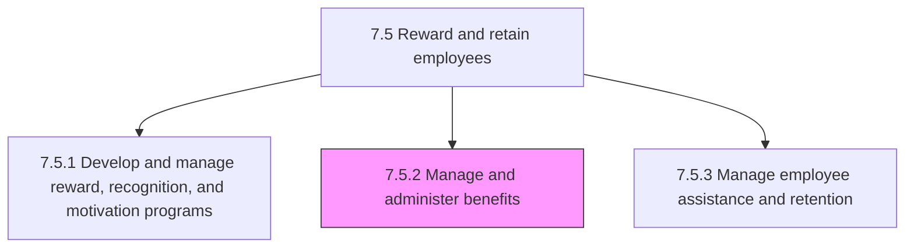
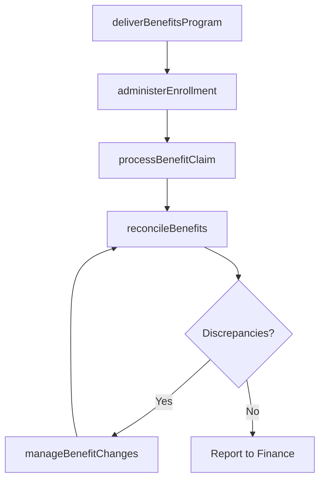

# Manage and administer benefits

> Business-as-Code definition for benefits management and administration. Models benefits program delivery, enrollment processing, claims handling, and benefit reconciliation.

## Overview

Managing and ensuring benefits enrollment by the employees. Process any benefit claims made by the employees. Balance the estimated amount and entitled amount of benefits.

## Process Hierarchy



## GraphDL

```yaml
manage:
  object: And Administer Benefits
  actor: BenefitsAdministrator
  result: BenefitsEnrollmentRecord
```

## Actions

| Action | Description |
|--------|-------------|
| deliverBenefitsProgram | Implement and communicate employee benefits offerings across the organization |
| administerEnrollment | Process employee benefits elections during open enrollment and qualifying life events |
| processBenefitClaim | Review and adjudicate employee benefit claims for eligible expenses |
| reconcileBenefits | Compare benefits delivered against entitlements and resolve discrepancies |
| manageBenefitChanges | Process mid-year benefit modifications for qualifying life events |

## Events

| Event | Description |
|-------|-------------|
| benefitsProgramDelivered | Benefits offerings implemented and communicated to employees |
| enrollmentAdministered | Employee benefits elections processed and confirmed |
| benefitClaimProcessed | Employee benefit claim reviewed and adjudicated |
| benefitsReconciled | Benefits entitlement reconciliation completed |
| benefitChangesManaged | Mid-year benefit modification processed |

## Searches

| Search | Description |
|--------|-------------|
| getEnrollmentStatus | Retrieve employee enrollment elections by plan type or period |
| getBenefitClaims | List benefit claims by employee, status, or claim type |
| getReconciliationReport | Query benefits reconciliation data by plan or department |
| getEligibilityStatus | Check employee eligibility for specific benefits plans |

## Process Flow



## RACI Matrix

| Activity | Responsible | Accountable | Consulted | Informed |
|----------|-------------|-------------|-----------|----------|
| deliverBenefitsProgram | Benefits Administrator | Benefits Manager | Brokers, Legal | All Employees |
| administerEnrollment | Benefits Administrator | Benefits Manager | HRIS Admin | Employee |
| processBenefitClaim | Claims Processor | Benefits Manager | Insurance Carrier | Employee |
| reconcileBenefits | Benefits Analyst | Benefits Manager | Finance, Payroll | VP HR |

## Sub-Processes

| ID | Name | Description |
|----|------|-------------|
| 7.5.2.1 | Deliver employee benefits program | Implementing the programs that specify employee benefits, other than salary provided, such as those  |
| 7.5.2.2 | Administer benefit enrollment | Handling the employee enrollment for obtaining benefits. Manage employee enrollment and eligibility. |
| 7.5.2.3 | Process claims | Processing any formal requests or demands made by the employees claiming that they have earned some  |
| 7.5.2.4 | Perform benefit reconciliation | Carrying out reconciliation of benefits delivered to employees. Compare the estimated benefit requir |

## Related Processes

| Process | Relationship |
|---------|-------------|
| 7.5.1 Develop and manage reward, recognition, and motivation programs | Upstream - benefits plan design feeds administration |
| 7.5.3 Manage employee assistance and retention | Parallel - assistance programs complement benefits |
| 7.5.4 Administer payroll | Downstream - benefits deductions processed through payroll |

## Related Departments

| Department | Role |
|-----------|------|
| Benefits Administration | Manages enrollment, claims processing, and reconciliation |
| Finance | Monitors benefits costs and budget adherence |
| Payroll | Processes benefit deductions and employer contributions |
| Legal | Ensures benefits compliance with ERISA and ACA regulations |

## Related Occupations

| Occupation | Involvement |
|-----------|-------------|
| Benefits Administrator | Manages day-to-day benefits enrollment and claims |
| Benefits Analyst | Performs reconciliation and analyzes utilization data |
| Claims Processor | Reviews and adjudicates employee benefit claims |

## KPIs

| KPI | Description | Unit |
|-----|-------------|------|
| Benefits Enrollment Rate | Percentage of eligible employees enrolled in benefits plans | % |
| Claim Processing Time | Average days from claim submission to adjudication | Days |
| Reconciliation Accuracy | Percentage of benefit transactions reconciled without errors | % |
| Benefits Cost per Employee | Total benefits expenditure divided by enrolled headcount | USD |

## Usage

```typescript
import { manageAndAdministerBenefits } from '@headlessly/manage-and-administer-benefits'

const benefits = manageAndAdministerBenefits()

// Administer enrollment
const enrollment = await benefits.administerEnrollment({
  employeeId: 'emp_12345',
  enrollmentPeriod: 'open-enrollment-2025',
  elections: [
    { plan: 'health-ppo', tier: 'employee-plus-family' },
    { plan: '401k', contributionRate: 0.06 }
  ]
})

// Process a benefit claim
await benefits.processBenefitClaim({
  employeeId: 'emp_12345',
  claimType: 'health',
  amount: 2500,
  serviceDate: '2025-05-15'
})
```
