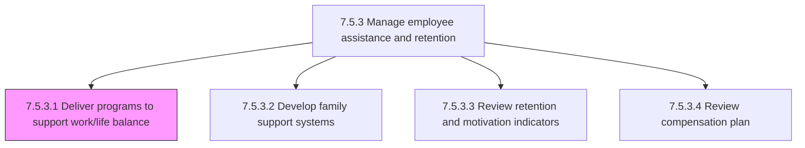
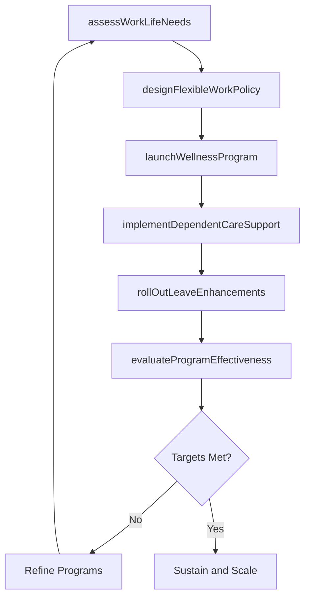

# Deliver programs to support work/life balance for employees

> Business-as-Code definition for work/life balance program delivery. Models the design, implementation, and evaluation of programs that promote balance between professional responsibilities and personal well-being, including flexible work arrangements, wellness initiatives, dependent care support, and leave policies.

## Overview

Designing programs that promote proper balance between work (career and ambition) and lifestyle (health, leisure, family, and personal development). This includes establishing flexible work arrangements such as remote work, compressed schedules, and flextime; launching wellness programs covering physical fitness, mental health, and stress management; providing dependent care assistance including childcare subsidies and elder care referrals; managing leave-of-absence policies beyond statutory requirements; and offering on-the-job development opportunities like sabbaticals and learning stipends. The process measures program effectiveness through employee satisfaction surveys, utilization metrics, and retention impact analysis.

## Process Hierarchy



## GraphDL

```yaml
deliver:
  object: WorkLifeBalancePrograms
  actor: EmployeeWellnessManager
  result: WorkLifeProgramDeliveryRecord
```

## Actions

| Action | Description |
|--------|-------------|
| assessWorkLifeNeeds | Survey employees and analyze utilization data to identify the most impactful work/life balance program areas |
| designFlexibleWorkPolicy | Create policies for remote work, compressed schedules, flextime, and hybrid arrangements with eligibility criteria |
| launchWellnessProgram | Deploy physical fitness, mental health, stress management, and mindfulness programs with vendor partnerships |
| implementDependentCareSupport | Establish childcare subsidies, backup care services, elder care referral networks, and dependent care FSA programs |
| rollOutLeaveEnhancements | Introduce enhanced leave policies beyond statutory minimums including paid parental leave, sabbaticals, and volunteer time off |
| evaluateProgramEffectiveness | Measure program utilization, employee satisfaction, absenteeism trends, and retention correlation to assess ROI |

## Events

| Event | Description |
|-------|-------------|
| workLifeNeedsAssessed | Employee survey completed and work/life balance program priorities identified |
| flexibleWorkPolicyDesigned | Remote work, flextime, and hybrid arrangement policies finalized with eligibility criteria |
| wellnessProgramLaunched | Physical fitness, mental health, or mindfulness program activated with vendor partnerships |
| dependentCareSupportImplemented | Childcare subsidies, backup care, or elder care referral programs deployed to eligible employees |
| leaveEnhancementsRolledOut | Enhanced leave policies (paid parental, sabbatical, VTO) approved and communicated to workforce |
| programEffectivenessEvaluated | Work/life balance program utilization and retention impact analysis completed |

## Searches

| Search | Description |
|--------|-------------|
| findActiveWorkLifePrograms | List active work/life balance programs by category (wellness, flexibility, leave, dependent care) |
| getProgramUtilization | Retrieve utilization rates for specific programs by department, location, or employee demographic |
| getFlexibleWorkArrangements | Query employees with active flexible work arrangements by type and approval status |
| getWellnessEngagementMetrics | Access wellness program participation rates, completion rates, and satisfaction scores |

## Process Flow



## RACI Matrix

| Activity | Responsible | Accountable | Consulted | Informed |
|----------|-------------|-------------|-----------|----------|
| assessWorkLifeNeeds | EmployeeWellnessManager | VP TotalRewards | HRBusinessPartner | EmployeeResourceGroups |
| designFlexibleWorkPolicy | EmployeeWellnessManager | CHRO | LegalCounsel | DepartmentManagers |
| launchWellnessProgram | EmployeeWellnessManager | VP TotalRewards | WellnessVendor | AllEmployees |
| evaluateProgramEffectiveness | HRAnalyst | VP TotalRewards | EmployeeWellnessManager | ExecutiveTeam |

## Related Processes

| Process | Relationship |
|---------|-------------|
| 7.5.3.2 Develop family support systems | Downstream - work/life balance needs assessment informs family support system design |
| 7.5.3.3 Review retention and motivation indicators | Downstream - program utilization data feeds retention indicator analysis |
| 7.5.1.6 Reward and motivate employees | Parallel - work/life programs complement monetary and non-monetary reward programs |
| 7.5.2.1 Deliver employee benefits program | Parallel - wellness and dependent care programs supplement core benefits offerings |
| 7.5.3 Manage employee assistance and retention | Parent - governing process group |

## Related Departments

| Department | Role |
|-----------|------|
| Human Resources | Designs and manages work/life balance program portfolio |
| Employee Wellness | Coordinates wellness vendor partnerships and program delivery |
| Legal | Reviews flexible work policies for labor law compliance |
| Facilities | Supports on-site wellness amenities and flexible workspace configurations |

## Related Occupations

| Occupation | Involvement |
|-----------|-------------|
| Employee Wellness Manager | Designs, launches, and manages work/life balance programs |
| HR Business Partner | Advocates for department-specific program needs and monitors utilization |
| Benefits Analyst | Models program costs and analyzes utilization trends |
| Wellness Program Coordinator | Manages vendor relationships and day-to-day program operations |

## KPIs

| KPI | Description | Unit |
|-----|-------------|------|
| Program Utilization Rate | Percentage of eligible employees actively participating in work/life programs | % |
| Flexible Work Adoption | Percentage of employees with approved flexible work arrangements | % |
| Employee Well-being Score | Average score from employee well-being pulse surveys | Score (1-10) |
| Absenteeism Rate Change | Year-over-year change in unplanned absenteeism rate | % |

## Usage

```typescript
import { deliverWorkLifeBalancePrograms } from '@headlessly/deliver-programs'

const worklife = deliverWorkLifeBalancePrograms()

// Assess work/life balance needs across the organization
const needs = await worklife.assessWorkLifeNeeds({
  surveyId: 'wellbeing-pulse-2026-Q1',
  includeUtilizationData: true,
  segmentBy: ['department', 'location', 'tenure-band']
})

// Launch a new mental health wellness program
const program = await worklife.launchWellnessProgram({
  programType: 'mental-health',
  vendor: 'Spring Health',
  sessionAllocation: 8,
  eligibility: 'all-active-employees',
  launchDate: '2026-03-01'
})
```
