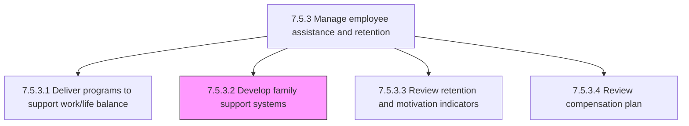
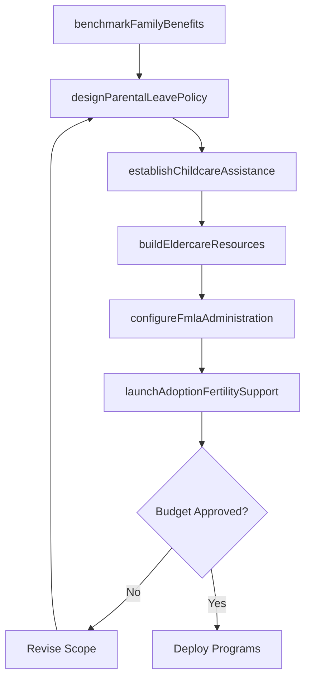

# Develop family support systems

> Business-as-Code definition for family support systems development. Models the design and implementation of organizational support structures for employees with family responsibilities, including parental leave, childcare assistance, family medical leave, adoption support, and eldercare resources, in compliance with FMLA and state family leave laws.

## Overview

Creating a support structure that aligns with local and federal laws for families. This includes designing paid and unpaid parental leave policies (maternity, paternity, adoption), establishing childcare assistance programs such as on-site daycare, backup care partnerships, and dependent care FSA administration, building eldercare referral networks, configuring FMLA and state family leave administration workflows, creating adoption and fertility treatment reimbursement programs, and developing bereavement and family emergency leave policies. The output is a comprehensive family support framework that enhances employee retention, reduces caregiver-related attrition, and ensures compliance with federal and state family leave regulations.

## Process Hierarchy



## GraphDL

```yaml
develop:
  object: FamilySupportSystems
  actor: FamilyBenefitsSpecialist
  result: FamilySupportFramework
```

## Actions

| Action | Description |
|--------|-------------|
| benchmarkFamilyBenefits | Research competitor and market family support offerings to establish a competitive baseline |
| designParentalLeavePolicy | Create paid and unpaid parental leave policies for birth, adoption, and foster placement with eligibility rules and duration |
| establishChildcareAssistance | Set up childcare subsidies, on-site or near-site daycare partnerships, and backup care provider networks |
| buildEldercareResources | Develop eldercare referral services, caregiver support groups, and eldercare leave provisions |
| configureFmlaAdministration | Implement FMLA and state family leave intake workflows, eligibility tracking, and documentation management |
| launchAdoptionFertilitySupport | Deploy adoption expense reimbursement and fertility treatment coverage programs with provider partnerships |

## Events

| Event | Description |
|-------|-------------|
| familyBenefitsBenchmarked | Competitor and market family support offering analysis completed with gap identification |
| parentalLeavePolicyDesigned | Paid and unpaid parental leave policy finalized with eligibility criteria and benefit durations |
| childcareAssistanceEstablished | Childcare subsidies, daycare partnerships, or backup care networks activated for eligible employees |
| eldercareResourcesBuilt | Eldercare referral services, support groups, and leave provisions deployed |
| fmlaAdministrationConfigured | FMLA and state family leave workflows, eligibility tracking, and documentation processes implemented |
| adoptionFertilitySupportLaunched | Adoption reimbursement and fertility treatment coverage programs activated with provider network |

## Searches

| Search | Description |
|--------|-------------|
| findFamilySupportPrograms | List active family support programs by category (parental leave, childcare, eldercare, FMLA) |
| getParentalLeaveUtilization | Retrieve parental leave usage rates by gender, department, and leave type |
| getFmlaLeaveStatus | Query active FMLA leave cases by employee, leave type, and remaining entitlement balance |
| getChildcareProviderNetwork | List contracted childcare and backup care providers by location and availability |

## Process Flow



## RACI Matrix

| Activity | Responsible | Accountable | Consulted | Informed |
|----------|-------------|-------------|-----------|----------|
| benchmarkFamilyBenefits | FamilyBenefitsSpecialist | VP TotalRewards | BenefitsConsultant | CHRO |
| designParentalLeavePolicy | FamilyBenefitsSpecialist | VP TotalRewards | LegalCounsel | HRBusinessPartner |
| establishChildcareAssistance | FamilyBenefitsSpecialist | VP TotalRewards | ChildcareVendor | AllEmployees |
| configureFmlaAdministration | LeaveAdministrator | FamilyBenefitsSpecialist | LegalCounsel | HRISTeam |
| launchAdoptionFertilitySupport | FamilyBenefitsSpecialist | VP TotalRewards | FertilityProvider | AllEmployees |

## Related Processes

| Process | Relationship |
|---------|-------------|
| 7.5.3.1 Deliver programs to support work/life balance | Upstream - work/life balance needs assessment identifies family support gaps |
| 7.5.3.3 Review retention and motivation indicators | Downstream - family support program utilization feeds retention analysis |
| 7.5.2.1 Deliver employee benefits program | Parallel - family support benefits complement core health and insurance programs |
| 7.5.1.4 Identify compensation requirements based on financial, benefits, and HR policies | Upstream - policy mandates define family leave compliance requirements |
| 7.5.3 Manage employee assistance and retention | Parent - governing process group |

## Related Departments

| Department | Role |
|-----------|------|
| Benefits Administration | Designs and administers family support benefit programs |
| Legal and Compliance | Ensures family leave policies comply with FMLA, state laws, and ADA |
| Human Resources | Manages leave administration workflows and employee communications |
| Procurement | Contracts with childcare, eldercare, and fertility service vendors |

## Related Occupations

| Occupation | Involvement |
|-----------|-------------|
| Family Benefits Specialist | Designs family support programs and manages vendor relationships |
| Leave Administrator | Processes FMLA and state family leave requests and tracks entitlements |
| Benefits Consultant | Advises on competitive family benefits positioning and program ROI |
| HR Business Partner | Advocates for employee family support needs and facilitates leave conversations |

## KPIs

| KPI | Description | Unit |
|-----|-------------|------|
| Parental Leave Utilization Rate | Percentage of eligible employees who use available parental leave | % |
| Return-from-Leave Retention | Percentage of employees returning from family leave who remain employed after 12 months | % |
| Childcare Program Enrollment | Number of employees enrolled in childcare subsidy or backup care programs | Count |
| FMLA Processing Time | Average business days from FMLA request to eligibility determination | Days |

## Usage

```typescript
import { developFamilySupportSystems } from '@headlessly/develop-family-support-systems'

const familySupport = developFamilySupportSystems()

// Benchmark family benefits against market competitors
const benchmark = await familySupport.benchmarkFamilyBenefits({
  industryGroup: 'technology',
  companySize: '1000-5000',
  regions: ['us-west', 'us-east'],
  programCategories: ['parental-leave', 'childcare', 'fertility']
})

// Configure FMLA administration for a new state requirement
const fmla = await familySupport.configureFmlaAdministration({
  jurisdiction: 'California',
  leaveTypes: ['CFRA', 'PDL', 'federal-FMLA'],
  eligibilityRules: { tenureMonths: 12, hoursWorked: 1250 },
  documentationRequired: ['medical-certification', 'employer-response']
})
```
