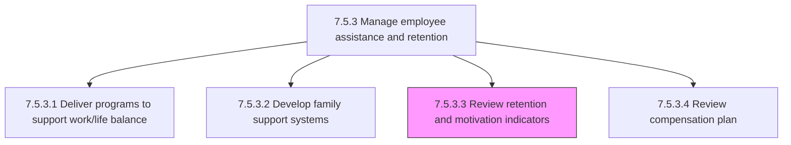
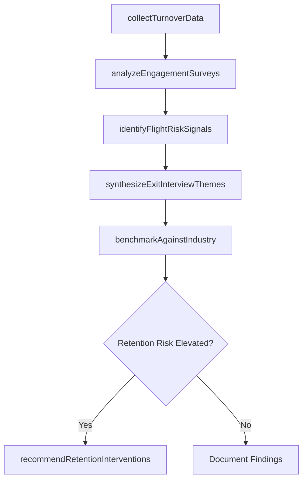

# Review retention and motivation indicators

> Business-as-Code definition for retention and motivation indicator review. Models the periodic analysis of workforce retention metrics, engagement survey data, turnover patterns, and flight risk signals to identify retention threats and inform corrective action plans.

## Overview

Reassessing the indicators for retention and motivation of employees. This includes analyzing voluntary turnover rates by department, tenure band, and job family; reviewing engagement survey results and eNPS scores; monitoring flight risk signals such as vesting cliffs, promotion stagnation, and compensation below market; tracking exit interview themes and regrettable loss patterns; benchmarking retention metrics against industry norms; and producing actionable recommendations for HR leadership on where to invest in retention interventions. The process runs quarterly with ad-hoc analysis triggered by significant attrition events.

## Process Hierarchy



## GraphDL

```yaml
review:
  object: RetentionAndMotivationIndicators
  actor: WorkforceAnalyticsAnalyst
  result: RetentionIndicatorReport
```

## Actions

| Action | Description |
|--------|-------------|
| collectTurnoverData | Extract voluntary and involuntary turnover records by department, job family, tenure band, and performance rating |
| analyzeEngagementSurveys | Parse engagement survey results, eNPS scores, and pulse survey trends to identify motivation patterns |
| identifyFlightRiskSignals | Flag employees exhibiting flight risk indicators such as equity vesting cliffs, stalled promotions, or below-market pay |
| synthesizeExitInterviewThemes | Aggregate and categorize exit interview feedback to surface recurring departure reasons and systemic issues |
| benchmarkAgainstIndustry | Compare organizational retention metrics against industry benchmarks and labor market trends |
| recommendRetentionInterventions | Produce an actionable retention action plan with prioritized interventions, owners, and expected impact |

## Events

| Event | Description |
|-------|-------------|
| turnoverDataCollected | Voluntary and involuntary turnover data extracted and segmented for analysis |
| engagementSurveysAnalyzed | Engagement survey results, eNPS scores, and pulse survey trends parsed and patterns identified |
| flightRiskSignalsIdentified | Employees with elevated flight risk flagged based on compensation, promotion, and vesting indicators |
| exitInterviewThemesSynthesized | Exit interview feedback aggregated with recurring departure themes and systemic issues surfaced |
| industryBenchmarkCompleted | Organizational retention metrics compared against industry norms with gap analysis produced |
| retentionInterventionsRecommended | Prioritized retention action plan delivered to HR leadership with owners and expected ROI |

## Searches

| Search | Description |
|--------|-------------|
| getTurnoverTrends | Retrieve voluntary turnover rates segmented by department, job family, tenure band, or time period |
| getEngagementScores | Query engagement survey scores and eNPS by department, manager, or survey cycle |
| findFlightRiskEmployees | List employees flagged as flight risks with contributing risk factors and scores |
| getExitInterviewInsights | Retrieve aggregated exit interview themes and departure reason frequencies |

## Process Flow



## RACI Matrix

| Activity | Responsible | Accountable | Consulted | Informed |
|----------|-------------|-------------|-----------|----------|
| collectTurnoverData | WorkforceAnalyticsAnalyst | VP HR | HRISTeam | HRBusinessPartner |
| analyzeEngagementSurveys | WorkforceAnalyticsAnalyst | VP HR | EngagementSurveyVendor | DepartmentManagers |
| identifyFlightRiskSignals | WorkforceAnalyticsAnalyst | VP HR | CompensationAnalyst | HRBusinessPartner |
| recommendRetentionInterventions | VP HR | CHRO | WorkforceAnalyticsAnalyst | ExecutiveTeam |

## Related Processes

| Process | Relationship |
|---------|-------------|
| 7.5.3.4 Review compensation plan | Downstream - retention risk findings trigger compensation plan review |
| 7.5.3.1 Deliver programs to support work/life balance | Upstream - program utilization data feeds retention indicator analysis |
| 7.5.3.2 Develop family support systems | Upstream - family support program participation informs retention trends |
| 7.5.1.6 Reward and motivate employees | Parallel - recognition program effectiveness correlates with retention outcomes |
| 7.5.3 Manage employee assistance and retention | Parent - governing process group |

## Related Departments

| Department | Role |
|-----------|------|
| People Analytics | Collects, models, and reports on retention and engagement metrics |
| Human Resources | Owns retention strategy and implements intervention programs |
| Compensation and Benefits | Provides market pay data and benefits utilization for retention analysis |
| Department Management | Acts on retention recommendations and manages individual flight risk cases |

## Related Occupations

| Occupation | Involvement |
|-----------|-------------|
| Workforce Analytics Analyst | Collects turnover data, models flight risk, and produces retention reports |
| HR Business Partner | Contextualizes retention data with department-specific workforce knowledge |
| Compensation Analyst | Provides market pay comparison data for flight risk identification |
| VP of Human Resources | Sponsors retention strategy and approves intervention action plans |

## KPIs

| KPI | Description | Unit |
|-----|-------------|------|
| Voluntary Turnover Rate | Annualized percentage of employees who voluntarily resign | % |
| Regrettable Loss Rate | Percentage of voluntary departures classified as high-performer or critical-role losses | % |
| Employee Net Promoter Score (eNPS) | Net percentage of employees who would recommend the organization as a place to work | Score (-100 to 100) |
| Flight Risk Prediction Accuracy | Percentage of employees flagged as flight risks who actually depart within 12 months | % |

## Usage

```typescript
import { reviewRetentionIndicators } from '@headlessly/review-retention-and-motivation-indicators'

const retention = reviewRetentionIndicators()

// Collect and analyze turnover data for the quarter
const turnover = await retention.collectTurnoverData({
  period: 'Q4-2025',
  segmentBy: ['department', 'job-family', 'tenure-band'],
  includePerformanceRatings: true
})

// Identify employees with elevated flight risk
const flightRisk = await retention.identifyFlightRiskSignals({
  department: 'engineering',
  riskFactors: ['below-market-pay', 'promotion-stagnation', 'vesting-cliff'],
  threshold: 'high'
})
```
