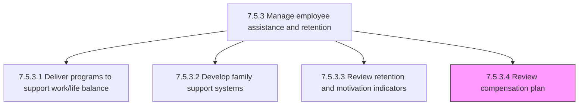
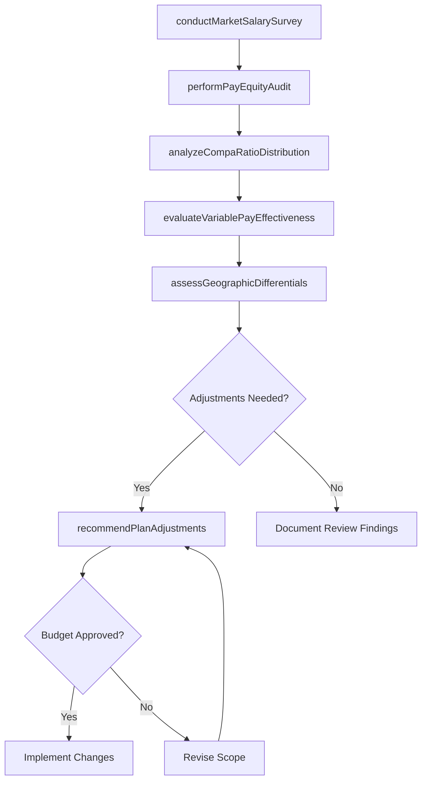

# Review compensation plan

> Business-as-Code definition for compensation plan review. Models the periodic evaluation of existing compensation structures against market benchmarks, internal equity analysis, budget constraints, and retention data to determine whether adjustments are needed to maintain competitiveness and retain talent.

## Overview

Analyzing existing compensation plans and making changes necessary to continue to retain employees. This includes conducting market salary surveys and comparing pay ranges against benchmark data, performing internal pay equity audits across protected classes and job families, reviewing compa-ratio distributions to identify overpaid and underpaid populations, evaluating the effectiveness of variable pay programs against business performance targets, assessing geographic pay differential accuracy, and producing recommendations for salary structure adjustments, merit budget allocation changes, or targeted market corrections. The review runs annually aligned with the compensation planning cycle and ad-hoc when triggered by elevated retention risk or significant market movement.

## Process Hierarchy



## GraphDL

```yaml
review:
  object: CompensationPlan
  actor: CompensationAnalyst
  result: CompensationPlanAssessment
```

## Actions

| Action | Description |
|--------|-------------|
| conductMarketSalarySurvey | Collect and analyze salary survey data from compensation benchmarking providers to establish market positioning |
| performPayEquityAudit | Analyze compensation across gender, ethnicity, and other protected classes to identify and quantify pay gaps |
| analyzeCompaRatioDistribution | Review the distribution of employee pay relative to salary range midpoints across departments and job families |
| evaluateVariablePayEffectiveness | Assess bonus and incentive program payouts against business performance targets and employee participation rates |
| assessGeographicDifferentials | Validate geographic pay differentials against cost-of-labor indices and remote work population shifts |
| recommendPlanAdjustments | Produce a compensation plan revision proposal with salary structure changes, market corrections, and budget impact analysis |

## Events

| Event | Description |
|-------|-------------|
| marketSalarySurveyConducted | Salary survey data collected and market positioning analysis completed for all benchmarked roles |
| payEquityAuditPerformed | Pay gap analysis across protected classes completed with remediation recommendations |
| compaRatioDistributionAnalyzed | Employee compa-ratio distribution reviewed with underpaid and overpaid populations identified |
| variablePayEffectivenessEvaluated | Bonus and incentive program effectiveness assessed against targets and participation metrics |
| geographicDifferentialsAssessed | Geographic pay differentials validated against current cost-of-labor and remote work data |
| planAdjustmentsRecommended | Compensation plan revision proposal delivered with structure changes, corrections, and budget impact |

## Searches

| Search | Description |
|--------|-------------|
| getMarketBenchmarkData | Retrieve salary survey benchmark data by job family, level, and geographic region |
| getPayEquityGaps | Query identified pay gaps by protected class, department, or job family with gap magnitude |
| getCompaRatiosByDepartment | Retrieve average compa-ratios by department, job family, or manager with distribution statistics |
| getCompensationPlanVersions | List historical compensation plan versions with effective dates and key changes |

## Process Flow



## RACI Matrix

| Activity | Responsible | Accountable | Consulted | Informed |
|----------|-------------|-------------|-----------|----------|
| conductMarketSalarySurvey | CompensationAnalyst | CompensationManager | BenchmarkSurveyVendor | VP TotalRewards |
| performPayEquityAudit | CompensationAnalyst | CompensationManager | LegalCounsel | CHRO |
| analyzeCompaRatioDistribution | CompensationAnalyst | CompensationManager | HRBusinessPartner | DepartmentManagers |
| recommendPlanAdjustments | CompensationManager | VP TotalRewards | Finance | CHRO |

## Related Processes

| Process | Relationship |
|---------|-------------|
| 7.5.3.3 Review retention and motivation indicators | Upstream - retention risk findings trigger compensation plan review |
| 7.5.1.1 Develop salary/compensation structure and plan | Downstream - plan review recommendations feed salary structure redesign |
| 7.5.1.3 Perform competitive analysis of benefits and rewards | Parallel - market analysis data supplements compensation benchmarking |
| 7.5.1.5 Administer compensation and rewards to employees | Downstream - approved plan adjustments are implemented through administration |
| 7.5.3 Manage employee assistance and retention | Parent - governing process group |

## Related Departments

| Department | Role |
|-----------|------|
| Compensation and Benefits | Conducts analysis, produces recommendations, and implements plan changes |
| Finance | Reviews budget impact and approves compensation plan adjustment funding |
| Legal | Reviews pay equity audit findings for litigation risk and regulatory compliance |
| People Analytics | Provides workforce data, turnover analysis, and compa-ratio modeling |

## Related Occupations

| Occupation | Involvement |
|-----------|-------------|
| Compensation Analyst | Performs market surveys, equity audits, and compa-ratio analysis |
| Compensation Manager | Oversees the review process and authors plan adjustment recommendations |
| Employment Lawyer | Reviews pay equity findings for legal risk and compliance implications |
| HR Business Partner | Provides department-level context and advocates for specific adjustment needs |

## KPIs

| KPI | Description | Unit |
|-----|-------------|------|
| Market Competitiveness Ratio | Average of organization pay at target percentile versus market benchmark | Percentile |
| Pay Equity Gap | Maximum unexplained pay gap percentage across protected classes | % |
| Compa-Ratio Average | Organization-wide average compa-ratio indicating pay versus range midpoint | Ratio |
| Compensation Plan Review Cycle Time | Days from review initiation to approved plan adjustment recommendations | Days |

## Usage

```typescript
import { reviewCompensationPlan } from '@headlessly/review-compensation-plan'

const compReview = reviewCompensationPlan()

// Conduct a market salary survey for engineering roles
const survey = await compReview.conductMarketSalarySurvey({
  jobFamily: 'software-engineering',
  levels: ['IC3', 'IC4', 'IC5', 'M1', 'M2'],
  regions: ['us-west', 'us-east', 'remote-us'],
  surveySource: 'radford',
  targetPercentile: 75
})

// Perform a pay equity audit across the organization
const equityAudit = await compReview.performPayEquityAudit({
  protectedClasses: ['gender', 'ethnicity'],
  controlVariables: ['job-family', 'level', 'tenure', 'location'],
  significanceThreshold: 0.05,
  includeRemediationCosts: true
})
```
