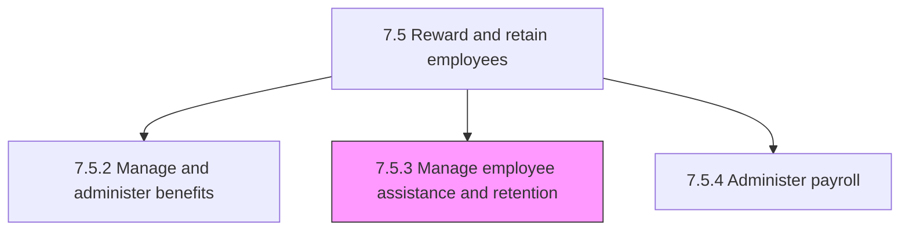
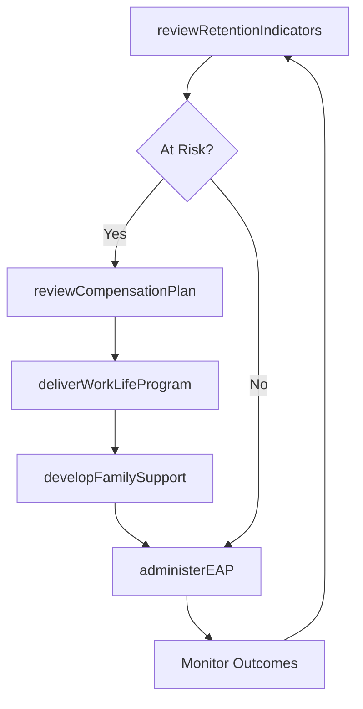

# Manage employee assistance and retention

> Business-as-Code definition for employee assistance and retention management. Models work-life balance programs, family support systems, retention indicator monitoring, and compensation plan review.

## Overview

Managing activities centered around delivering programs to support work/life balance for employees; developing family support systems; reviewing retention and motivation indicators; and reviewing compensation plans.

## Process Hierarchy



## GraphDL

```yaml
manage:
  object: Employee Assistance And Retention
  actor: EmployeeExperienceManager
  result: RetentionStrategy
```

## Actions

| Action | Description |
|--------|-------------|
| deliverWorkLifeProgram | Implement flexible work, wellness, and work-life balance initiatives |
| developFamilySupport | Create family assistance programs including parental leave and dependent care |
| reviewRetentionIndicators | Analyze turnover data, engagement scores, and flight risk signals |
| reviewCompensationPlan | Assess compensation competitiveness and recommend adjustments |
| administerEAP | Manage employee assistance program for counseling and support services |

## Events

| Event | Description |
|-------|-------------|
| workLifeProgramDelivered | Work-life balance initiative implemented and communicated |
| familySupportDeveloped | Family assistance program created or updated |
| retentionIndicatorsReviewed | Turnover and engagement data analysis completed |
| compensationPlanReviewed | Compensation assessment completed with recommendations |
| eapAdministered | Employee assistance program services delivered |

## Searches

| Search | Description |
|--------|-------------|
| getRetentionMetrics | Retrieve turnover, engagement, and retention data by department or period |
| getFlightRiskEmployees | List employees flagged as high flight risk based on indicators |
| getEAPUtilization | Query employee assistance program usage by category or period |
| getWorkLifeProgramParticipation | Retrieve participation rates for wellness and balance programs |

## Process Flow



## RACI Matrix

| Activity | Responsible | Accountable | Consulted | Informed |
|----------|-------------|-------------|-----------|----------|
| deliverWorkLifeProgram | Employee Experience Manager | VP HR | Department Heads | All Employees |
| developFamilySupport | Benefits Manager | VP HR | Legal | All Employees |
| reviewRetentionIndicators | HR Analyst | VP HR | Finance, Department Heads | CHRO |
| reviewCompensationPlan | Compensation Manager | VP HR | Finance | Department Heads |

## Sub-Processes

| ID | Name | Description |
|----|------|-------------|
| 7.5.3.1 | Deliver programs to support work/life balance for employees | Designing programs that prompt proper balance between work (i.e., career and ambition) and lifestyle |
| 7.5.3.2 | Develop family support systems | Creating a support structure that aligns with local and federal laws that allow for support for fami |
| 7.5.3.3 | Review retention and motivation indicators | Reassessing the indicators for retention and motivation of employees. Monitor the indicators that si |
| 7.5.3.4 | Review compensation plan | Analyzing existing compensation plans and making changes necessary to continue to retain employees. |

## Related Processes

| Process | Relationship |
|---------|-------------|
| 7.5.1 Develop and manage reward, recognition, and motivation programs | Upstream - reward programs contribute to retention |
| 7.5.2 Manage and administer benefits | Parallel - benefits administration supports retention |
| 7.3.2 Manage employee performance | Upstream - performance data informs retention risk assessment |
| 7.6.2 Manage separation | Downstream - failed retention leads to employee separation |

## Related Departments

| Department | Role |
|-----------|------|
| Human Resources | Designs and manages retention and assistance programs |
| Employee Experience | Implements wellness and work-life balance initiatives |
| Finance | Approves retention budgets and compensation adjustments |
| Legal | Ensures compliance with leave and family support regulations |

## Related Occupations

| Occupation | Involvement |
|-----------|-------------|
| Employee Experience Manager | Designs and delivers retention and wellness programs |
| HR Analyst | Monitors retention indicators and flight risk data |
| EAP Coordinator | Manages employee assistance program services |

## KPIs

| KPI | Description | Unit |
|-----|-------------|------|
| Voluntary Turnover Rate | Percentage of employees voluntarily leaving the organization | % |
| Employee Engagement Score | Average employee engagement survey rating | Score (1-5) |
| EAP Utilization Rate | Percentage of employees using employee assistance services | % |
| Retention of High Performers | Percentage of top-rated employees retained year over year | % |

## Usage

```typescript
import { manageEmployeeAssistanceAndRetention } from '@headlessly/manage-employee-assistance-and-retention'

const retention = manageEmployeeAssistanceAndRetention()

// Review retention indicators
const analysis = await retention.reviewRetentionIndicators({
  department: 'engineering',
  period: '2025-H1',
  indicators: ['turnover', 'engagement', 'flight-risk']
})

// Deliver a work-life balance program
await retention.deliverWorkLifeProgram({
  program: 'flexible-friday',
  targetAudience: 'all-employees',
  startDate: '2025-07-01'
})
```
