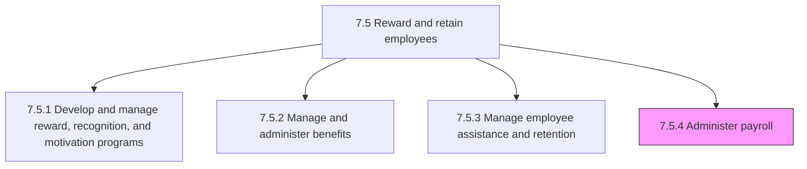
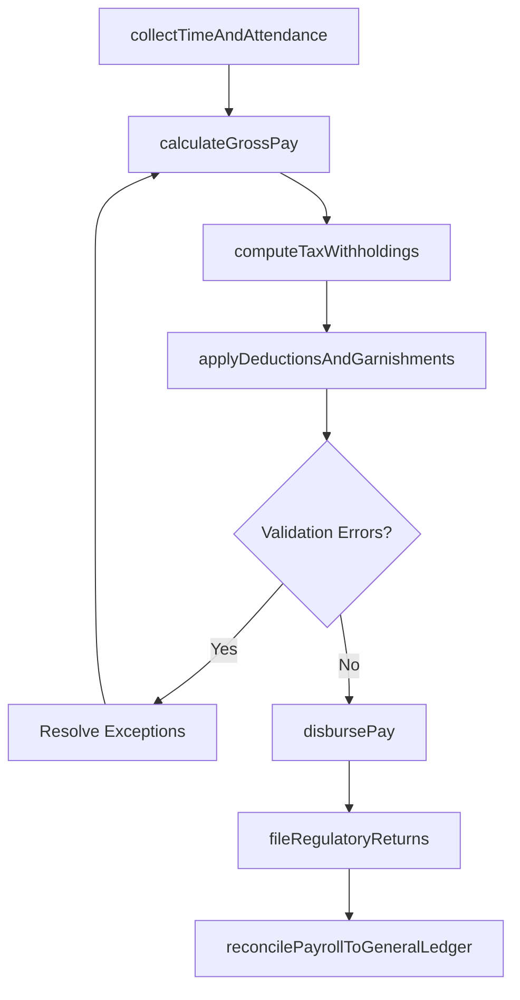

# Administer payroll

> Business-as-Code definition for payroll administration. Models the end-to-end payroll processing lifecycle including gross pay calculation, tax withholding, deduction processing, net pay disbursement, regulatory filing, and general ledger reconciliation across all pay cycles.

## Overview

Managing the sum of all financial records of salaries for an employee, including wages, bonuses, and deductions. This includes collecting time and attendance data, calculating gross pay from base salary, overtime, shift differentials, and variable pay components, computing federal, state, and local tax withholdings, applying pre-tax and post-tax deductions (benefits premiums, retirement contributions, garnishments), generating net pay for direct deposit or check issuance, producing itemized pay stubs, submitting quarterly and annual tax filings (941, W-2, state unemployment), and reconciling payroll journal entries against the general ledger. The process handles multi-state, multi-currency, and expatriate payroll scenarios with compliance across all applicable jurisdictions.

## Process Hierarchy



## GraphDL

```yaml
administer:
  object: Payroll
  actor: PayrollManager
  result: PayrollCycleRecord
```

## Actions

| Action | Description |
|--------|-------------|
| collectTimeAndAttendance | Import approved timesheet data, PTO usage, overtime hours, and shift records from the time tracking system |
| calculateGrossPay | Compute gross pay from base salary, overtime, shift differentials, commissions, bonuses, and retroactive adjustments |
| computeTaxWithholdings | Calculate federal income tax, FICA (Social Security and Medicare), state income tax, and local taxes based on W-4 elections and jurisdiction rules |
| applyDeductionsAndGarnishments | Process pre-tax deductions (401k, HSA, transit), post-tax deductions (Roth 401k, voluntary benefits), and court-ordered garnishments |
| disbursePay | Execute direct deposit transmissions, generate paper checks for exceptions, and produce itemized pay stubs for all employees |
| fileRegulatoryReturns | Submit quarterly Form 941, annual W-2s, state unemployment returns, and new hire reports to applicable agencies |
| reconcilePayrollToGeneralLedger | Match payroll journal entries against general ledger accounts to ensure accurate expense recognition and liability tracking |

## Events

| Event | Description |
|-------|-------------|
| timeAndAttendanceCollected | Approved timesheets, PTO, overtime, and shift data imported for the pay period |
| grossPayCalculated | Gross pay computed for all employees including base, variable, and retroactive components |
| taxWithholdingsComputed | Federal, state, local, and FICA tax withholdings calculated based on current elections and rates |
| deductionsApplied | Pre-tax, post-tax deductions, and garnishments processed and validated against plan limits |
| payDisbursed | Direct deposits transmitted, paper checks generated, and pay stubs distributed |
| regulatoryReturnsFiled | Quarterly and annual tax returns and government reports filed with applicable agencies |
| payrollReconciledToGL | Payroll journal entries matched against general ledger with variances investigated and resolved |

## Searches

| Search | Description |
|--------|-------------|
| getPayrollRunStatus | Retrieve the processing status of current or historical payroll runs by pay period and cycle type |
| findEmployeePayHistory | List pay history for a specific employee including gross, deductions, taxes, and net by pay period |
| getPendingGarnishments | Query active garnishments by employee, type (child support, tax levy, student loan), and remaining balance |
| getTaxFilingStatus | Retrieve the filing status of quarterly and annual tax returns by jurisdiction and reporting period |

## Process Flow



## RACI Matrix

| Activity | Responsible | Accountable | Consulted | Informed |
|----------|-------------|-------------|-----------|----------|
| collectTimeAndAttendance | PayrollSpecialist | PayrollManager | HRISTeam | DepartmentManagers |
| calculateGrossPay | PayrollSpecialist | PayrollManager | CompensationAdministrator | Finance |
| computeTaxWithholdings | PayrollTaxSpecialist | PayrollManager | TaxAccountant | ComplianceOfficer |
| disbursePay | PayrollSpecialist | PayrollManager | BankingPartner | AllEmployees |
| fileRegulatoryReturns | PayrollTaxSpecialist | PayrollManager | ExternalTaxAdvisor | CFO |
| reconcilePayrollToGeneralLedger | PayrollSpecialist | CFO | FinancialController | InternalAudit |

## Related Processes

| Process | Relationship |
|---------|-------------|
| 7.5.1.5 Administer compensation and rewards to employees | Upstream - compensation changes (merit, bonus, equity) feed payroll inputs |
| 7.5.2.2 Administer benefit enrollment | Upstream - enrollment elections determine payroll deduction amounts |
| 7.5.2.4 Perform benefit reconciliation | Parallel - payroll deduction records support carrier invoice reconciliation |
| 7.5.3.4 Review compensation plan | Upstream - approved compensation adjustments flow into payroll processing |
| 7.5 Reward and retain employees | Parent - governing process group |

## Related Departments

| Department | Role |
|-----------|------|
| Payroll | Executes payroll processing, disbursement, and tax filing |
| Finance | Owns general ledger reconciliation and expense reporting |
| Human Resources | Provides employee data changes, new hires, and terminations |
| Tax and Compliance | Ensures payroll tax calculations and filings meet regulatory requirements |

## Related Occupations

| Occupation | Involvement |
|-----------|-------------|
| Payroll Manager | Oversees payroll operations, compliance, and team performance |
| Payroll Specialist | Processes payroll runs, resolves exceptions, and generates pay stubs |
| Payroll Tax Specialist | Manages tax withholding calculations and regulatory filings |
| Financial Controller | Reviews payroll journal entries and ensures general ledger accuracy |

## KPIs

| KPI | Description | Unit |
|-----|-------------|------|
| Payroll Accuracy Rate | Percentage of pay cycles processed without errors requiring correction | % |
| Payroll On-Time Rate | Percentage of pay runs completed and disbursed by the scheduled pay date | % |
| Cost Per Paycheck | Total payroll department operating cost divided by number of paychecks processed | USD |
| Tax Filing Compliance | Percentage of regulatory tax returns filed on time and without penalties | % |

## Usage

```typescript
import { administerPayroll } from '@headlessly/administer-payroll'

const payroll = administerPayroll()

// Process bi-weekly payroll run
const run = await payroll.calculateGrossPay({
  payPeriod: '2026-PP-03',
  payDate: '2026-02-13',
  cycleType: 'bi-weekly',
  includeRetroactive: true
})

// Reconcile the payroll run against the general ledger
const reconciliation = await payroll.reconcilePayrollToGeneralLedger({
  payrollRunId: run.id,
  glAccountMapping: 'standard-v3',
  varianceThreshold: 50.00,
  autoPostJournalEntries: true
})
```
