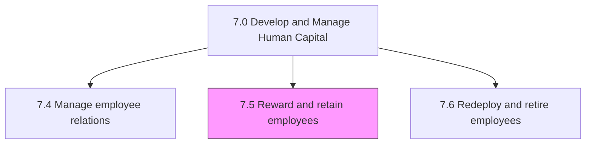
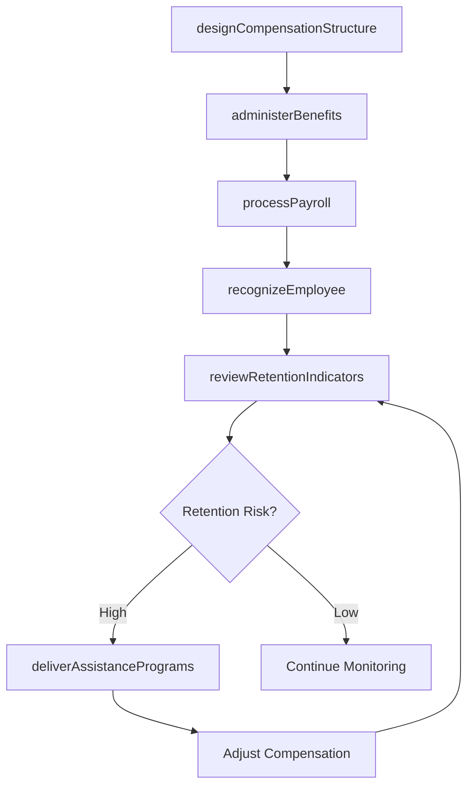

# Reward and retain employees

> Business-as-Code definition for employee rewards and retention management. Models compensation structures, benefits administration, recognition programs, employee assistance, and payroll processing.

## Overview

Creating frameworks for rewarding and recognizing employees with the objective of retaining them. Create and manage programs for provision of rewards, recognition, and motivation. Manage and administer the benefits for employees. Help assist and retain employees. Administer payroll to employees.

## Process Hierarchy



## GraphDL

```yaml
reward:
  object: And Retain Employees
  actor: CompensationAndBenefitsManager
  result: RetentionOutcome
```

## Actions

| Action | Description |
|--------|-------------|
| designCompensationStructure | Define salary bands, grade levels, and pay equity guidelines |
| administerBenefits | Enroll employees in benefits and process benefit changes |
| processPayroll | Calculate and distribute employee compensation |
| recognizeEmployee | Award recognition through bonus, promotion, or non-monetary programs |
| manageBenefitClaims | Process employee benefit claims and reimbursements |
| reviewRetentionIndicators | Analyze turnover risk and retention program effectiveness |
| deliverAssistancePrograms | Provide work-life balance and employee assistance programs |

## Events

| Event | Description |
|-------|-------------|
| compensationStructureDesigned | Salary and incentive framework updated and approved |
| benefitsAdministered | Employee benefits enrollment or change processed |
| payrollProcessed | Payroll cycle completed and compensation distributed |
| employeeRecognized | Employee reward or recognition awarded |
| benefitClaimManaged | Benefit claim processed and settled |
| retentionIndicatorsReviewed | Retention analysis completed with recommendations |
| assistanceProgramDelivered | Employee assistance program session or benefit delivered |

## Searches

| Search | Description |
|--------|-------------|
| getCompensationData | Retrieve salary and compensation data by employee, grade, or department |
| getBenefitsEnrollment | Query benefits enrollment status by employee or plan type |
| getPayrollHistory | Retrieve payroll records by employee, period, or pay component |
| getRetentionMetrics | Query turnover rates and retention metrics by segment |
| getRecognitionHistory | List employee recognition awards by type or period |

## Process Flow



## RACI Matrix

| Activity | Responsible | Accountable | Consulted | Informed |
|----------|-------------|-------------|-----------|----------|
| designCompensationStructure | Compensation Manager | VP Human Resources | Finance, Legal | Department Heads |
| administerBenefits | Benefits Administrator | Compensation Manager | Vendors | Employees |
| processPayroll | Payroll Specialist | Compensation Manager | Finance, Tax | Employees |
| recognizeEmployee | Manager | Department Head | HR | Employees |
| reviewRetentionIndicators | HR Analyst | VP Human Resources | Business Unit Leaders | Executive Team |

## Sub-Processes

| ID | Name | Description |
|----|------|-------------|
| 7.5.1 | Develop and manage reward, recognition, and motivation programs | Developing a salary/compensation structure and plan; developing a benefits and reward plan; develop  |
| 7.5.2 | Manage and administer benefits | Managing and ensuring benefits enrollment by the employees. Process any benefit claims made by the e |
| 7.5.3 | Manage employee assistance and retention | Managing activities centered around delivering programs to support work/life balance for employees;  |
| 7.5.4 | Administer payroll | Managing the sum of all financial records of salaries for an employee, including wages, bonuses, and |

## Related Processes

| Process | Relationship |
|---------|-------------|
| 7.1 Develop and manage HR planning, policies, and strategies | Upstream - compensation strategy derives from HR strategy |
| 7.3 Manage employee on-boarding, development, and training | Parallel - performance outcomes influence compensation |
| 9.0 Manage Financial Resources | Supporting - payroll and benefits require financial processing |

## Related Departments

| Department | Role |
|-----------|------|
| Compensation and Benefits | Designs and administers total rewards programs |
| Finance | Manages payroll accounting and benefits cost forecasting |
| Human Resources | Oversees retention programs and employee assistance |
| Legal | Ensures compensation practices comply with labor regulations |
| All Departments | Managers participate in recognition and retention efforts |

## Related Occupations

| Occupation | Involvement |
|-----------|-------------|
| Compensation Analyst | Designs salary structures and performs market benchmarking |
| Benefits Administrator | Manages enrollment, claims, and vendor relationships |
| Payroll Specialist | Processes payroll calculations and tax withholdings |
| Employee Assistance Counselor | Delivers work-life balance and wellness programs |

## KPIs

| KPI | Description | Unit |
|-----|-------------|------|
| Voluntary Turnover Rate | Percentage of employees who leave voluntarily per year | % |
| Compensation Competitiveness Ratio | Company pay relative to market median for comparable roles | Ratio |
| Benefits Utilization Rate | Percentage of eligible employees enrolled in benefits | % |
| Payroll Accuracy Rate | Percentage of payroll cycles processed without errors | % |
| Employee Satisfaction with Compensation | Survey score on compensation satisfaction | Score (1-5) |

## Usage

```typescript
import { rewardAndRetainEmployees } from '@headlessly/reward-and-retain-employees'

const rewards = rewardAndRetainEmployees()

// Process monthly payroll
const payroll = await rewards.processPayroll({
  period: '2025-03',
  businessUnit: 'engineering',
  includeBonus: true
})

// Review retention indicators
const retention = await rewards.reviewRetentionIndicators({
  department: 'product',
  period: '2025-Q1',
  riskThreshold: 'high'
})
```
