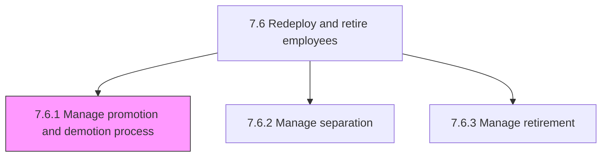
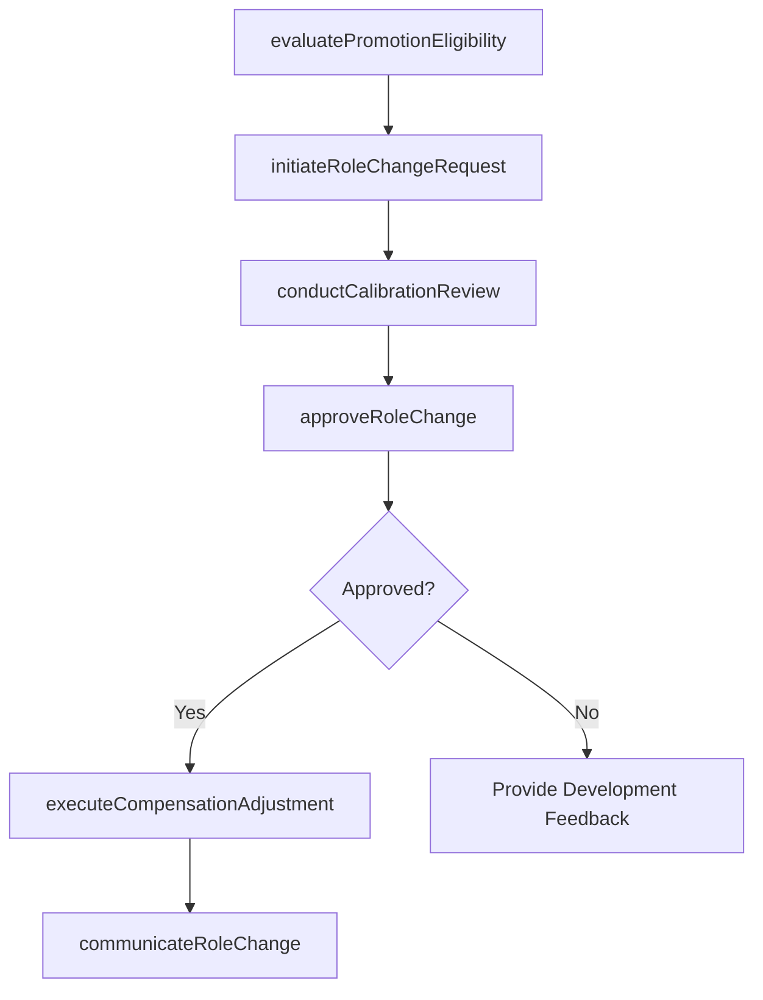

# Manage promotion and demotion process

> Business-as-Code definition for promotion and demotion management. Models the end-to-end process of evaluating employees for role changes, conducting calibration reviews, executing promotions and demotions with compensation adjustments, and communicating outcomes to employees and stakeholders.

## Overview

Administering the process of promoting and demoting employees. This includes evaluating promotion eligibility against performance ratings, tenure, competency assessments, and readiness criteria; initiating formal promotion or demotion requests with business justification; conducting cross-functional calibration sessions to ensure consistency and fairness across departments; routing requests through multi-level approval workflows; adjusting salary bands, job grades, titles, and benefits upon approval; and communicating role changes to the employee, their team, and supporting departments. The process supports horizontal promotions (lateral moves with expanded scope), vertical promotions (grade advancement), and involuntary or voluntary demotions with appropriate documentation and compliance safeguards.

## Process Hierarchy



## GraphDL

```yaml
manage:
  object: PromotionAndDemotionProcess
  actor: HRBusinessPartner
  result: RoleChangeRecord
```

## Actions

| Action | Description |
|--------|-------------|
| evaluatePromotionEligibility | Assess employee performance history, tenure, competency scores, and readiness indicators against published promotion criteria |
| initiateRoleChangeRequest | Create a formal promotion or demotion request with proposed new role, level, justification narrative, and supporting evidence |
| conductCalibrationReview | Facilitate cross-functional calibration sessions where managers compare candidates to ensure consistent promotion standards |
| approveRoleChange | Route the promotion or demotion request through the approval workflow including manager, skip-level, HR, and compensation sign-offs |
| executeCompensationAdjustment | Update salary band, job grade, title, equity refresh grant, and benefits tier to reflect the new position level |
| communicateRoleChange | Notify the employee of the approved role change with updated offer letter, and inform the team, HRIS, and payroll systems |

## Events

| Event | Description |
|-------|-------------|
| promotionEligibilityEvaluated | Employee assessed against published promotion criteria with eligibility recommendation documented |
| roleChangeRequestInitiated | Formal promotion or demotion request submitted with justification narrative and supporting evidence |
| calibrationReviewConducted | Cross-functional calibration session completed with candidate ratings normalized across departments |
| roleChangeApproved | Promotion or demotion approved through multi-level management and HR approval workflow |
| compensationAdjustmentExecuted | Salary, grade, title, equity, and benefits updated in HRIS and payroll to reflect new role |
| roleChangeCommunicated | Employee notified of role change with updated offer letter; team and systems informed |

## Searches

| Search | Description |
|--------|-------------|
| findPromotionCandidates | List employees eligible for promotion based on performance ratings, tenure, and competency scores |
| getPendingRoleChanges | Retrieve promotion and demotion requests awaiting approval by department, level, or status |
| getPromotionHistory | Query historical promotion and demotion records for an employee or department over time |
| getCalibrationResults | Access cross-functional calibration session results by review cycle and department |

## Process Flow



## RACI Matrix

| Activity | Responsible | Accountable | Consulted | Informed |
|----------|-------------|-------------|-----------|----------|
| evaluatePromotionEligibility | HRBusinessPartner | DepartmentManager | TalentManagement | Employee |
| conductCalibrationReview | HRBusinessPartner | VP HR | CrossFunctionalManagers | TalentManagement |
| approveRoleChange | DepartmentManager | VP HR | CompensationManager | Finance |
| executeCompensationAdjustment | CompensationAnalyst | CompensationManager | Payroll | HRBusinessPartner |
| communicateRoleChange | HRBusinessPartner | DepartmentManager | InternalComms | Employee |

## Related Processes

| Process | Relationship |
|---------|-------------|
| 7.6.2 Manage separation | Sibling - alternative outcome when demotion is not appropriate or employee elects to leave |
| 7.6.3 Manage retirement | Sibling - retirement eligibility may influence promotion pipeline planning |
| 7.5.1.5 Administer compensation and rewards to employees | Downstream - compensation adjustments from role changes flow to administration |
| 7.5.3.3 Review retention and motivation indicators | Upstream - retention risk and promotion stagnation data inform promotion decisions |
| 7.6 Redeploy and retire employees | Parent - governing process group |

## Related Departments

| Department | Role |
|-----------|------|
| Human Resources | Manages promotion policies, calibration, and approval workflows |
| Compensation and Benefits | Processes salary, grade, and benefits adjustments for role changes |
| Department Management | Initiates promotion requests and participates in calibration |
| Talent Management | Provides succession planning and readiness assessment data |

## Related Occupations

| Occupation | Involvement |
|-----------|-------------|
| HR Business Partner | Facilitates eligibility assessments, calibration reviews, and role change communications |
| Compensation Analyst | Processes salary band, grade, and equity adjustments for approved role changes |
| Department Manager | Initiates promotion requests and provides performance justification |
| Talent Management Specialist | Assesses employee readiness and succession pipeline positioning |

## KPIs

| KPI | Description | Unit |
|-----|-------------|------|
| Promotion Rate | Percentage of eligible employees promoted per review cycle | % |
| Promotion Cycle Time | Average days from eligibility evaluation to role change effective date | Days |
| Calibration Consistency | Variance in promotion rates across departments after calibration normalization | % |
| Internal Fill Rate | Percentage of open senior roles filled through internal promotion versus external hire | % |

## Usage

```typescript
import { managePromotionAndDemotionProcess } from '@headlessly/manage-promotion-and-demotion-process'

const promotions = managePromotionAndDemotionProcess()

// Evaluate an employee's promotion eligibility
const eligibility = await promotions.evaluatePromotionEligibility({
  employeeId: 'EMP-4521',
  reviewCycle: '2026-annual',
  criteria: ['performance-rating', 'tenure', 'competency-scores', 'readiness-assessment']
})

// Initiate a promotion request for an eligible employee
const request = await promotions.initiateRoleChangeRequest({
  employeeId: 'EMP-4521',
  changeType: 'promotion',
  currentRole: { title: 'Senior Engineer', level: 'IC4', grade: 'E4' },
  proposedRole: { title: 'Staff Engineer', level: 'IC5', grade: 'E5' },
  justification: eligibility.summary,
  effectiveDate: '2026-04-01'
})
```
