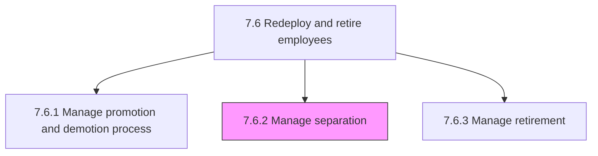
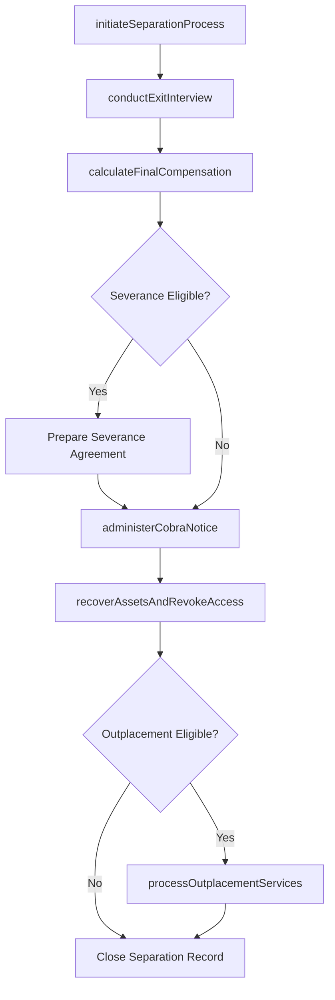

# Manage separation

> Business-as-Code definition for employee separation management. Models the end-to-end process of managing voluntary resignations, involuntary terminations, and reduction-in-force layoffs, including exit interviews, final pay processing, benefits continuation (COBRA), asset recovery, system access revocation, and compliance documentation.

## Overview

Managing the process of employee separation, including resignations, discharges, and layoffs. This includes receiving and processing resignation notices or initiating termination documentation, conducting exit interviews to capture departure reasons, calculating and disbursing final pay including accrued PTO and severance, administering COBRA benefit continuation notices, recovering company assets (laptop, badge, keys), revoking system access and credentials, processing outplacement services for eligible separating employees, and maintaining separation records for compliance with WARN Act, OWBPA, and state-specific requirements. The process handles voluntary separations (resignation, mutual agreement) and involuntary separations (termination for cause, performance-based, reduction in force) with distinct workflows and compliance safeguards.

## Process Hierarchy



## GraphDL

```yaml
manage:
  object: Separation
  actor: HRBusinessPartner
  result: SeparationRecord
```

## Actions

| Action | Description |
|--------|-------------|
| initiateSeparationProcess | Receive resignation notice or create termination documentation with separation type, reason code, and effective date |
| conductExitInterview | Facilitate a structured exit interview to capture departure reasons, feedback on management, and improvement suggestions |
| calculateFinalCompensation | Compute final pay including prorated salary, accrued but unused PTO, severance entitlement, and outstanding expense reimbursements |
| administerCobraNotice | Generate and deliver COBRA election notices for benefit continuation with enrollment deadlines and premium amounts |
| recoverAssetsAndRevokeAccess | Coordinate return of company equipment (laptop, badge, phone), revoke system credentials, and terminate facility access |
| processOutplacementServices | Enroll eligible separating employees in outplacement support including resume coaching, job search assistance, and career counseling |

## Events

| Event | Description |
|-------|-------------|
| separationProcessInitiated | Resignation received or termination documentation created with separation type and effective date |
| exitInterviewConducted | Structured exit interview completed with departure reasons and feedback captured |
| finalCompensationCalculated | Final pay computed including prorated salary, accrued PTO, severance, and expense reimbursements |
| cobraNoticeAdministered | COBRA election notice generated and delivered to separating employee with enrollment deadlines |
| assetsRecoveredAndAccessRevoked | Company equipment returned, system credentials revoked, and facility access terminated |
| outplacementServicesProcessed | Eligible employee enrolled in outplacement career transition support services |

## Searches

| Search | Description |
|--------|-------------|
| findActiveSeparations | List separation cases in progress by type (voluntary, involuntary, RIF), department, or effective date |
| getSeparationRecord | Retrieve complete separation details for a specific employee including timeline, final pay, and COBRA status |
| getExitInterviewThemes | Query aggregated exit interview feedback themes by department, manager, or time period |
| getSeparationCompliance | Check compliance status of separation documentation including WARN, OWBPA, and state requirements |

## Process Flow



## RACI Matrix

| Activity | Responsible | Accountable | Consulted | Informed |
|----------|-------------|-------------|-----------|----------|
| initiateSeparationProcess | HRBusinessPartner | HRManager | EmploymentLawyer | DepartmentManager |
| conductExitInterview | HRBusinessPartner | HRManager | DepartmentManager | PeopleAnalytics |
| calculateFinalCompensation | PayrollSpecialist | PayrollManager | CompensationAdministrator | Finance |
| administerCobraNotice | BenefitsAdministrator | BenefitsManager | CobraVendor | SeparatingEmployee |
| recoverAssetsAndRevokeAccess | ITServiceDesk | ITManager | FacilitiesManager | HRBusinessPartner |
| processOutplacementServices | HRBusinessPartner | HRManager | OutplacementVendor | SeparatingEmployee |

## Related Processes

| Process | Relationship |
|---------|-------------|
| 7.6.1 Manage promotion and demotion process | Sibling - demotion may precede separation or serve as an alternative |
| 7.6.3 Manage retirement | Sibling - retirement is a specific type of voluntary separation |
| 7.5.4 Administer payroll | Downstream - final compensation and severance processed through payroll |
| 7.5.2.2 Administer benefit enrollment | Downstream - separation triggers COBRA administration and benefits termination |
| 7.6 Redeploy and retire employees | Parent - governing process group |

## Related Departments

| Department | Role |
|-----------|------|
| Human Resources | Manages separation workflows, exit interviews, and compliance documentation |
| Legal | Reviews termination documentation, severance agreements, and regulatory compliance |
| Payroll | Processes final compensation, severance, and PTO payout |
| IT and Security | Revokes system access, recovers equipment, and terminates credentials |

## Related Occupations

| Occupation | Involvement |
|-----------|-------------|
| HR Business Partner | Manages separation process, conducts exit interviews, and coordinates outplacement |
| Employment Lawyer | Reviews termination legality, severance agreements, and regulatory compliance |
| Payroll Specialist | Calculates and disburses final compensation and severance payments |
| IT Service Desk Analyst | Revokes system access and coordinates equipment recovery |

## KPIs

| KPI | Description | Unit |
|-----|-------------|------|
| Separation Processing Time | Average business days from separation initiation to complete record closure | Days |
| Exit Interview Completion Rate | Percentage of voluntary separations with completed exit interviews | % |
| COBRA Notice Timeliness | Percentage of COBRA notices delivered within the 14-day regulatory window | % |
| Asset Recovery Rate | Percentage of company-owned assets recovered from separating employees | % |

## Usage

```typescript
import { manageSeparation } from '@headlessly/manage-separation'

const separation = manageSeparation()

// Initiate a voluntary separation for a resigning employee
const record = await separation.initiateSeparationProcess({
  employeeId: 'EMP-6142',
  separationType: 'voluntary-resignation',
  reasonCode: 'career-advancement',
  lastWorkingDate: '2026-03-14',
  noticeDate: '2026-02-28'
})

// Calculate final compensation including PTO payout and severance
const finalPay = await separation.calculateFinalCompensation({
  separationId: record.id,
  includeAccruedPto: true,
  severanceWeeks: 0,
  outstandingExpenses: true,
  payDate: '2026-03-14'
})
```
