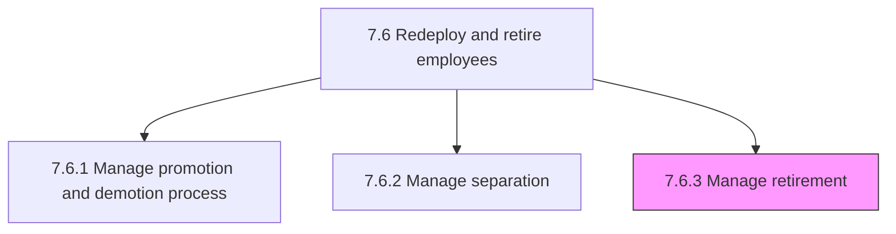
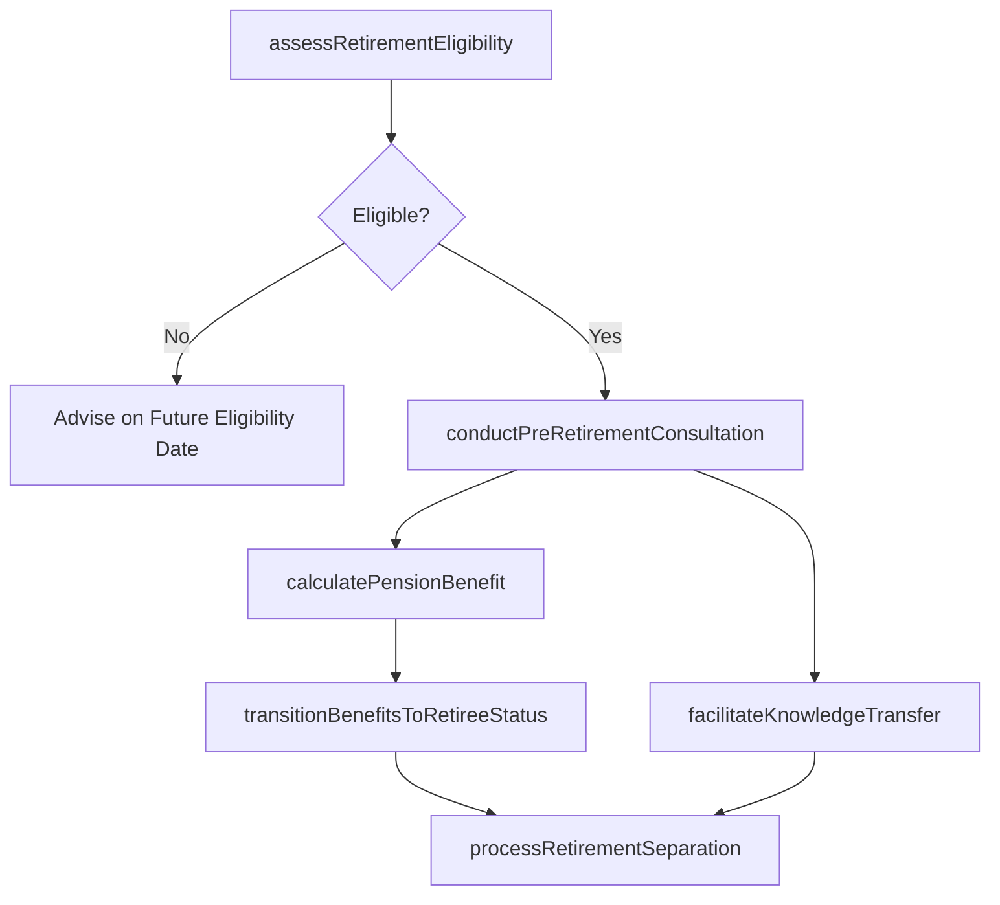

# Manage retirement

> Business-as-Code definition for retirement management. Models the end-to-end process of planning, processing, and administering employee retirements including eligibility assessment, pension benefit calculations, benefits transition to retiree status, knowledge transfer facilitation, and compliance with ERISA pension regulations.

## Overview

Managing and administering instances where a person stops employment completely through retirement. This includes assessing retirement eligibility based on age, tenure, and pension plan rules; conducting pre-retirement planning consultations to help employees understand their pension benefits, Social Security coordination, and retiree health insurance options; calculating defined benefit pension amounts or confirming defined contribution account balances; transitioning health, life, and supplemental insurance from active employee to retiree status; facilitating structured knowledge transfer to successors; processing the final separation including last paycheck, PTO payout, and pension commencement paperwork; and maintaining compliance with ERISA vesting and distribution rules, IRS required minimum distribution timelines, and retiree benefit continuation obligations.

## Process Hierarchy



## GraphDL

```yaml
manage:
  object: Retirement
  actor: RetirementBenefitsSpecialist
  result: RetirementProcessRecord
```

## Actions

| Action | Description |
|--------|-------------|
| assessRetirementEligibility | Evaluate employee age, years of service, and pension plan rules to confirm eligibility for normal, early, or deferred retirement |
| conductPreRetirementConsultation | Meet with the employee to review pension benefit estimates, Social Security coordination, retiree health options, and financial planning resources |
| calculatePensionBenefit | Compute the defined benefit pension amount using the plan formula (final average salary, years of service, accrual rate) or confirm defined contribution account balance |
| transitionBenefitsToRetireeStatus | Convert active employee health insurance, life insurance, and supplemental coverage to retiree plan tiers and premium schedules |
| facilitateKnowledgeTransfer | Organize structured handover of institutional knowledge, key relationships, active projects, and documentation to identified successors |
| processRetirementSeparation | Execute final payroll including accrued PTO payout, initiate pension commencement paperwork, revoke system access, and close the employment record |

## Events

| Event | Description |
|-------|-------------|
| retirementEligibilityAssessed | Employee retirement eligibility confirmed based on age, service years, and pension plan rules |
| preRetirementConsultationConducted | Pre-retirement planning session completed covering pension, Social Security, and retiree health options |
| pensionBenefitCalculated | Defined benefit pension amount computed or defined contribution balance confirmed for distribution |
| benefitsTransitionedToRetireeStatus | Active employee benefits converted to retiree plan tiers with updated premium schedules |
| knowledgeTransferFacilitated | Structured knowledge handover completed with successor documentation finalized |
| retirementSeparationProcessed | Final pay disbursed, pension commencement initiated, system access revoked, and employment record closed |

## Searches

| Search | Description |
|--------|-------------|
| findUpcomingRetirements | List employees approaching retirement eligibility within a specified timeframe by department or location |
| getRetirementProcessRecord | Retrieve complete retirement processing status and timeline for a specific employee |
| getPensionBenefitEstimate | Query pension benefit estimates for an employee at normal, early, and deferred retirement dates |
| getRetireeBenefitsStatus | Access retiree benefits enrollment and premium payment status for a retired former employee |

## Process Flow



## RACI Matrix

| Activity | Responsible | Accountable | Consulted | Informed |
|----------|-------------|-------------|-----------|----------|
| assessRetirementEligibility | RetirementBenefitsSpecialist | BenefitsManager | PensionPlanActuary | HRBusinessPartner |
| conductPreRetirementConsultation | RetirementBenefitsSpecialist | BenefitsManager | FinancialPlanningAdvisor | Employee |
| calculatePensionBenefit | PensionPlanActuary | BenefitsManager | RetirementBenefitsSpecialist | Finance |
| transitionBenefitsToRetireeStatus | BenefitsAdministrator | BenefitsManager | InsuranceCarrier | Retiree |
| facilitateKnowledgeTransfer | DepartmentManager | HRBusinessPartner | Successor | Operations |
| processRetirementSeparation | HRBusinessPartner | HRManager | Payroll | ITSecurity |

## Related Processes

| Process | Relationship |
|---------|-------------|
| 7.6.2 Manage separation | Sibling - retirement is a specialized form of voluntary separation with unique pension and benefits workflows |
| 7.6.1 Manage promotion and demotion process | Sibling - retirement pipeline data informs promotion and succession planning |
| 7.5.2.1 Deliver employee benefits program | Upstream - retiree benefit plan design determines available post-retirement coverage |
| 7.5.4 Administer payroll | Downstream - final compensation and pension commencement feed payroll processing |
| 7.6 Redeploy and retire employees | Parent - governing process group |

## Related Departments

| Department | Role |
|-----------|------|
| Benefits Administration | Manages retirement eligibility, pension calculations, and retiree benefits transition |
| Human Resources | Coordinates retirement process, exit documentation, and knowledge transfer |
| Finance | Tracks pension liability, processes final compensation, and manages retiree benefit costs |
| Legal and Compliance | Ensures retirement processing complies with ERISA, IRS distribution rules, and ADEA protections |

## Related Occupations

| Occupation | Involvement |
|-----------|-------------|
| Retirement Benefits Specialist | Assesses eligibility, conducts pre-retirement consultations, and manages pension commencement |
| Pension Plan Actuary | Computes defined benefit pension amounts using plan formulas and mortality tables |
| HR Business Partner | Coordinates the retirement process, knowledge transfer, and separation logistics |
| Department Manager | Facilitates knowledge transfer and succession planning for the retiring employee |

## KPIs

| KPI | Description | Unit |
|-----|-------------|------|
| Retirement Processing Time | Average business days from retirement notice to complete record closure and pension commencement | Days |
| Pre-Retirement Consultation Rate | Percentage of retiring employees who complete a pre-retirement planning consultation | % |
| Knowledge Transfer Completion | Percentage of retirements with documented knowledge transfer plans completed before last day | % |
| Pension Calculation Accuracy | Percentage of pension benefit calculations confirmed correct at initial audit | % |

## Usage

```typescript
import { manageRetirement } from '@headlessly/manage-retirement'

const retirement = manageRetirement()

// Assess retirement eligibility for an employee approaching retirement age
const eligibility = await retirement.assessRetirementEligibility({
  employeeId: 'EMP-2025-0456',
  targetRetirementDate: '2026-06-30',
  planType: 'defined-benefit',
  includeEarlyRetirementOptions: true
})

// Calculate the defined benefit pension amount
const pension = await retirement.calculatePensionBenefit({
  employeeId: 'EMP-2025-0456',
  retirementType: eligibility.recommendedType,
  finalAverageSalaryYears: 5,
  benefitCommencementDate: '2026-07-01',
  survivorBenefitElection: 'joint-and-50-percent'
})
```
