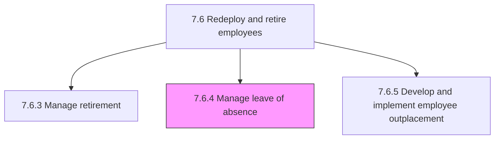
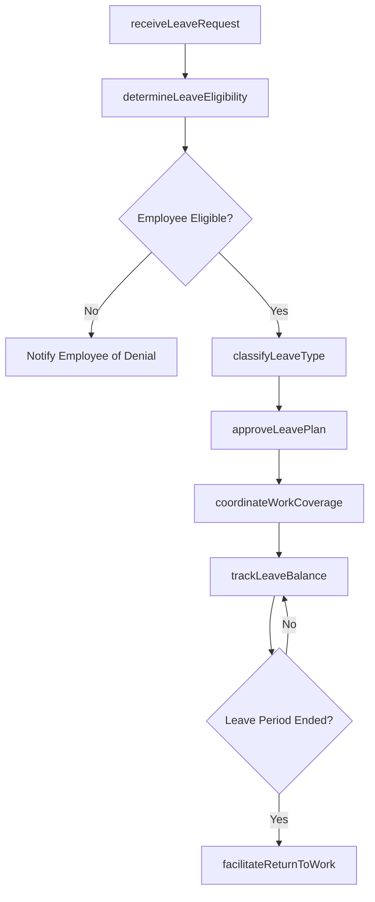

# Manage leave of absence

> Business-as-Code definition for managing employee leave of absence. Models the complete process of administering paid and unpaid leave requests, ensuring policy compliance, tracking leave balances, and coordinating return-to-work transitions.

## Overview

Managing the period of time that an employee must be away from their primary job, while maintaining the status of employee (i.e., paid and unpaid leave of absence but not vacations, holidays, hiatuses, sabbaticals, and work-from-home programs). Administer FMLA, parental, medical, personal, and military leave types. Ensure regulatory compliance, coordinate coverage during absences, and facilitate smooth return-to-work processes.

## Process Hierarchy



## GraphDL

```yaml
manage:
  object: Leave Of Absence
  actor: LeaveAdministrator
  result: LeaveOfAbsence
```

## Actions

| Action | Description |
|--------|-------------|
| receiveLeaveRequest | Intake and log an employee's formal request for leave of absence |
| determineLeaveEligibility | Evaluate employee tenure, leave type, and policy rules to confirm eligibility |
| classifyLeaveType | Categorize the request as FMLA, parental, medical, personal, or military leave |
| approveLeavePlan | Review supporting documentation and authorize the leave with defined dates |
| coordinateWorkCoverage | Arrange interim staffing or workload redistribution during the employee's absence |
| trackLeaveBalance | Monitor accrued, used, and remaining leave entitlements for the employee |
| facilitateReturnToWork | Coordinate medical clearance, role readiness, and reintegration upon leave completion |

## Events

| Event | Description |
|-------|-------------|
| leaveRequestReceived | Employee leave of absence request formally submitted and logged |
| leaveEligibilityDetermined | Employee eligibility for requested leave type confirmed or denied |
| leaveTypeClassified | Leave request categorized under the applicable leave policy |
| leavePlanApproved | Leave dates and conditions authorized by manager and HR |
| workCoverageCoordinated | Interim staffing or redistribution plan established for the absence period |
| leaveBalanceTracked | Employee leave entitlement records adjusted after accrual or usage |
| returnToWorkCompleted | Employee successfully reintegrated into their role after leave |

## Searches

| Search | Description |
|--------|-------------|
| findLeaveRequests | List leave requests filtered by employee, leave type, status, or date range |
| getLeaveBalance | Retrieve current leave entitlement balances for a specific employee |
| getLeaveHistory | Query historical leave records for an employee or department |
| getActiveLeaves | List all employees currently on leave of absence across the organization |

## Process Flow



## RACI Matrix

| Activity | Responsible | Accountable | Consulted | Informed |
|----------|-------------|-------------|-----------|----------|
| receiveLeaveRequest | LeaveAdministrator | HRManager | Employee | DepartmentManager |
| determineLeaveEligibility | LeaveAdministrator | HRManager | EmploymentCounsel | Employee |
| approveLeavePlan | HRManager | VP HR | DepartmentManager | PayrollSpecialist |
| coordinateWorkCoverage | DepartmentManager | HRBusinessPartner | TeamLead | LeaveAdministrator |
| facilitateReturnToWork | LeaveAdministrator | HRManager | OccupationalHealth | DepartmentManager |

## Related Processes

| Process | Relationship |
|---------|-------------|
| 7.6.3 Manage retirement | Sibling - alternative employee transition path |
| 7.6.5 Develop and implement employee outplacement | Sibling - related workforce transition support |
| 7.6.6 Manage workforce scheduling | Downstream - scheduling adjustments during leave |
| 7.6 Redeploy and retire employees | Parent - governing process group |

## Related Departments

| Department | Role |
|-----------|------|
| Human Resources | Administers leave policies and eligibility determinations |
| Legal | Advises on FMLA, ADA, and jurisdictional leave regulations |
| Payroll | Manages pay continuation or cessation during leave periods |
| Department Management | Arranges interim coverage and approves operational adjustments |

## Related Occupations

| Occupation | Involvement |
|-----------|-------------|
| Leave Administrator | Processes leave requests and manages compliance documentation |
| HR Business Partner | Advises managers on leave policy and workforce impact |
| Benefits Analyst | Coordinates benefits continuation during leave periods |

## KPIs

| KPI | Description | Unit |
|-----|-------------|------|
| Leave Request Processing Time | Average days from request submission to approval or denial | Days |
| FMLA Compliance Rate | Percentage of FMLA leave cases fully compliant with regulations | % |
| Return-to-Work Rate | Percentage of employees returning to their role after leave | % |
| Leave Utilization Rate | Ratio of leave taken to leave available across the organization | % |

## Usage

```typescript
import { manageLeaveOfAbsence } from '@headlessly/manage-leave-of-absence'

const leave = manageLeaveOfAbsence()

// Determine eligibility for a parental leave request
const eligibility = await leave.determineLeaveEligibility({
  employeeId: 'EMP-4821',
  leaveType: 'parental',
  requestedStartDate: '2026-04-01',
  requestedEndDate: '2026-06-30'
})

// Retrieve all active leaves in the engineering department
const activeLeaves = await leave.getActiveLeaves({
  department: 'engineering',
  includeExpectedReturnDates: true
})
```
