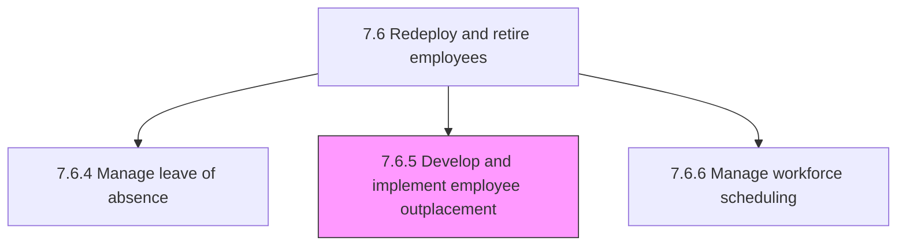
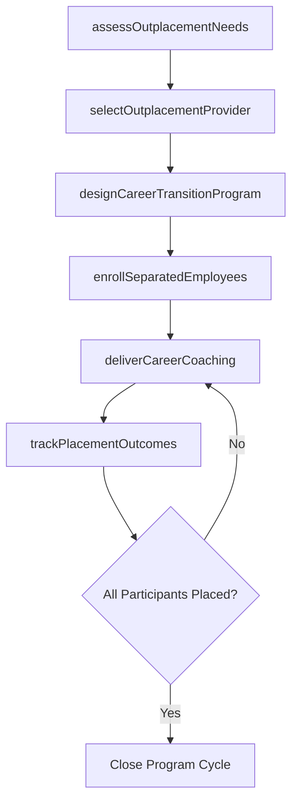

# Develop and implement employee outplacement

> Business-as-Code definition for developing and implementing employee outplacement services. Models the complete process of designing career transition programs, providing job search support, and helping separated employees successfully re-enter the labor market.

## Overview

Helping former employees transition to new jobs or to re-orient themselves in the job market. Deliver help through one-on-one sessions or in a group format. Provide guidance in career evaluation, resume writing, interview preparation, developing networks, and job searching. Design outplacement programs that align with organizational values and severance agreements.

## Process Hierarchy



## GraphDL

```yaml
develop:
  object: Employee Outplacement
  actor: WorkforceTransitionSpecialist
  result: OutplacementProgram
```

## Actions

| Action | Description |
|--------|-------------|
| assessOutplacementNeeds | Evaluate the scope and scale of workforce reductions requiring outplacement support |
| selectOutplacementProvider | Evaluate and contract external outplacement firms or build internal program capabilities |
| designCareerTransitionProgram | Structure program components including coaching, workshops, and digital resources |
| enrollSeparatedEmployees | Register affected employees in the appropriate outplacement program tier |
| deliverCareerCoaching | Provide one-on-one and group career counseling sessions to participants |
| trackPlacementOutcomes | Monitor participant job search progress, interviews, and successful placements |

## Events

| Event | Description |
|-------|-------------|
| outplacementNeedsAssessed | Workforce reduction scope analyzed and outplacement requirements defined |
| outplacementProviderSelected | Vendor contract executed or internal program authorized |
| careerTransitionProgramDesigned | Program structure, tiers, and content finalized |
| employeeEnrolledInOutplacement | Separated employee registered and onboarded into the program |
| careerCoachingDelivered | Coaching session or workshop completed for a participant |
| placementOutcomeRecorded | Participant secured new employment or completed program |

## Searches

| Search | Description |
|--------|-------------|
| findOutplacementPrograms | List outplacement programs filtered by status, provider, or date range |
| getParticipantProgress | Retrieve career transition progress for a specific enrolled employee |
| getPlacementStatistics | Query placement success rates by program tier, department, or time period |
| getOutplacementProviders | List contracted outplacement service providers and their specializations |

## Process Flow



## RACI Matrix

| Activity | Responsible | Accountable | Consulted | Informed |
|----------|-------------|-------------|-----------|----------|
| assessOutplacementNeeds | WorkforceTransitionSpecialist | VP HR | EmploymentCounsel | CFO |
| selectOutplacementProvider | WorkforceTransitionSpecialist | VP HR | Procurement | Finance |
| designCareerTransitionProgram | WorkforceTransitionSpecialist | HRManager | OutplacementProvider | DepartmentManagers |
| enrollSeparatedEmployees | HRBusinessPartner | HRManager | WorkforceTransitionSpecialist | Employee |
| trackPlacementOutcomes | WorkforceTransitionSpecialist | VP HR | OutplacementProvider | CHRO |

## Related Processes

| Process | Relationship |
|---------|-------------|
| 7.6.2 Manage separation | Upstream - triggers outplacement for separated employees |
| 7.6.4 Manage leave of absence | Sibling - alternative workforce transition scenario |
| 7.6.6 Manage workforce scheduling | Sibling - workforce capacity planning post-reduction |
| 7.6 Redeploy and retire employees | Parent - governing process group |

## Related Departments

| Department | Role |
|-----------|------|
| Human Resources | Designs and manages outplacement programs |
| Legal | Reviews severance agreements and outplacement obligations |
| Finance | Budgets outplacement costs and vendor payments |
| Procurement | Manages outplacement vendor selection and contracts |

## Related Occupations

| Occupation | Involvement |
|-----------|-------------|
| Workforce Transition Specialist | Designs programs and coordinates outplacement delivery |
| Career Coach | Delivers one-on-one counseling and job search support |
| HR Business Partner | Communicates outplacement options to affected employees |

## KPIs

| KPI | Description | Unit |
|-----|-------------|------|
| Placement Rate | Percentage of outplaced employees securing new roles within 6 months | % |
| Time to Placement | Average weeks from program enrollment to successful job placement | Weeks |
| Participant Satisfaction | Average satisfaction rating from outplacement program participants | Score (1-5) |
| Cost per Placement | Total outplacement spend divided by number of successful placements | USD |

## Usage

```typescript
import { developEmployeeOutplacement } from '@headlessly/develop-employee-outplacement'

const outplacement = developEmployeeOutplacement()

// Enroll a separated employee in career transition services
const enrollment = await outplacement.enrollSeparatedEmployees({
  employeeId: 'EMP-7203',
  programTier: 'executive',
  separationDate: '2026-03-15',
  coachingSessionsIncluded: 12
})

// Track placement outcomes for the current program cycle
const outcomes = await outplacement.trackPlacementOutcomes({
  programId: 'OP-2026-Q1',
  includeInProgress: true,
  minWeeksEnrolled: 4
})
```
