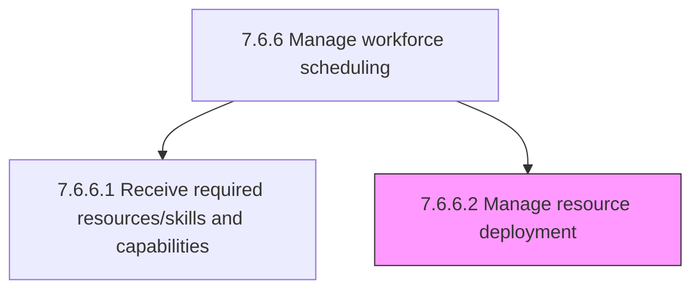
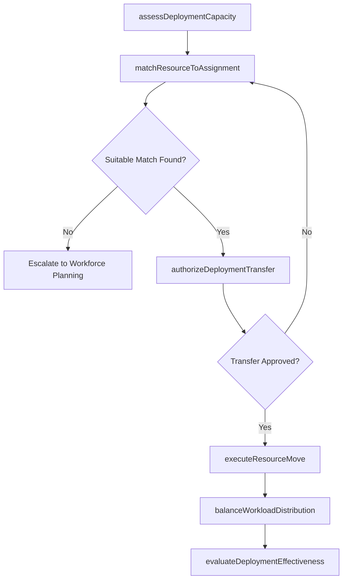

# Manage resource deployment

> Business-as-Code definition for managing resource deployment. Models the process of allocating and deploying personnel across the organization to ensure optimal alignment between labor capacity and job requirements.

## Overview

Allocating employees. Deploy personnel to ensure that the labor of the organization is continuously in an optimal relation to the jobs and organizational structure. Match available talent to open assignments, balance workload distribution, and redeploy resources based on changing business demands and project requirements.

## Process Hierarchy



## GraphDL

```yaml
manage:
  object: Resource Deployment
  actor: WorkforcePlanner
  result: DeploymentAssignment
```

## Actions

| Action | Description |
|--------|-------------|
| assessDeploymentCapacity | Evaluate current headcount, skills inventory, and available capacity for redeployment |
| matchResourceToAssignment | Align employee skills and availability with open role or project requirements |
| authorizeDeploymentTransfer | Obtain management approval for cross-functional or cross-location resource moves |
| executeResourceMove | Process the administrative transfer and update organizational assignments |
| balanceWorkloadDistribution | Redistribute tasks and responsibilities to optimize team utilization |
| evaluateDeploymentEffectiveness | Measure post-deployment performance and role fit outcomes |

## Events

| Event | Description |
|-------|-------------|
| deploymentCapacityAssessed | Current workforce availability and skills inventory evaluated |
| resourceMatchedToAssignment | Employee identified as best-fit candidate for open assignment |
| deploymentTransferAuthorized | Management approval granted for the resource move |
| resourceMoveExecuted | Employee administratively transferred to new role or assignment |
| workloadRebalanced | Task distribution adjusted across team members after deployment |
| deploymentEffectivenessEvaluated | Post-move performance review completed for deployed resource |

## Searches

| Search | Description |
|--------|-------------|
| findAvailableResources | List employees available for redeployment filtered by skill, location, or capacity |
| getDeploymentAssignments | Retrieve current and pending deployment assignments for a department |
| getUtilizationRates | Query resource utilization percentages by team, department, or location |
| getDeploymentHistory | Retrieve historical deployment moves for a specific employee |

## Process Flow



## RACI Matrix

| Activity | Responsible | Accountable | Consulted | Informed |
|----------|-------------|-------------|-----------|----------|
| assessDeploymentCapacity | WorkforcePlanner | HRManager | DepartmentManagers | VP HR |
| matchResourceToAssignment | WorkforcePlanner | HRManager | HiringManager | Employee |
| authorizeDeploymentTransfer | DepartmentManager | VP Operations | HRBusinessPartner | WorkforcePlanner |
| executeResourceMove | HROperationsSpecialist | HRManager | Payroll | ITAdmin |
| evaluateDeploymentEffectiveness | HRBusinessPartner | DepartmentManager | WorkforcePlanner | VP HR |

## Related Processes

| Process | Relationship |
|---------|-------------|
| 7.6.6.1 Receive required resources/skills and capabilities | Upstream - defines the resource requirements to be fulfilled |
| 7.6.6 Manage workforce scheduling | Parent - governing process for workforce allocation |
| 7.6.7 Relocate employees and manage assignments | Downstream - handles physical relocations from deployments |

## Related Departments

| Department | Role |
|-----------|------|
| Human Resources | Manages deployment policies and facilitates resource moves |
| Operations | Identifies deployment needs and approves transfers |
| Finance | Tracks cost implications of resource redeployment |
| IT | Updates system access and organizational assignments |

## Related Occupations

| Occupation | Involvement |
|-----------|-------------|
| Workforce Planner | Analyzes capacity and matches resources to assignments |
| HR Operations Specialist | Processes administrative transfers and system updates |
| Resource Manager | Coordinates cross-team and cross-project deployments |

## KPIs

| KPI | Description | Unit |
|-----|-------------|------|
| Resource Utilization Rate | Percentage of available workforce capacity actively deployed | % |
| Time to Deploy | Average days from resource request to completed deployment | Days |
| Deployment Success Rate | Percentage of deployed resources meeting performance expectations at 90 days | % |
| Internal Fill Rate | Percentage of open assignments filled through internal redeployment | % |

## Usage

```typescript
import { manageResourceDeployment } from '@headlessly/manage-resource-deployment'

const deployment = manageResourceDeployment()

// Match available engineers to an open project assignment
const matches = await deployment.matchResourceToAssignment({
  assignmentId: 'PRJ-8842',
  requiredSkills: ['python', 'data-engineering'],
  location: 'remote',
  startDate: '2026-03-01'
})

// Check utilization rates across the product division
const utilization = await deployment.getUtilizationRates({
  department: 'product',
  period: 'Q1-2026',
  includeContractors: false
})
```
