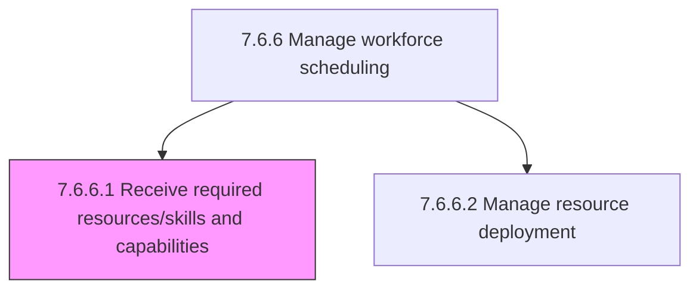
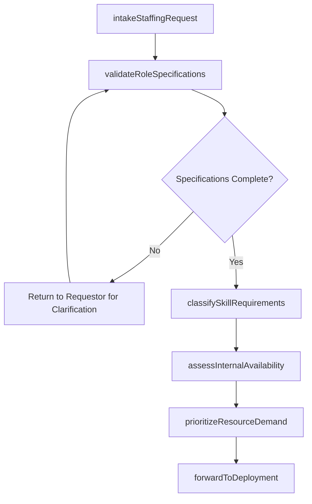

# Receive required resources/skills and capabilities

> Business-as-Code definition for receiving required resource, skill, and capability requests. Models the process of collecting staffing demands from business units, validating role specifications, and creating actionable resource requirements for workforce scheduling.

## Overview

Obtaining resources necessary to fill a position utilizing specific skills and capabilities. Intake staffing requests from hiring managers and project leads, validate role requirements against organizational standards, and translate business needs into structured resource demand signals for workforce planning and deployment.

## Process Hierarchy



## GraphDL

```yaml
receive:
  object: Resource Requirements
  actor: WorkforcePlanner
  result: ResourceRequirement
```

## Actions

| Action | Description |
|--------|-------------|
| intakeStaffingRequest | Receive and log a resource demand from a hiring manager or project lead |
| validateRoleSpecifications | Verify that requested skills, certifications, and experience levels are well-defined |
| classifySkillRequirements | Categorize required competencies by domain, proficiency level, and criticality |
| assessInternalAvailability | Check existing talent pool and bench strength against the stated requirements |
| prioritizeResourceDemand | Rank incoming requests by business urgency, project timeline, and strategic alignment |
| forwardToDeployment | Route validated and prioritized requirements to the resource deployment process |

## Events

| Event | Description |
|-------|-------------|
| staffingRequestReceived | Resource demand formally submitted and logged in the workforce planning system |
| roleSpecificationsValidated | Requested role requirements confirmed as complete and standards-compliant |
| skillRequirementsClassified | Competency requirements categorized and mapped to the skills taxonomy |
| internalAvailabilityAssessed | Existing talent pool evaluated against the incoming resource request |
| resourceDemandPrioritized | Request ranked and queued based on urgency and strategic importance |
| requirementForwardedToDeployment | Validated requirement handed off to the resource deployment process |

## Searches

| Search | Description |
|--------|-------------|
| findResourceRequests | List incoming staffing requests filtered by department, skill, or priority |
| getRequestDetails | Retrieve full specifications for a specific resource requirement |
| getSkillDemandSummary | Query aggregate skill demand across all active requests by competency area |
| getPendingRequirements | List validated requirements awaiting deployment fulfillment |

## Process Flow



## RACI Matrix

| Activity | Responsible | Accountable | Consulted | Informed |
|----------|-------------|-------------|-----------|----------|
| intakeStaffingRequest | WorkforcePlanner | HRManager | HiringManager | VP HR |
| validateRoleSpecifications | WorkforcePlanner | HRManager | CompensationAnalyst | HiringManager |
| classifySkillRequirements | TalentAcquisitionSpecialist | WorkforcePlanner | SubjectMatterExpert | HRAnalyst |
| assessInternalAvailability | WorkforcePlanner | HRManager | DepartmentManagers | TalentAcquisition |
| prioritizeResourceDemand | HRManager | VP HR | BusinessUnitLeads | WorkforcePlanner |

## Related Processes

| Process | Relationship |
|---------|-------------|
| 7.6.6.2 Manage resource deployment | Downstream - receives validated requirements for fulfillment |
| 7.6.6 Manage workforce scheduling | Parent - governing process for scheduling and allocation |
| 7.6.7 Relocate employees and manage assignments | Related - may trigger relocation if internal candidate is remote |

## Related Departments

| Department | Role |
|-----------|------|
| Human Resources | Validates and prioritizes incoming resource demands |
| Business Units | Submit staffing requests with role specifications |
| Talent Acquisition | Assesses internal candidate pipeline availability |
| Finance | Validates headcount budget for requested positions |

## Related Occupations

| Occupation | Involvement |
|-----------|-------------|
| Workforce Planner | Receives, validates, and prioritizes resource requirements |
| Talent Acquisition Specialist | Evaluates internal talent pool against requirements |
| HR Analyst | Provides skill demand analytics and trend reporting |

## KPIs

| KPI | Description | Unit |
|-----|-------------|------|
| Request Intake Volume | Number of resource requests received per period | Count |
| Specification Completeness Rate | Percentage of requests passing validation on first submission | % |
| Time to Validate | Average days from request receipt to validated requirement | Days |
| Internal Match Rate | Percentage of requirements with at least one internal candidate identified | % |

## Usage

```typescript
import { receiveResourceRequirements } from '@headlessly/receive-resource-requirements'

const requirements = receiveResourceRequirements()

// Intake a new staffing request from the data engineering team
const request = await requirements.intakeStaffingRequest({
  requestorId: 'MGR-1045',
  department: 'data-engineering',
  roleTitle: 'Senior Data Engineer',
  requiredSkills: ['spark', 'python', 'airflow'],
  urgency: 'high',
  targetStartDate: '2026-04-15'
})

// View aggregate skill demand across the organization
const demand = await requirements.getSkillDemandSummary({
  period: 'Q2-2026',
  groupBy: 'competency-area',
  minRequestCount: 3
})
```
