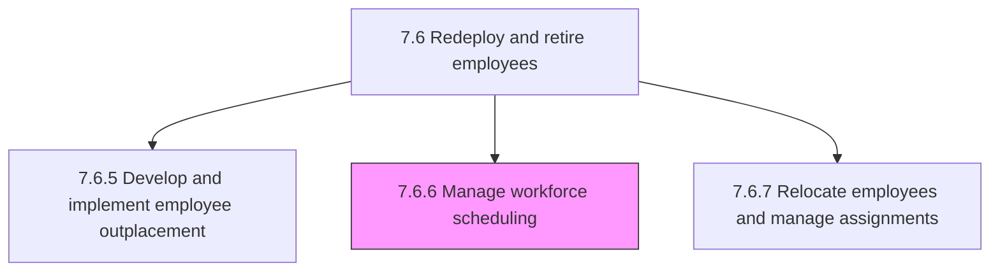
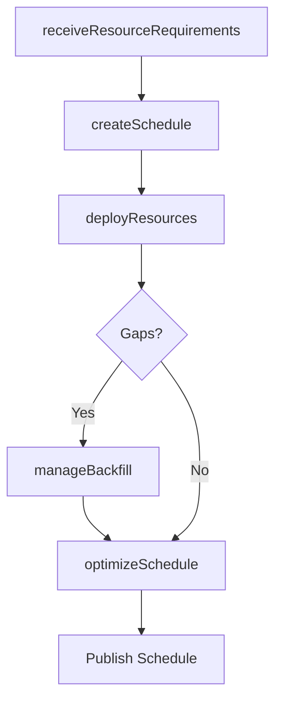

# Manage workforce scheduling

> Business-as-Code definition for workforce scheduling management. Models resource requirements gathering, shift coverage planning, skill-based deployment, and leave backfill coordination.

## Overview

Organizing the workforce so that all positions are covered for all shifts with the necessary skilled resources in place. Have a system in place to backfill positions while an employee is on leave.

## Process Hierarchy



## GraphDL

```yaml
manage:
  object: Workforce Scheduling
  actor: WorkforceScheduler
  result: WorkforceSchedule
```

## Actions

| Action | Description |
|--------|-------------|
| receiveResourceRequirements | Gather staffing needs including skills, shift coverage, and capability requirements |
| createSchedule | Build workforce schedules matching employee availability to operational demand |
| deployResources | Assign employees to shifts, projects, or locations based on skills and capacity |
| manageBackfill | Coordinate temporary coverage for employees on leave or absence |
| optimizeSchedule | Rebalance schedules to minimize overtime and maximize skill coverage |

## Events

| Event | Description |
|-------|-------------|
| resourceRequirementsReceived | Staffing needs and skill requirements documented |
| scheduleCreated | Workforce schedule published for upcoming period |
| resourcesDeployed | Employees assigned to shifts and work assignments |
| backfillManaged | Temporary coverage arranged for absent employees |
| scheduleOptimized | Workforce schedule rebalanced for efficiency |

## Searches

| Search | Description |
|--------|-------------|
| getScheduleByPeriod | Retrieve workforce schedules by date range, department, or shift |
| getResourceAvailability | Query employee availability by skill, location, or time slot |
| getCoverageGaps | List unfilled shifts or understaffed periods |
| getOvertimeReport | Retrieve overtime hours by employee, department, or period |

## Process Flow



## RACI Matrix

| Activity | Responsible | Accountable | Consulted | Informed |
|----------|-------------|-------------|-----------|----------|
| receiveResourceRequirements | Workforce Scheduler | Operations Manager | Department Heads | HR |
| createSchedule | Workforce Scheduler | Operations Manager | Team Leads | All Employees |
| deployResources | Workforce Scheduler | Operations Manager | HR | Finance |
| manageBackfill | Workforce Scheduler | Operations Manager | Staffing Agency | Department Heads |

## Sub-Processes

| ID | Name | Description |
|----|------|-------------|
| 7.6.6.1 | Receive required resources/skills and capabilities | Obtaining resources necessary to fill a position utilizing specific skills and capabilities. |
| 7.6.6.2 | Manage resource deployment | Allocating employees. Deploy personnel to ensure that the labor of the organization is continuously  |

## Related Processes

| Process | Relationship |
|---------|-------------|
| 7.6.4 Manage leave of absence | Upstream - leave requests trigger backfill scheduling |
| 7.6.7 Relocate employees and manage assignments | Parallel - assignment changes affect scheduling |
| 7.7.6 Develop and manage time and attendance systems | Supporting - time data validates schedule adherence |

## Related Departments

| Department | Role |
|-----------|------|
| Operations | Defines staffing requirements and approves schedules |
| Human Resources | Provides employee availability and leave data |
| All Departments | Submits resource needs and receives deployment schedules |

## Related Occupations

| Occupation | Involvement |
|-----------|-------------|
| Workforce Scheduler | Creates and optimizes employee schedules |
| Operations Manager | Approves staffing plans and deployment decisions |
| Staffing Coordinator | Manages temporary and contingent workforce assignments |

## KPIs

| KPI | Description | Unit |
|-----|-------------|------|
| Schedule Fill Rate | Percentage of required shifts covered by assigned employees | % |
| Overtime as Percentage of Total Hours | Overtime hours relative to total scheduled hours | % |
| Schedule Adherence | Percentage of employees working their scheduled shifts | % |
| Backfill Response Time | Average hours to arrange coverage for unplanned absences | Hours |

## Usage

```typescript
import { manageWorkforceScheduling } from '@headlessly/manage-workforce-scheduling'

const scheduling = manageWorkforceScheduling()

// Create a workforce schedule
const schedule = await scheduling.createSchedule({
  department: 'customer-support',
  period: '2025-07',
  shifts: ['morning', 'afternoon', 'evening'],
  minimumCoverage: { morning: 5, afternoon: 4, evening: 3 }
})

// Manage backfill for an absence
await scheduling.manageBackfill({
  absentEmployeeId: 'emp_12345',
  startDate: '2025-07-10',
  endDate: '2025-07-24',
  requiredSkills: ['tier-2-support', 'spanish-language']
})
```
