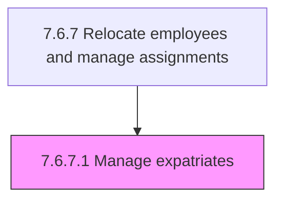
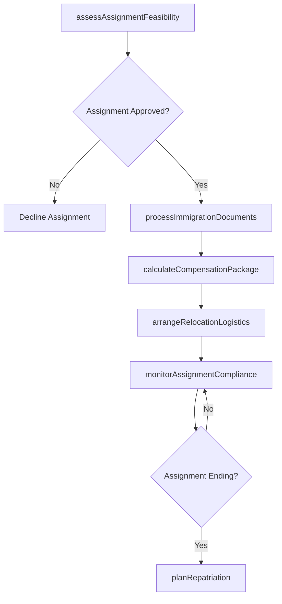

# Manage expatriates

> Business-as-Code definition for managing expatriate employees. Models the complete process of administering international assignments, including pre-departure preparation, immigration compliance, compensation equalization, and repatriation planning.

## Overview

Managing foreign resources. Manage employees who are sent to live abroad for a defined time period, as well as non-native employees. Administer work visas and immigration documentation, coordinate cost-of-living adjustments and tax equalization, arrange housing and relocation logistics, and plan for repatriation or assignment extension at term completion.

## Process Hierarchy



## GraphDL

```yaml
manage:
  object: Expatriates
  actor: GlobalMobilitySpecialist
  result: ExpatriateAssignment
```

## Actions

| Action | Description |
|--------|-------------|
| assessAssignmentFeasibility | Evaluate candidate readiness, host-country requirements, and business justification for the posting |
| processImmigrationDocuments | Coordinate work permits, visa applications, and legal residency documentation |
| calculateCompensationPackage | Determine cost-of-living allowances, hardship differentials, and tax equalization provisions |
| arrangeRelocationLogistics | Coordinate housing, shipping, school enrollment, and spousal support services |
| monitorAssignmentCompliance | Track visa validity, tax filings, and host-country regulatory obligations throughout the posting |
| planRepatriation | Prepare the return assignment, reverse culture support, and knowledge transfer upon completion |

## Events

| Event | Description |
|-------|-------------|
| assignmentFeasibilityAssessed | Candidate evaluated and international posting viability confirmed |
| immigrationDocumentsProcessed | Work permits and visas secured for the expatriate and dependents |
| compensationPackageCalculated | Cost-of-living, tax equalization, and allowance package finalized |
| relocationLogisticsArranged | Housing, shipping, and family support services coordinated |
| assignmentComplianceVerified | Ongoing visa, tax, and regulatory obligations confirmed as current |
| repatriationPlanned | Return-to-home-country assignment and transition plan established |

## Searches

| Search | Description |
|--------|-------------|
| findExpatriateAssignments | List active and upcoming expatriate postings filtered by country, status, or division |
| getAssignmentDetails | Retrieve full assignment profile including compensation, compliance, and timeline |
| getVisaExpirations | Query upcoming visa and work permit expiration dates for proactive renewal |
| getRepatriationSchedule | List expatriates approaching assignment end dates with repatriation status |

## Process Flow



## RACI Matrix

| Activity | Responsible | Accountable | Consulted | Informed |
|----------|-------------|-------------|-----------|----------|
| assessAssignmentFeasibility | GlobalMobilitySpecialist | VP HR | BusinessUnitLeader | Employee |
| processImmigrationDocuments | ImmigrationSpecialist | GlobalMobilitySpecialist | ExternalCounsel | Employee |
| calculateCompensationPackage | CompensationAnalyst | GlobalMobilitySpecialist | TaxAdvisor | Finance |
| arrangeRelocationLogistics | RelocationCoordinator | GlobalMobilitySpecialist | RelocationVendor | Employee |
| planRepatriation | GlobalMobilitySpecialist | VP HR | HomeCountryManager | Employee |

## Related Processes

| Process | Relationship |
|---------|-------------|
| 7.6.7 Relocate employees and manage assignments | Parent - governing process for all assignment relocations |
| 7.6.6 Manage workforce scheduling | Related - global assignments affect workforce scheduling |
| 7.6.4 Manage leave of absence | Related - expatriates may require international leave coordination |

## Related Departments

| Department | Role |
|-----------|------|
| Global Mobility | Owns end-to-end expatriate assignment lifecycle |
| Legal | Manages immigration compliance and international employment law |
| Tax | Handles cross-border tax equalization and filing obligations |
| Finance | Tracks assignment costs, allowances, and repatriation budgets |

## Related Occupations

| Occupation | Involvement |
|-----------|-------------|
| Global Mobility Specialist | Manages the full expatriate assignment lifecycle |
| Immigration Specialist | Processes visa and work permit documentation |
| International Tax Advisor | Structures tax equalization and compliance provisions |

## KPIs

| KPI | Description | Unit |
|-----|-------------|------|
| Assignment Acceptance Rate | Percentage of offered international postings accepted by candidates | % |
| Immigration Processing Time | Average days from assignment approval to work permit issuance | Days |
| Assignment Completion Rate | Percentage of expatriates completing their full assignment term | % |
| Repatriation Retention Rate | Percentage of repatriated employees remaining with the company 12 months after return | % |

## Usage

```typescript
import { manageExpatriates } from '@headlessly/manage-expatriates'

const expats = manageExpatriates()

// Process immigration documents for a new Tokyo assignment
const immigration = await expats.processImmigrationDocuments({
  employeeId: 'EMP-3391',
  hostCountry: 'JP',
  assignmentDuration: 24,
  includeDependents: true,
  visaCategory: 'specialist-in-humanities'
})

// Check upcoming visa expirations across all active assignments
const expirations = await expats.getVisaExpirations({
  daysUntilExpiry: 90,
  hostCountry: 'all',
  includeRenewalStatus: true
})
```
