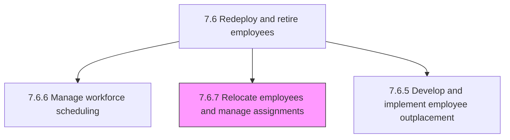
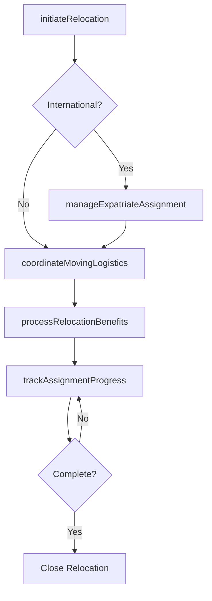

# Relocate employees and manage assignments

> Business-as-Code definition for employee relocation and assignment management. Models domestic and international transfers, expatriate management, relocation logistics, and assignment tracking.

## Overview

Managing the relocation of employees in order to carry out assignments. Manage internal business processes to transfer employees, their families, and/or entire departments of a business to a new location.

## Process Hierarchy



## GraphDL

```yaml
relocate:
  object: Employees And Manage Assignments
  actor: GlobalMobilityManager
  result: RelocationPackage
```

## Actions

| Action | Description |
|--------|-------------|
| initiateRelocation | Begin the employee relocation process with needs assessment and cost estimation |
| coordinateMovingLogistics | Arrange household goods shipment, temporary housing, and travel arrangements |
| manageExpatriateAssignment | Oversee international assignment including visa, tax equalization, and cultural support |
| processRelocationBenefits | Administer relocation allowances, reimbursements, and tax gross-ups |
| trackAssignmentProgress | Monitor relocation milestones and assignment completion status |

## Events

| Event | Description |
|-------|-------------|
| relocationInitiated | Employee relocation process started with approved package |
| movingLogisticsCoordinated | Household move, travel, and temporary housing arranged |
| expatriateAssignmentManaged | International assignment terms and support established |
| relocationBenefitsProcessed | Relocation allowances and reimbursements disbursed |
| assignmentProgressTracked | Relocation milestone or assignment status updated |

## Searches

| Search | Description |
|--------|-------------|
| getActiveRelocations | List in-progress employee relocations by status or destination |
| getExpatriateAssignments | Retrieve international assignments by country, duration, or employee |
| getRelocationCosts | Query relocation expenditures by employee, department, or period |
| getAssignmentTimeline | Retrieve milestones and deadlines for a specific relocation |

## Process Flow



## RACI Matrix

| Activity | Responsible | Accountable | Consulted | Informed |
|----------|-------------|-------------|-----------|----------|
| initiateRelocation | Global Mobility Manager | VP HR | Hiring Manager | Employee |
| coordinateMovingLogistics | Relocation Coordinator | Global Mobility Manager | Moving Vendor | Employee |
| manageExpatriateAssignment | Global Mobility Manager | VP HR | Legal, Tax | Finance |
| processRelocationBenefits | HR Coordinator | Global Mobility Manager | Payroll, Tax | Employee |

## Sub-Processes

| ID | Name | Description |
|----|------|-------------|
| 7.6.7.1 | Manage expatriates | Managing foreign resources. Manage employees who are sent to live abroad for a defined time period,  |

## Related Processes

| Process | Relationship |
|---------|-------------|
| 7.6.6 Manage workforce scheduling | Parallel - relocations affect workforce deployment |
| 7.5.1 Develop and manage reward, recognition, and motivation programs | Supporting - relocation packages align with compensation strategy |
| 7.6.1 Manage promotion and demotion process | Upstream - promotions may trigger relocation |

## Related Departments

| Department | Role |
|-----------|------|
| Global Mobility | Manages relocation logistics and expatriate support |
| Human Resources | Coordinates assignment terms and employee communication |
| Legal | Handles immigration, visa, and employment law compliance |
| Finance | Manages relocation budgets and tax equalization |

## Related Occupations

| Occupation | Involvement |
|-----------|-------------|
| Global Mobility Manager | Oversees relocation programs and expatriate assignments |
| Relocation Coordinator | Manages moving logistics and vendor relationships |
| Immigration Specialist | Handles visa and work permit processing |

## KPIs

| KPI | Description | Unit |
|-----|-------------|------|
| Average Relocation Cost | Total relocation spend divided by number of relocations | USD |
| Relocation Satisfaction Score | Employee rating of relocation experience | Score (1-5) |
| Assignment Completion Rate | Percentage of international assignments completed as planned | % |
| Time to Settle | Average days from relocation start to employee fully operational | Days |

## Usage

```typescript
import { relocateEmployeesAndManageAssignments } from '@headlessly/relocate-employees-and-manage-assignments'

const mobility = relocateEmployeesAndManageAssignments()

// Initiate a relocation
const relocation = await mobility.initiateRelocation({
  employeeId: 'emp_12345',
  originCity: 'San Francisco',
  destinationCity: 'London',
  assignmentType: 'long-term-expatriate',
  duration: '24-months',
  startDate: '2025-09-01'
})

// Track assignment progress
const status = await mobility.trackAssignmentProgress({
  relocationId: relocation.id,
  milestones: ['visa-approved', 'housing-secured', 'start-date-confirmed']
})
```
