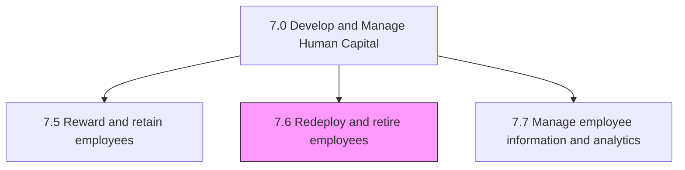
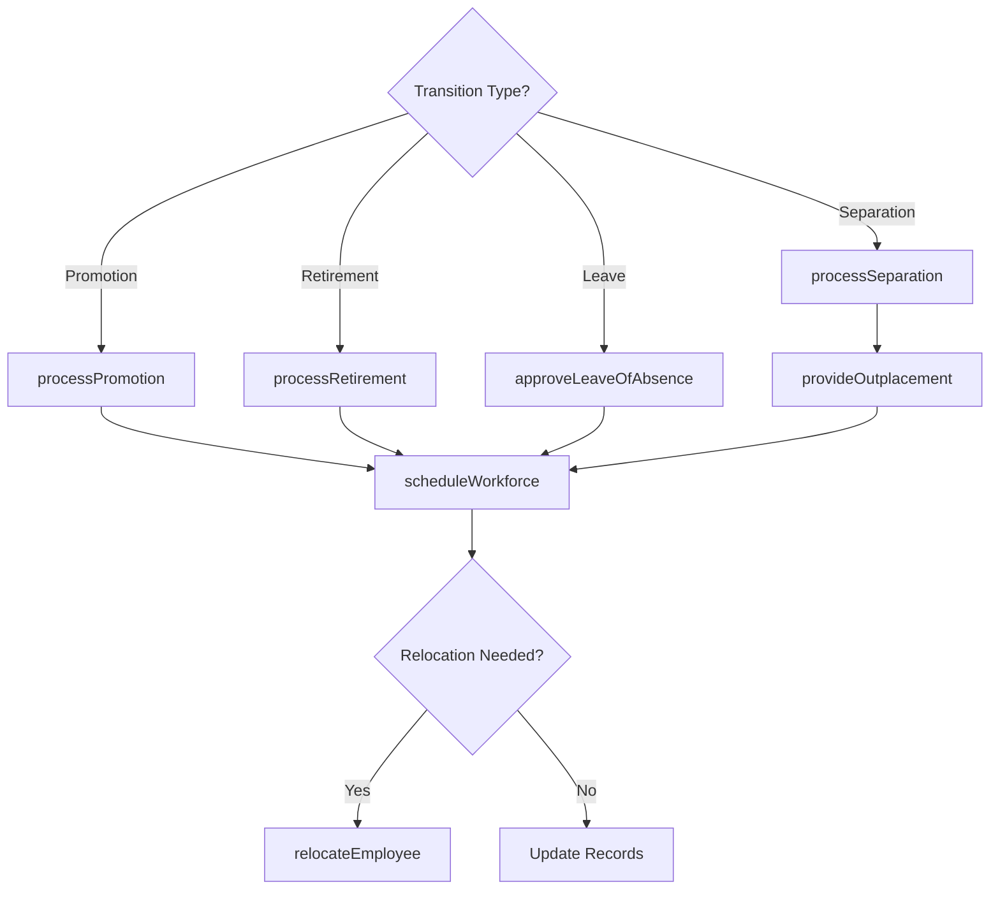

# Redeploy and retire employees

> Business-as-Code definition for employee redeployment and retirement management. Models promotion and demotion, separation, retirement, leave of absence, outplacement, workforce scheduling, and employee relocation processes.

## Overview

Managing the reassignment and retirement of employees. Manage the process of employee promotion and demotion. Administer separation, retirement, and leaves of absence. Outplace employees. Deploy personnel. Relocate employees in order to manage assignments.

## Process Hierarchy



## GraphDL

```yaml
redeploy:
  object: And Retire Employees
  actor: HROperationsManager
  result: WorkforceTransitionRecord
```

## Actions

| Action | Description |
|--------|-------------|
| processPromotion | Execute employee promotion with role and compensation changes |
| processSeparation | Manage involuntary or voluntary employee separation |
| processRetirement | Administer employee retirement including benefits transition |
| approveLeaveOfAbsence | Evaluate and approve employee leave requests |
| provideOutplacement | Deliver career transition services for departing employees |
| scheduleWorkforce | Assign employees to shifts and projects based on skills and availability |
| relocateEmployee | Manage employee relocation for assignment changes |

## Events

| Event | Description |
|-------|-------------|
| promotionProcessed | Employee promotion completed with updated role and compensation |
| separationProcessed | Employee separation finalized and exit procedures completed |
| retirementProcessed | Employee retirement administered and benefits transitioned |
| leaveOfAbsenceApproved | Employee leave request evaluated and approved |
| outplacementProvided | Career transition services delivered to departing employee |
| workforceScheduled | Employee shift or project assignments published |
| employeeRelocated | Employee relocation completed for new assignment |

## Searches

| Search | Description |
|--------|-------------|
| getPendingTransitions | List employees with pending promotions, separations, or retirements |
| getLeaveRequests | Query leave of absence requests by status, type, or department |
| getWorkforceSchedule | Retrieve workforce schedules by team, skill, or date range |
| getRelocationRequests | List employee relocation cases by status or destination |
| getOutplacementCases | Query active outplacement engagements by status |

## Process Flow



## RACI Matrix

| Activity | Responsible | Accountable | Consulted | Informed |
|----------|-------------|-------------|-----------|----------|
| processPromotion | HR Business Partner | VP Human Resources | Department Head, Compensation | Employee |
| processSeparation | HR Operations Manager | VP Human Resources | Legal | Finance, IT |
| processRetirement | Benefits Administrator | VP Human Resources | Finance, Legal | Employee |
| approveLeaveOfAbsence | HR Coordinator | HR Operations Manager | Manager | Payroll |
| scheduleWorkforce | Workforce Planner | HR Operations Manager | Department Managers | Employees |

## Sub-Processes

| ID | Name | Description |
|----|------|-------------|
| 7.6.1 | Manage promotion and demotion process | Administering the process of promoting and demoting employees. Design a system for advancing or demo |
| 7.6.2 | Manage separation | Managing the process of employee separation, including resignations, discharges, and layoffs. Inform |
| 7.6.3 | Manage retirement | Managing and administering instances where a person stops employment completely. |
| 7.6.4 | Manage leave of absence | Managing the period of time that an employee must be away from their primary job, while maintaining  |
| 7.6.5 | Develop and implement employee outplacement | Helping former employees transition to new jobs or to re-orient themselves in the job market. Delive |
| 7.6.6 | Manage workforce scheduling | Organizing the workforce so that all positions are covered for all shifts with the necessary skilled |
| 7.6.7 | Relocate employees and manage assignments | Managing the relocation of employees in order to carry out assignments. Manage internal business pro |

## Related Processes

| Process | Relationship |
|---------|-------------|
| 7.3 Manage employee on-boarding, development, and training | Upstream - development outcomes inform promotion decisions |
| 7.5 Reward and retain employees | Parallel - compensation changes accompany transitions |
| 7.7 Manage employee information and analytics | Downstream - transition records update employee data |

## Related Departments

| Department | Role |
|-----------|------|
| Human Resources | Manages all employee transition processes |
| Finance | Processes severance, retirement benefits, and relocation costs |
| Legal | Reviews separation agreements and compliance matters |
| Information Technology | Manages system access changes during transitions |
| Facilities | Coordinates workspace changes and relocations |

## Related Occupations

| Occupation | Involvement |
|-----------|-------------|
| HR Operations Specialist | Processes employee transitions and administrative changes |
| Workforce Planning Analyst | Optimizes resource deployment and scheduling |
| Relocation Coordinator | Manages employee relocations and assignments |
| Outplacement Consultant | Delivers career transition services |

## KPIs

| KPI | Description | Unit |
|-----|-------------|------|
| Internal Mobility Rate | Percentage of positions filled through internal transfers or promotions | % |
| Separation Processing Time | Average days to complete employee offboarding | Days |
| Leave Return Rate | Percentage of employees returning from leave of absence | % |
| Workforce Schedule Adherence | Percentage of shifts filled according to schedule | % |
| Outplacement Placement Rate | Percentage of outplaced employees finding new roles within 6 months | % |

## Usage

```typescript
import { redeployAndRetireEmployees } from '@headlessly/redeploy-and-retire-employees'

const transitions = redeployAndRetireEmployees()

// Process a promotion
const promotion = await transitions.processPromotion({
  employeeId: 'emp_45678',
  newRole: 'Senior Engineer',
  newGrade: 'L5',
  effectiveDate: '2025-04-01',
  compensationChange: { baseSalary: 145000 }
})

// Manage workforce scheduling
const schedule = await transitions.scheduleWorkforce({
  team: 'manufacturing-line-a',
  period: '2025-W14',
  shiftPattern: '3x12'
})
```
