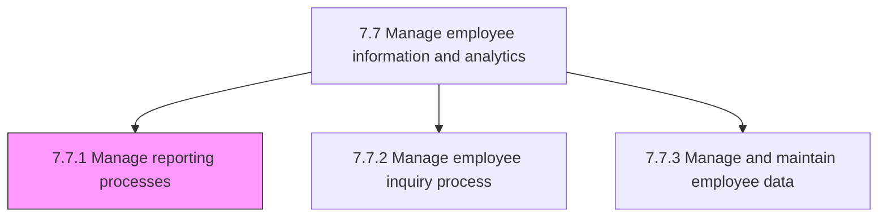
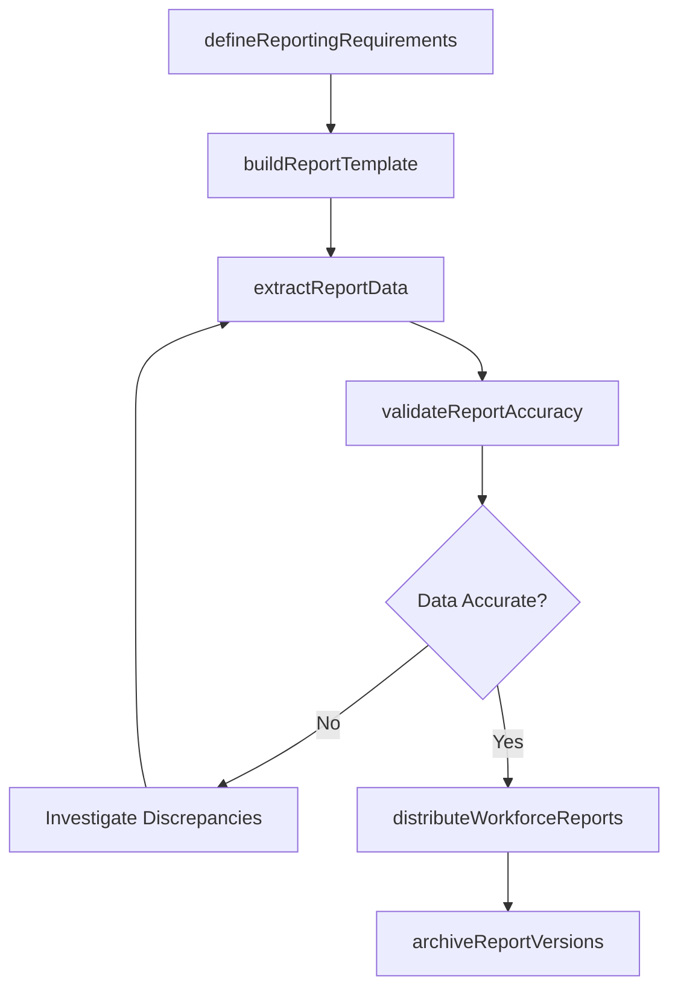

# Manage reporting processes

> Business-as-Code definition for managing HR reporting processes. Models the complete process of designing, producing, and distributing workforce reports and analytics to management, ensuring data accuracy, regulatory compliance, and timely delivery of actionable insights.

## Overview

Providing information and reports regarding employees to management. Define standard and ad-hoc reporting requirements, build report templates and dashboards, extract data from HR systems, validate accuracy, and distribute workforce analytics on headcount, turnover, diversity, compensation, and compliance to leadership and regulatory bodies.

## Process Hierarchy



## GraphDL

```yaml
manage:
  object: Reporting Processes
  actor: HRAnalyst
  result: WorkforceReport
```

## Actions

| Action | Description |
|--------|-------------|
| defineReportingRequirements | Gather and document stakeholder needs for standard and ad-hoc workforce reports |
| buildReportTemplate | Design reusable report layouts with appropriate data fields, filters, and visualizations |
| extractReportData | Pull employee data from HRIS, payroll, and other source systems into the reporting pipeline |
| validateReportAccuracy | Cross-check extracted data against source records and apply quality rules |
| distributeWorkforceReports | Deliver finalized reports to management, compliance teams, and designated stakeholders |
| archiveReportVersions | Store historical report versions for audit trail and period-over-period comparison |

## Events

| Event | Description |
|-------|-------------|
| reportingRequirementsDefined | Stakeholder report needs documented and prioritized |
| reportTemplateBuilt | Reusable report layout created and validated against requirements |
| reportDataExtracted | Employee data successfully pulled from source systems |
| reportAccuracyValidated | Data quality checks passed and discrepancies resolved |
| workforceReportsDistributed | Finalized reports delivered to all designated recipients |
| reportVersionArchived | Historical report snapshot stored for compliance and audit |

## Searches

| Search | Description |
|--------|-------------|
| findReports | List available workforce reports filtered by type, frequency, or audience |
| getReportOutput | Retrieve the latest output for a specific report by ID |
| getReportSchedule | Query the production and distribution schedule for recurring reports |
| getReportAuditLog | Retrieve the version history and access log for a given report |

## Process Flow



## RACI Matrix

| Activity | Responsible | Accountable | Consulted | Informed |
|----------|-------------|-------------|-----------|----------|
| defineReportingRequirements | HRAnalyst | VP HR | BusinessUnitLeads | HRISAnalyst |
| buildReportTemplate | HRISAnalyst | HRAnalyst | ITBusinessIntelligence | VP HR |
| extractReportData | HRISAnalyst | HRAnalyst | DatabaseAdministrator | HRDataManager |
| validateReportAccuracy | HRAnalyst | HRDataManager | HRISAnalyst | VP HR |
| distributeWorkforceReports | HRAnalyst | VP HR | InternalCommunications | Leadership |

## Related Processes

| Process | Relationship |
|---------|-------------|
| 7.7.2 Manage employee inquiry process | Sibling - reports often answer recurring inquiry topics |
| 7.7.3 Manage and maintain employee data | Upstream - data quality directly affects report accuracy |
| 7.7.5 Develop and manage employee metrics | Downstream - metrics feed into standard reports |
| 7.7 Manage employee information and analytics | Parent - governing process group |

## Related Departments

| Department | Role |
|-----------|------|
| Human Resources | Defines reporting requirements and validates output |
| IT / Business Intelligence | Supports data extraction and dashboard infrastructure |
| Finance | Consumes headcount, compensation, and labor cost reports |
| Compliance | Requires EEO, OSHA, and regulatory workforce filings |

## Related Occupations

| Occupation | Involvement |
|-----------|-------------|
| HR Analyst | Designs reports, validates data, and distributes insights |
| HRIS Analyst | Builds templates and extracts data from HR systems |
| HR Data Manager | Ensures source data quality and manages report archives |

## KPIs

| KPI | Description | Unit |
|-----|-------------|------|
| Report Timeliness | Percentage of recurring reports delivered on schedule | % |
| Data Accuracy Rate | Percentage of report data points passing validation checks | % |
| Report Utilization | Number of unique stakeholders accessing reports per period | Count |
| Ad-Hoc Request Turnaround | Average business days to fulfill an ad-hoc report request | Days |

## Usage

```typescript
import { manageReportingProcesses } from '@headlessly/manage-reporting-processes'

const reporting = manageReportingProcesses()

// Extract and validate data for the monthly headcount report
const report = await reporting.extractReportData({
  reportId: 'RPT-HC-MONTHLY',
  period: '2026-01',
  departments: ['engineering', 'sales', 'operations'],
  includeContractors: true
})

// Retrieve the distribution schedule for all quarterly reports
const schedule = await reporting.getReportSchedule({
  frequency: 'quarterly',
  nextDeliveryBefore: '2026-04-15'
})
```
