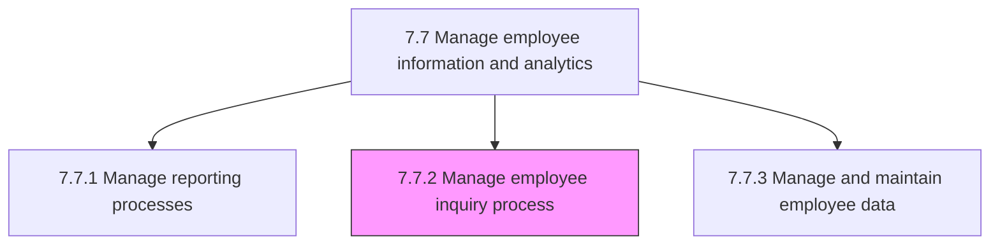
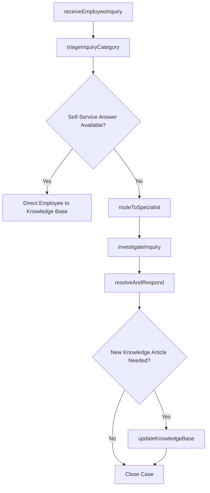

# Manage employee inquiry process

> Business-as-Code definition for managing the employee inquiry process. Models the complete lifecycle of receiving, triaging, resolving, and tracking employee questions and grievances related to HR policies, benefits, payroll, and workplace treatment.

## Overview

Handling instances where an employee believes that he/she has been inappropriately treated or he/she desires clarification. Encourage employees to inquire when needed. Record and clarify the issues for which the enquiry has been made. Triage inquiries by category, route to the appropriate HR specialist, track resolution progress, and maintain a knowledge base of common questions and answers to improve self-service options.

## Process Hierarchy



## GraphDL

```yaml
manage:
  object: Employee Inquiry Process
  actor: HRServiceCenterAgent
  result: InquiryResolution
```

## Actions

| Action | Description |
|--------|-------------|
| receiveEmployeeInquiry | Log an incoming question, complaint, or clarification request from an employee |
| triageInquiryCategory | Classify the inquiry by topic (benefits, payroll, policy, grievance) and assign priority |
| routeToSpecialist | Forward the inquiry to the appropriate HR subject matter expert for resolution |
| investigateInquiry | Research the issue, review applicable policies, and gather relevant documentation |
| resolveAndRespond | Provide the employee with a clear resolution or explanation and close the ticket |
| updateKnowledgeBase | Add new or revised answers to the self-service knowledge base from resolved inquiries |

## Events

| Event | Description |
|-------|-------------|
| employeeInquiryReceived | Employee question or grievance formally logged in the case management system |
| inquiryCategoryTriaged | Inquiry classified, prioritized, and routed to the correct queue |
| inquiryRoutedToSpecialist | Case assigned to an HR specialist for investigation and resolution |
| inquiryInvestigated | Research and documentation gathering completed for the case |
| inquiryResolved | Employee received resolution and the case was closed |
| knowledgeBaseUpdated | Self-service article created or updated from the resolved inquiry |

## Searches

| Search | Description |
|--------|-------------|
| findInquiries | List employee inquiries filtered by status, category, priority, or date range |
| getInquiryDetails | Retrieve full case details including timeline, notes, and resolution for a specific inquiry |
| getKnowledgeArticles | Search the HR knowledge base for self-service answers by topic or keyword |
| getInquiryVolumeByCategory | Query inquiry counts grouped by category and time period for trend analysis |

## Process Flow



## RACI Matrix

| Activity | Responsible | Accountable | Consulted | Informed |
|----------|-------------|-------------|-----------|----------|
| receiveEmployeeInquiry | HRServiceCenterAgent | HRServiceCenterManager | Employee | HRBusinessPartner |
| triageInquiryCategory | HRServiceCenterAgent | HRServiceCenterManager | HRAnalyst | HRSpecialist |
| routeToSpecialist | HRServiceCenterManager | VP HR | HRSpecialist | Employee |
| investigateInquiry | HRSpecialist | HRServiceCenterManager | EmploymentCounsel | HRBusinessPartner |
| resolveAndRespond | HRSpecialist | HRServiceCenterManager | HRBusinessPartner | Employee |

## Related Processes

| Process | Relationship |
|---------|-------------|
| 7.7.1 Manage reporting processes | Downstream - inquiry volume data feeds into HR reports |
| 7.7.3 Manage and maintain employee data | Related - inquiries may trigger data corrections |
| 7.7.4 Manage human resource information systems (HRIS) | Related - HRIS powers the case management system |
| 7.7 Manage employee information and analytics | Parent - governing process group |

## Related Departments

| Department | Role |
|-----------|------|
| HR Service Center | Receives, triages, and resolves the majority of employee inquiries |
| Legal / Employee Relations | Handles escalated grievances and compliance-sensitive inquiries |
| Benefits Administration | Resolves benefits eligibility, enrollment, and claims questions |
| Payroll | Addresses pay discrepancy and tax withholding inquiries |

## Related Occupations

| Occupation | Involvement |
|-----------|-------------|
| HR Service Center Agent | Front-line intake and resolution of employee inquiries |
| HR Specialist | Provides subject matter expertise on escalated cases |
| Employee Relations Manager | Investigates formal grievances and workplace treatment complaints |

## KPIs

| KPI | Description | Unit |
|-----|-------------|------|
| First-Contact Resolution Rate | Percentage of inquiries resolved on the first interaction | % |
| Average Resolution Time | Mean business hours from inquiry receipt to resolution | Hours |
| Employee Satisfaction Score | Average post-resolution satisfaction rating from employees | Score (1-5) |
| Self-Service Deflection Rate | Percentage of inquiries resolved via knowledge base without agent involvement | % |

## Usage

```typescript
import { manageEmployeeInquiryProcess } from '@headlessly/manage-employee-inquiry-process'

const inquiries = manageEmployeeInquiryProcess()

// Log a new employee inquiry about benefits eligibility
const ticket = await inquiries.receiveEmployeeInquiry({
  employeeId: 'EMP-2847',
  category: 'benefits',
  subject: 'Dental coverage for dependents',
  description: 'Requesting clarification on dependent eligibility for the PPO dental plan',
  priority: 'standard'
})

// Analyze inquiry volume trends by category
const trends = await inquiries.getInquiryVolumeByCategory({
  period: 'Q1-2026',
  groupBy: 'category',
  includeResolutionTimes: true
})
```
