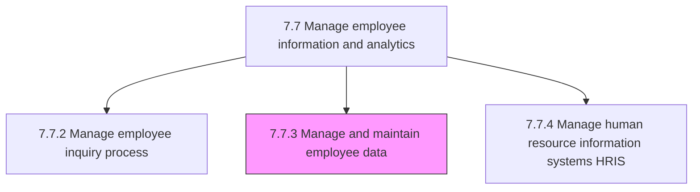
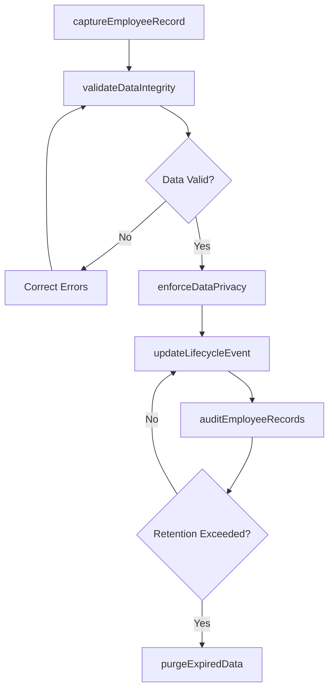

# Manage and maintain employee data

> Business-as-Code definition for managing and maintaining employee data. Models the complete process of capturing, validating, updating, securing, and governing employee records throughout the employment lifecycle.

## Overview

Capturing and updating employee information and data and information on the employees. Ensure data integrity across hire, transfer, promotion, compensation change, and separation events. Enforce data governance standards, manage access controls, comply with privacy regulations (GDPR, CCPA), and perform regular data quality audits to maintain a single source of truth for all workforce records.

## Process Hierarchy



## GraphDL

```yaml
manage:
  object: Employee Data
  actor: HRDataManager
  result: EmployeeRecord
```

## Actions

| Action | Description |
|--------|-------------|
| captureEmployeeRecord | Create a new employee record at hire with personal, job, and compensation data |
| updateLifecycleEvent | Apply changes from promotions, transfers, compensation adjustments, or status changes |
| validateDataIntegrity | Run automated and manual quality checks to detect duplicates, missing fields, and inconsistencies |
| enforceDataPrivacy | Apply access controls, encryption, and retention policies per GDPR, CCPA, and internal governance |
| auditEmployeeRecords | Conduct periodic reviews of data completeness, accuracy, and compliance |
| purgeExpiredData | Remove or anonymize records that have exceeded the mandated retention period |

## Events

| Event | Description |
|-------|-------------|
| employeeRecordCreated | New hire employee record established in the system of record |
| lifecycleEventApplied | Employee record updated to reflect a job, compensation, or status change |
| dataIntegrityValidated | Quality checks completed and data anomalies flagged or resolved |
| dataPrivacyEnforced | Access controls and privacy settings applied or updated for employee records |
| employeeRecordsAudited | Periodic data quality audit completed with findings documented |
| expiredDataPurged | Records exceeding retention thresholds anonymized or deleted |

## Searches

| Search | Description |
|--------|-------------|
| findEmployeeRecords | List employee records filtered by department, status, hire date, or location |
| getEmployeeProfile | Retrieve the complete data profile for a specific employee |
| getDataQualityScores | Query data completeness and accuracy scores by department or data field |
| getAuditFindings | Retrieve results from the most recent data quality audit |

## Process Flow



## RACI Matrix

| Activity | Responsible | Accountable | Consulted | Informed |
|----------|-------------|-------------|-----------|----------|
| captureEmployeeRecord | HRDataManager | HRManager | HRISAnalyst | HiringManager |
| updateLifecycleEvent | HRISAnalyst | HRDataManager | HRBusinessPartner | Payroll |
| validateDataIntegrity | HRDataManager | VP HR | ITDatabaseAdmin | HRAnalyst |
| enforceDataPrivacy | DataPrivacyOfficer | VP HR | Legal | HRDataManager |
| auditEmployeeRecords | HRDataManager | VP HR | InternalAudit | Compliance |

## Related Processes

| Process | Relationship |
|---------|-------------|
| 7.7.2 Manage employee inquiry process | Downstream - inquiries may reveal data errors requiring correction |
| 7.7.4 Manage human resource information systems (HRIS) | Related - HRIS is the primary system for employee data storage |
| 7.7.1 Manage reporting processes | Downstream - report accuracy depends on data quality |
| 7.7 Manage employee information and analytics | Parent - governing process group |

## Related Departments

| Department | Role |
|-----------|------|
| Human Resources | Owns employee data governance and maintains records |
| IT | Manages database infrastructure, backups, and system integrations |
| Legal / Privacy | Advises on data protection regulations and retention policies |
| Internal Audit | Conducts independent reviews of data management controls |

## Related Occupations

| Occupation | Involvement |
|-----------|-------------|
| HR Data Manager | Governs data quality, enforces standards, and conducts audits |
| HRIS Analyst | Performs system-level data entry, updates, and integration maintenance |
| Data Privacy Officer | Ensures employee data handling complies with privacy regulations |

## KPIs

| KPI | Description | Unit |
|-----|-------------|------|
| Data Completeness Rate | Percentage of employee records with all mandatory fields populated | % |
| Data Accuracy Rate | Percentage of records passing automated validation checks | % |
| Lifecycle Update Timeliness | Average hours from event occurrence to record update | Hours |
| Privacy Compliance Rate | Percentage of records fully compliant with data retention and access policies | % |

## Usage

```typescript
import { manageEmployeeData } from '@headlessly/manage-employee-data'

const data = manageEmployeeData()

// Validate data integrity across the sales department
const quality = await data.validateDataIntegrity({
  department: 'sales',
  checks: ['completeness', 'duplicates', 'format-compliance'],
  autoCorrect: false
})

// Retrieve the full employee profile for an HR investigation
const profile = await data.getEmployeeProfile({
  employeeId: 'EMP-6190',
  includeSensitiveFields: true,
  auditReason: 'internal-investigation'
})
```
