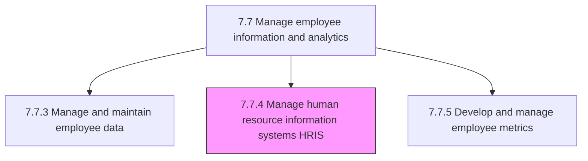
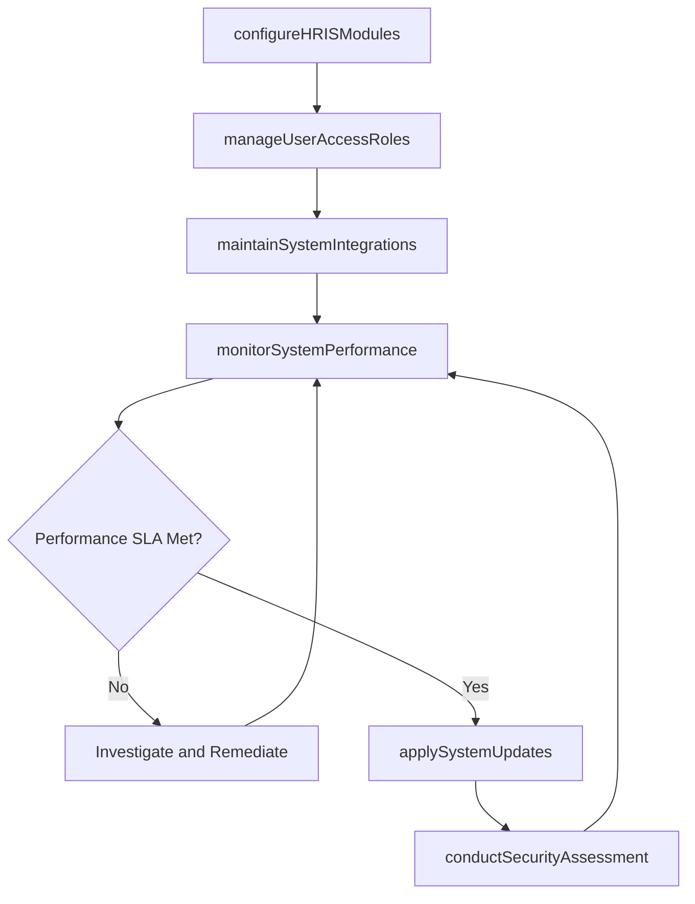

# Manage human resource information systems (HRIS)

> Business-as-Code definition for managing human resource information systems. Models the complete process of administering, configuring, integrating, and maintaining HRIS platforms that support HR, payroll, benefits, and talent management operations.

## Overview

Administering and maintaining HR information systems that take care of activities related to HR, accounting, management, and payroll. Configure system modules, manage user access and roles, maintain integrations with payroll, benefits, and talent systems, apply patches and upgrades, and ensure system performance, security, and data integrity across the HR technology stack.

## Process Hierarchy



## GraphDL

```yaml
manage:
  object: Human Resource Information Systems HRIS
  actor: HRISAdministrator
  result: HRISConfiguration
```

## Actions

| Action | Description |
|--------|-------------|
| configureHRISModules | Set up and customize system modules for core HR, payroll, benefits, and talent management |
| manageUserAccessRoles | Provision, modify, and deactivate user accounts and role-based security permissions |
| maintainSystemIntegrations | Monitor and troubleshoot data feeds between HRIS and downstream systems (payroll, finance, LMS) |
| applySystemUpdates | Test and deploy vendor patches, version upgrades, and configuration changes |
| monitorSystemPerformance | Track uptime, response times, error rates, and capacity utilization of the HRIS platform |
| conductSecurityAssessment | Evaluate system vulnerabilities, review access logs, and ensure compliance with security standards |

## Events

| Event | Description |
|-------|-------------|
| hrisModuleConfigured | System module activated, customized, and validated for production use |
| userAccessUpdated | User account or role permission provisioned, modified, or revoked |
| integrationHealthChecked | Data feed between HRIS and a downstream system verified as operational |
| systemUpdateApplied | Vendor patch or version upgrade successfully deployed to production |
| performanceThresholdBreached | System metric exceeded defined SLA threshold, triggering an alert |
| securityAssessmentCompleted | Vulnerability scan and access review completed with findings documented |

## Searches

| Search | Description |
|--------|-------------|
| findHRISModules | List configured HRIS modules filtered by status, vendor, or functional area |
| getUserAccessReport | Retrieve user accounts and permissions for a specific module or role |
| getIntegrationStatus | Query the current health and sync status of all HRIS data integrations |
| getSystemPerformanceMetrics | Retrieve uptime, response time, and error rate data for a given period |

## Process Flow



## RACI Matrix

| Activity | Responsible | Accountable | Consulted | Informed |
|----------|-------------|-------------|-----------|----------|
| configureHRISModules | HRISAdministrator | HRISManager | VP HR | BusinessProcessOwners |
| manageUserAccessRoles | HRISAdministrator | HRISManager | InformationSecurity | HRDataManager |
| maintainSystemIntegrations | HRISAdministrator | HRISManager | ITIntegrationTeam | Payroll |
| applySystemUpdates | HRISAdministrator | HRISManager | VendorSupport | VP HR |
| conductSecurityAssessment | InformationSecurity | HRISManager | HRISAdministrator | Compliance |

## Related Processes

| Process | Relationship |
|---------|-------------|
| 7.7.3 Manage and maintain employee data | Upstream - HRIS is the system of record for employee data |
| 7.7.5 Develop and manage employee metrics | Downstream - HRIS provides data for metric calculation |
| 7.7.6 Develop and manage time and attendance systems | Related - time systems often integrate with or reside in HRIS |
| 7.7 Manage employee information and analytics | Parent - governing process group |

## Related Departments

| Department | Role |
|-----------|------|
| HRIS / HR Technology | Owns system administration, configuration, and integration |
| IT Infrastructure | Manages hosting, networking, and disaster recovery for HRIS |
| Information Security | Enforces security policies and conducts vulnerability assessments |
| HR Operations | Primary business user community for HRIS functionality |

## Related Occupations

| Occupation | Involvement |
|-----------|-------------|
| HRIS Administrator | Configures modules, manages access, and maintains integrations |
| HRIS Manager | Oversees the HR technology roadmap and vendor relationships |
| IT Integration Specialist | Builds and monitors data feeds between HRIS and other systems |

## KPIs

| KPI | Description | Unit |
|-----|-------------|------|
| System Uptime | Percentage of time HRIS is available and operational | % |
| Integration Success Rate | Percentage of data sync jobs completing without error | % |
| Patch Deployment Timeliness | Percentage of vendor patches applied within the SLA window | % |
| User Satisfaction Score | Average satisfaction rating from HRIS end-user surveys | Score (1-5) |

## Usage

```typescript
import { manageHumanResourceInformationSystemsHris } from '@headlessly/manage-human-resource-information-systems-hris'

const hris = manageHumanResourceInformationSystemsHris()

// Check integration health for all active HRIS data feeds
const integrations = await hris.getIntegrationStatus({
  status: 'active',
  includeLastSyncTimestamp: true,
  includeErrorCounts: true
})

// Provision a new HRIS user with benefits administrator role
const access = await hris.manageUserAccessRoles({
  userId: 'USR-9021',
  action: 'provision',
  role: 'benefits-administrator',
  modules: ['benefits', 'open-enrollment'],
  effectiveDate: '2026-03-01'
})
```
