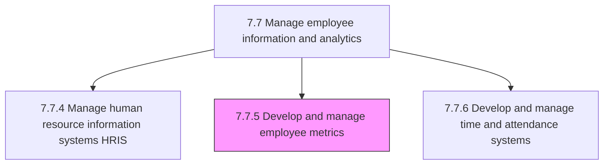
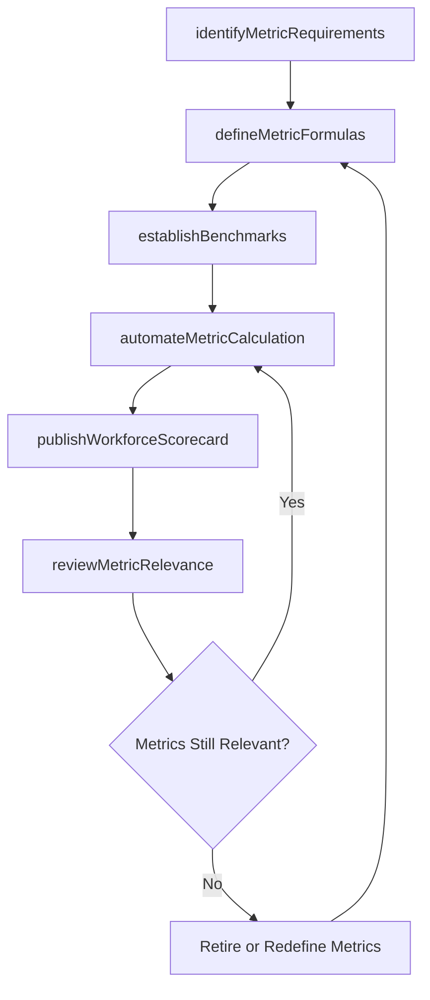

# Develop and manage employee metrics

> Business-as-Code definition for developing and managing employee metrics. Models the complete process of defining, calculating, benchmarking, and maintaining strategic workforce KPIs that drive data-informed HR decisions across the organization.

## Overview

Creating and maintaining performance metrics for employees. Create and manage a strategic system of data and statistics to accurately gauge each employee's information. Consider productivity metrics, efficiency metrics, training metrics, etc. Define metric formulas and data sources, establish benchmarks and targets, automate calculation pipelines, and publish workforce scorecards that inform talent, retention, and organizational effectiveness decisions.

## Process Hierarchy



## GraphDL

```yaml
develop:
  object: Employee Metrics
  actor: HRAnalyst
  result: WorkforceScorecard
```

## Actions

| Action | Description |
|--------|-------------|
| identifyMetricRequirements | Gather stakeholder needs and business questions that workforce metrics should answer |
| defineMetricFormulas | Specify calculation logic, data sources, and aggregation rules for each metric |
| establishBenchmarks | Set internal targets and external industry benchmarks for comparison |
| automateMetricCalculation | Build data pipelines that compute and refresh metric values on a scheduled cadence |
| publishWorkforceScorecard | Deliver interactive dashboards and scorecards to leadership and HR business partners |
| reviewMetricRelevance | Periodically assess whether existing metrics remain aligned with strategic priorities |

## Events

| Event | Description |
|-------|-------------|
| metricRequirementsIdentified | Stakeholder needs documented and metric catalog prioritized |
| metricFormulasDefined | Calculation logic and data source mappings established for new metrics |
| benchmarksEstablished | Internal targets and external comparisons set for each metric |
| metricCalculationAutomated | Data pipeline deployed and producing metric values on schedule |
| workforceScorecardPublished | Dashboard or scorecard released to designated stakeholders |
| metricRelevanceReviewed | Existing metric portfolio assessed and retired or updated as needed |

## Searches

| Search | Description |
|--------|-------------|
| findMetricDefinitions | List available workforce metrics filtered by category, owner, or data source |
| getMetricValues | Retrieve calculated metric values for a department, team, or time period |
| getBenchmarkComparisons | Query metric values against established internal and industry benchmarks |
| getMetricTrends | Retrieve metric values over time for trend analysis and forecasting |

## Process Flow



## RACI Matrix

| Activity | Responsible | Accountable | Consulted | Informed |
|----------|-------------|-------------|-----------|----------|
| identifyMetricRequirements | HRAnalyst | VP HR | BusinessUnitLeads | CHRO |
| defineMetricFormulas | HRAnalyst | HRDataManager | HRISAnalyst | VP HR |
| establishBenchmarks | HRAnalyst | VP HR | CompensationAnalyst | Finance |
| automateMetricCalculation | HRISAnalyst | HRDataManager | ITDataEngineering | HRAnalyst |
| publishWorkforceScorecard | HRAnalyst | VP HR | InternalCommunications | Leadership |

## Related Processes

| Process | Relationship |
|---------|-------------|
| 7.7.4 Manage human resource information systems (HRIS) | Upstream - HRIS provides the source data for metric calculations |
| 7.7.1 Manage reporting processes | Downstream - metrics are embedded in workforce reports |
| 7.7.6 Develop and manage time and attendance systems | Related - attendance data feeds productivity and efficiency metrics |
| 7.7 Manage employee information and analytics | Parent - governing process group |

## Related Departments

| Department | Role |
|-----------|------|
| Human Resources | Defines metrics, publishes scorecards, and drives metric-informed decisions |
| IT / Data Engineering | Builds and maintains metric calculation pipelines |
| Finance | Consumes workforce cost, productivity, and ROI metrics |
| Executive Leadership | Uses scorecards for strategic workforce planning |

## Related Occupations

| Occupation | Involvement |
|-----------|-------------|
| HR Analyst | Defines, calculates, and interprets workforce metrics |
| HR Data Manager | Governs metric data quality and pipeline reliability |
| People Analytics Specialist | Conducts advanced statistical analysis on workforce data |

## KPIs

| KPI | Description | Unit |
|-----|-------------|------|
| Metric Catalog Coverage | Percentage of strategic HR questions addressable by defined metrics | % |
| Scorecard Refresh Timeliness | Percentage of scorecards updated within the scheduled cadence | % |
| Stakeholder Adoption Rate | Percentage of target audience actively using workforce scorecards | % |
| Metric Data Freshness | Average lag between source data change and metric recalculation | Hours |

## Usage

```typescript
import { developEmployeeMetrics } from '@headlessly/develop-employee-metrics'

const metrics = developEmployeeMetrics()

// Retrieve turnover metric values with benchmark comparison
const turnover = await metrics.getBenchmarkComparisons({
  metricId: 'voluntary-turnover-rate',
  department: 'engineering',
  period: '2025',
  benchmarkSource: 'radford-technology-survey'
})

// Automate calculation pipeline for a new metric
const pipeline = await metrics.automateMetricCalculation({
  metricId: 'time-to-productivity',
  formula: 'avg(days_to_full_performance)',
  dataSources: ['hris', 'performance-management'],
  refreshCadence: 'monthly',
  effectiveDate: '2026-03-01'
})
```
