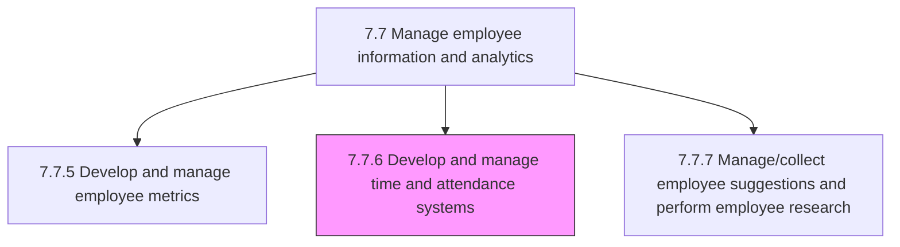
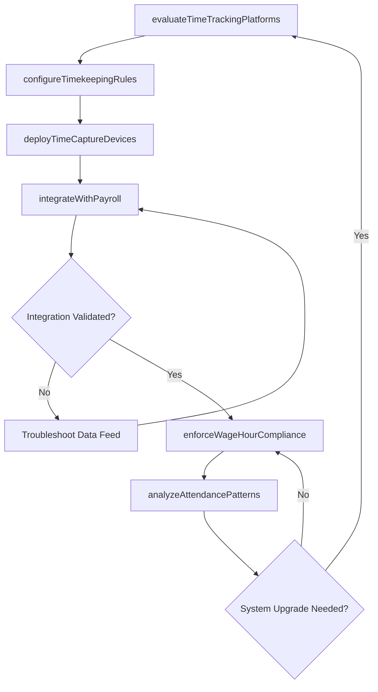

# Develop and manage time and attendance systems

> Business-as-Code definition for developing and managing time and attendance systems. Models the complete process of selecting, configuring, deploying, and maintaining systems that track employee work hours, attendance, breaks, and labor allocation.

## Overview

Developing and maintaining systems for managing the time and attendance of employees. Routinely upgrade the process and systems that track when employees start and stop work, the department where the work is performed, attendance in addition to tracking meals and breaks, the type of work performed, and the number of items produced. Ensure compliance with wage and hour regulations, integrate time data with payroll processing, and provide labor cost analytics to management.

## Process Hierarchy



## GraphDL

```yaml
develop:
  object: Time And Attendance Systems
  actor: HRISAdministrator
  result: TimeAttendanceConfiguration
```

## Actions

| Action | Description |
|--------|-------------|
| evaluateTimeTrackingPlatforms | Assess vendor solutions and internal build options against organizational requirements |
| configureTimekeepingRules | Define pay periods, overtime thresholds, break rules, and shift differentials in the system |
| deployTimeCaptureDevices | Install and commission time clocks, badge readers, or mobile time entry applications |
| integrateWithPayroll | Build and validate data feeds between time and attendance and payroll processing systems |
| enforceWageHourCompliance | Configure alerts and controls for overtime limits, meal period violations, and minor labor rules |
| analyzeAttendancePatterns | Generate reports on absenteeism, tardiness, overtime trends, and labor cost distribution |

## Events

| Event | Description |
|-------|-------------|
| timeTrackingPlatformEvaluated | Vendor or platform assessed and selection recommendation produced |
| timekeepingRulesConfigured | Pay period, overtime, and break rules activated in the system |
| timeCaptureDevicesDeployed | Physical or mobile time entry endpoints installed and operational |
| payrollIntegrationValidated | Time data feed to payroll verified for accuracy and completeness |
| wageHourViolationDetected | System alert triggered for an overtime, break, or minor labor rule violation |
| attendancePatternsAnalyzed | Absenteeism and overtime trend report generated for management review |

## Searches

| Search | Description |
|--------|-------------|
| findTimesheets | List employee timesheets filtered by pay period, department, or approval status |
| getAttendanceSummary | Retrieve attendance statistics for an employee or team over a given period |
| getOvertimeReport | Query overtime hours and costs by department, shift, or employee |
| getPayrollFeedStatus | Check the status and error log of the latest time-to-payroll data transfer |

## Process Flow



## RACI Matrix

| Activity | Responsible | Accountable | Consulted | Informed |
|----------|-------------|-------------|-----------|----------|
| evaluateTimeTrackingPlatforms | HRISAdministrator | HRISManager | VP HR | Procurement |
| configureTimekeepingRules | HRISAdministrator | HRISManager | PayrollManager | EmploymentCounsel |
| deployTimeCaptureDevices | ITInfrastructure | HRISAdministrator | FacilitiesManager | DepartmentManagers |
| integrateWithPayroll | HRISAdministrator | HRISManager | PayrollSpecialist | HRDataManager |
| enforceWageHourCompliance | PayrollManager | VP HR | EmploymentCounsel | HRISAdministrator |

## Related Processes

| Process | Relationship |
|---------|-------------|
| 7.7.5 Develop and manage employee metrics | Related - attendance data feeds productivity and efficiency metrics |
| 7.7.4 Manage human resource information systems (HRIS) | Upstream - time systems integrate with or reside within HRIS |
| 7.7.7 Manage/collect employee suggestions and perform employee research | Sibling - employee feedback may drive time system improvements |
| 7.7 Manage employee information and analytics | Parent - governing process group |

## Related Departments

| Department | Role |
|-----------|------|
| HRIS / HR Technology | Configures, deploys, and maintains time and attendance systems |
| Payroll | Consumes time data for pay calculation and wage compliance |
| IT Infrastructure | Manages hardware, network, and mobile device deployment |
| Legal / Compliance | Advises on wage and hour regulation adherence |

## Related Occupations

| Occupation | Involvement |
|-----------|-------------|
| HRIS Administrator | Configures time rules and manages system deployments |
| Payroll Manager | Validates time data feeds and enforces wage compliance |
| IT Infrastructure Specialist | Deploys and maintains time capture hardware and connectivity |

## KPIs

| KPI | Description | Unit |
|-----|-------------|------|
| Timesheet Completion Rate | Percentage of employees submitting timesheets by the deadline | % |
| Payroll Feed Accuracy | Percentage of time records synced to payroll without errors | % |
| Wage-Hour Violation Rate | Number of compliance violations detected per 1,000 employee-hours | Rate |
| System Adoption Rate | Percentage of workforce actively using the primary time capture method | % |

## Usage

```typescript
import { developTimeAndAttendanceSystems } from '@headlessly/develop-time-and-attendance-systems'

const timeAttendance = developTimeAndAttendanceSystems()

// Configure overtime rules for the manufacturing division
const rules = await timeAttendance.configureTimekeepingRules({
  division: 'manufacturing',
  payPeriod: 'biweekly',
  overtimeThreshold: 40,
  breakRules: { mealBreak: 30, restBreak: 10 },
  shiftDifferential: { nightShift: 1.15 }
})

// Analyze attendance patterns for the current quarter
const patterns = await timeAttendance.getAttendanceSummary({
  department: 'logistics',
  period: 'Q1-2026',
  metrics: ['absenteeism-rate', 'tardiness-rate', 'overtime-hours']
})
```
