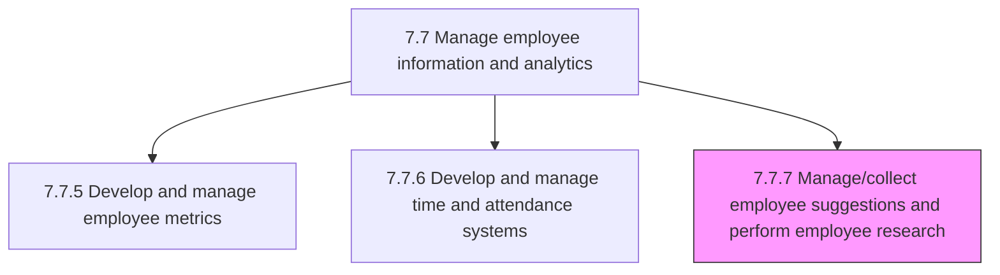
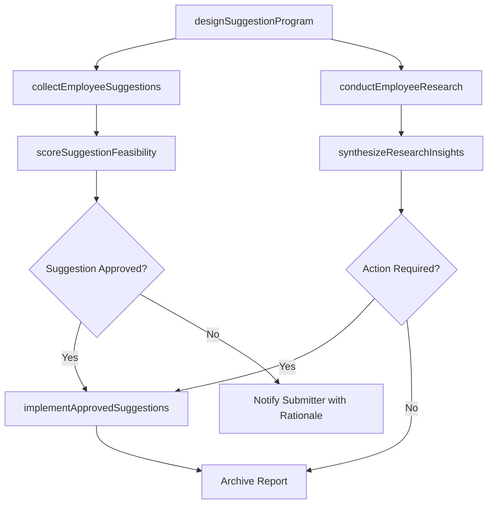

# Manage/Collect employee suggestions and perform employee research

> Business-as-Code definition for managing employee suggestion programs and conducting employee research. Models the process of collecting, evaluating, and implementing employee ideas while using surveys, focus groups, and data analysis to understand workforce attitudes and engagement.

## Overview

Procuring and handling suggestions from employees, and performing research on employees. Manage and analyze the programs that help the organization to tap into employee ideas for improving the organization's processes and/or products. Use surveys, focus groups, and other data-gathering methods to find out the attitudes, opinions, and feelings of members of an organization. Score and prioritize ideas by feasibility and business impact, close the loop with submitters, and feed insights into organizational improvement initiatives.

## Process Hierarchy



## GraphDL

```yaml
manage:
  object: Employee Suggestions And Employee Research
  actor: EmployeeEngagementManager
  result: SuggestionResearchReport
```

## Actions

| Action | Description |
|--------|-------------|
| designSuggestionProgram | Create suggestion collection channels, evaluation criteria, and recognition incentives |
| collectEmployeeSuggestions | Gather improvement ideas from employees through digital portals, town halls, and suggestion boxes |
| scoreSuggestionFeasibility | Evaluate each suggestion for implementation cost, business impact, and strategic alignment |
| conductEmployeeResearch | Design and administer surveys, focus groups, and pulse checks to gauge workforce sentiment |
| synthesizeResearchInsights | Analyze survey and suggestion data to identify themes, trends, and actionable recommendations |
| implementApprovedSuggestions | Coordinate execution of high-priority employee suggestions with responsible departments |

## Events

| Event | Description |
|-------|-------------|
| suggestionProgramDesigned | Suggestion collection channels and evaluation criteria established or refreshed |
| employeeSuggestionsCollected | Batch of employee ideas received, logged, and acknowledged |
| suggestionFeasibilityScored | Submitted suggestions evaluated and ranked by impact and feasibility |
| employeeResearchConducted | Survey, focus group, or pulse check completed and responses captured |
| researchInsightsSynthesized | Research findings analyzed and recommendations documented for leadership |
| approvedSuggestionImplemented | Employee suggestion executed and outcome reported back to the submitter |

## Searches

| Search | Description |
|--------|-------------|
| findSuggestions | List employee suggestions filtered by status, department, category, or impact score |
| getSuggestionDetails | Retrieve full details and evaluation history for a specific suggestion |
| getSurveyResults | Query employee research results by campaign, topic, or demographic segment |
| getEngagementTrends | Retrieve employee engagement and sentiment scores over time |

## Process Flow



## RACI Matrix

| Activity | Responsible | Accountable | Consulted | Informed |
|----------|-------------|-------------|-----------|----------|
| designSuggestionProgram | EmployeeEngagementManager | VP HR | HRBusinessPartner | InternalCommunications |
| collectEmployeeSuggestions | HRISAnalyst | EmployeeEngagementManager | DepartmentManagers | AllEmployees |
| scoreSuggestionFeasibility | EmployeeEngagementManager | VP HR | SubjectMatterExperts | Submitters |
| conductEmployeeResearch | HRAnalyst | EmployeeEngagementManager | ExternalResearchVendor | Leadership |
| synthesizeResearchInsights | HRAnalyst | EmployeeEngagementManager | PeopleAnalyticsSpecialist | VP HR |

## Related Processes

| Process | Relationship |
|---------|-------------|
| 7.7.6 Develop and manage time and attendance systems | Sibling - related employee information management process |
| 7.7.5 Develop and manage employee metrics | Related - engagement data feeds into workforce metrics |
| 7.8.2 Conduct employee engagement surveys | Downstream - research findings may trigger formal engagement surveys |
| 7.7 Manage employee information and analytics | Parent - governing process group |

## Related Departments

| Department | Role |
|-----------|------|
| Human Resources | Owns suggestion programs and employee research initiatives |
| Internal Communications | Promotes participation and communicates outcomes |
| Operations | Evaluates and implements process improvement suggestions |
| IT | Supports suggestion portals and survey administration platforms |

## Related Occupations

| Occupation | Involvement |
|-----------|-------------|
| Employee Engagement Manager | Designs programs, evaluates suggestions, and drives research strategy |
| HR Analyst | Conducts survey analysis and generates insight reports |
| HRIS Analyst | Manages suggestion system configuration and data collection |

## KPIs

| KPI | Description | Unit |
|-----|-------------|------|
| Suggestion Submission Rate | Number of employee suggestions received per quarter per 100 employees | Rate |
| Suggestion Implementation Rate | Percentage of scored suggestions approved and implemented | % |
| Survey Participation Rate | Percentage of targeted employees completing research surveys | % |
| Employee Engagement Score | Composite engagement score derived from employee research surveys | Score (1-100) |

## Usage

```typescript
import { manageEmployeeSuggestionsAndEmployeeResearch } from '@headlessly/manage-employee-suggestions-and-employee-research'

const suggestions = manageEmployeeSuggestionsAndEmployeeResearch()

// Score submitted suggestions for feasibility and business impact
const scored = await suggestions.scoreSuggestionFeasibility({
  department: 'engineering',
  period: 'Q1-2026',
  evaluationCriteria: ['cost', 'impact', 'alignment'],
  minImpactScore: 3
})

// Synthesize research insights from the latest pulse survey
const insights = await suggestions.synthesizeResearchInsights({
  campaignId: 'PULSE-2026-Q1',
  segmentBy: ['department', 'tenure-band'],
  includeOpenEndedThemes: true
})
```
