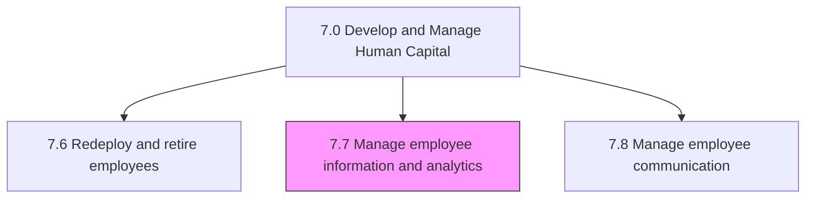
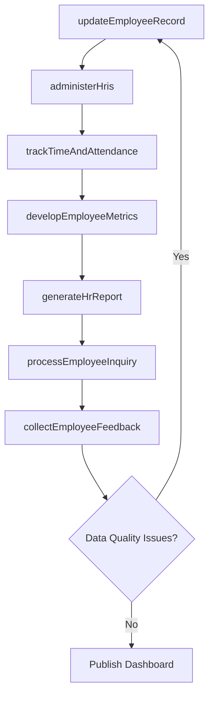

# Manage employee information and analytics

> Business-as-Code definition for employee information and HR analytics management. Models reporting processes, employee data management, HRIS administration, workforce metrics, time and attendance systems, and employee research.

## Overview

Managing the employee reporting processes, employee inquiry process, employee information and data, and the HR information systems. Create and administer the employee metrics. Develop and handle the time and attendance systems. Refurbish the indicators for employee retention and motivation.

## Process Hierarchy



## GraphDL

```yaml
manage:
  object: Employee Information And Analytics
  actor: HRISManager
  result: WorkforceAnalyticsReport
```

## Actions

| Action | Description |
|--------|-------------|
| generateHrReport | Produce standard and ad-hoc HR reports for management |
| processEmployeeInquiry | Handle employee information requests and data corrections |
| updateEmployeeRecord | Maintain and update employee master data records |
| administerHris | Configure and maintain HR information system modules |
| trackTimeAndAttendance | Record and validate employee time entries and attendance |
| developEmployeeMetrics | Define and calculate workforce performance metrics |
| collectEmployeeFeedback | Gather employee suggestions and conduct research surveys |

## Events

| Event | Description |
|-------|-------------|
| hrReportGenerated | HR management report produced and distributed |
| employeeInquiryProcessed | Employee data request or correction completed |
| employeeRecordUpdated | Employee master data record modified and validated |
| hrisAdministered | HRIS system configuration or maintenance completed |
| timeAndAttendanceTracked | Employee time entries validated and approved |
| employeeMetricsDeveloped | Workforce metrics calculated and published |
| employeeFeedbackCollected | Employee suggestions or survey responses gathered |

## Searches

| Search | Description |
|--------|-------------|
| getEmployeeData | Retrieve employee records filtered by department, role, or status |
| getHrReports | Query available HR reports by type, period, or audience |
| getTimeRecords | Retrieve time and attendance data by employee or period |
| getWorkforceMetrics | Query workforce analytics metrics by dimension and timeframe |
| getEmployeeSuggestions | List employee suggestions filtered by topic or status |

## Process Flow



## RACI Matrix

| Activity | Responsible | Accountable | Consulted | Informed |
|----------|-------------|-------------|-----------|----------|
| generateHrReport | HR Reporting Analyst | HRIS Manager | VP HR | Department Heads |
| updateEmployeeRecord | HR Data Administrator | HRIS Manager | Employees | Payroll |
| administerHris | HRIS Administrator | HRIS Manager | IT, Vendors | VP HR |
| trackTimeAndAttendance | Timekeeping Coordinator | HRIS Manager | Managers | Payroll |
| developEmployeeMetrics | People Analytics Analyst | HRIS Manager | VP HR, Finance | Executive Team |

## Sub-Processes

| ID | Name | Description |
|----|------|-------------|
| 7.7.1 | Manage reporting processes | Providing information and reports regarding employees to management. |
| 7.7.2 | Manage employee inquiry process | Handling instances where an employee believes that he/she has been inappropriately treated or he/she |
| 7.7.3 | Manage and maintain employee data | Capturing and updating employee information and data and information on the employees. |
| 7.7.4 | Manage human resource information systems HRIS | Administering and maintaining HR information systems that take care of activities related to HR, acc |
| 7.7.5 | Develop and manage employee metrics | Creating and maintaining performance metrics for employees. Create and manage a strategic system of  |
| 7.7.6 | Develop and manage time and attendance systems | Developing and maintaining systems for managing the time and attendance of employees. Routinely upgr |
| 7.7.7 | Manage/Collect employee suggestions and perform employee research | Procuring and handling suggestions from employees, and performing research on employees. Manage and  |

## Related Processes

| Process | Relationship |
|---------|-------------|
| 7.1 Develop and manage HR planning, policies, and strategies | Upstream - strategy defines metrics and reporting requirements |
| 7.5 Reward and retain employees | Supporting - provides payroll and compensation data |
| 7.3 Manage employee on-boarding, development, and training | Supporting - maintains training and development records |

## Related Departments

| Department | Role |
|-----------|------|
| HRIS | Primary owner of employee data systems and analytics |
| Human Resources | Defines reporting requirements and uses analytics insights |
| Information Technology | Supports HRIS infrastructure and integrations |
| Finance | Consumes workforce cost and headcount analytics |
| Compliance | Uses data for regulatory reporting and audit support |

## Related Occupations

| Occupation | Involvement |
|-----------|-------------|
| HRIS Administrator | Configures and maintains HR information systems |
| People Analytics Analyst | Develops workforce metrics and predictive models |
| HR Data Administrator | Maintains employee master data accuracy |
| Payroll Timekeeping Specialist | Manages time and attendance data processing |

## KPIs

| KPI | Description | Unit |
|-----|-------------|------|
| Data Accuracy Rate | Percentage of employee records without errors | % |
| Report Delivery Timeliness | Percentage of HR reports delivered on schedule | % |
| HRIS System Uptime | Availability of HR information systems | % |
| Employee Inquiry Response Time | Average hours to respond to employee data requests | Hours |
| Time Entry Compliance | Percentage of employees submitting timesheets on time | % |

## Usage

```typescript
import { manageEmployeeInformationAndAnalytics } from '@headlessly/manage-employee-information-and-analytics'

const hrAnalytics = manageEmployeeInformationAndAnalytics()

// Generate an HR report
const report = await hrAnalytics.generateHrReport({
  type: 'headcount-summary',
  period: '2025-Q1',
  dimensions: ['department', 'location', 'grade'],
  format: 'dashboard'
})

// Track time and attendance
const timeRecords = await hrAnalytics.trackTimeAndAttendance({
  department: 'operations',
  period: '2025-W12',
  flagExceptions: true
})
```
