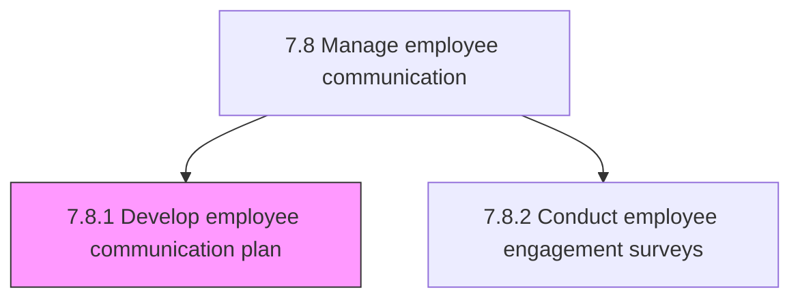
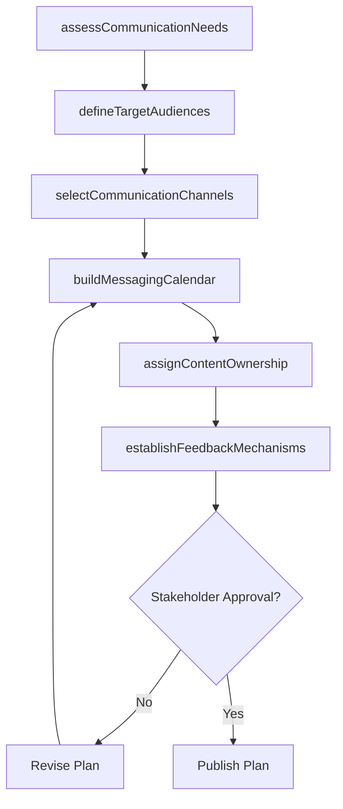

# Develop employee communication plan

> Business-as-Code definition for developing an employee communication plan. Models the complete process of designing a structured communication strategy that aligns messaging, channels, cadence, and stakeholder involvement to inform, engage, and empower employees during organizational change and steady-state operations.

## Overview

Creating a plan for managing communication among employees. Inform employees of direction. Counter resistance with change management approaches. Seek specific areas of input to the decision-making process. Seek varying degrees of involvement and co-creation. Define target audiences, select communication channels, establish messaging cadence, assign content ownership, and build feedback mechanisms to ensure two-way dialogue.

## Process Hierarchy



## GraphDL

```yaml
develop:
  object: Employee Communication Plan
  actor: InternalCommunicationsManager
  result: CommunicationPlan
```

## Actions

| Action | Description |
|--------|-------------|
| assessCommunicationNeeds | Identify organizational events, changes, and ongoing topics requiring employee communication |
| defineTargetAudiences | Segment the workforce by location, function, level, and information needs |
| selectCommunicationChannels | Choose the optimal mix of channels (intranet, email, town halls, chat, digital signage) per audience |
| buildMessagingCalendar | Schedule communication touchpoints, themes, and content owners across the planning horizon |
| assignContentOwnership | Designate responsible authors and approvers for each communication stream |
| establishFeedbackMechanisms | Create channels for employees to respond, ask questions, and provide input on communications |

## Events

| Event | Description |
|-------|-------------|
| communicationNeedsAssessed | Organizational communication requirements identified and prioritized |
| targetAudiencesDefined | Workforce segments mapped to their specific information needs |
| communicationChannelsSelected | Channel mix approved for each audience segment |
| messagingCalendarPublished | Communication schedule and themes finalized and shared with content owners |
| contentOwnershipAssigned | Authors and approvers designated for each planned communication |
| feedbackMechanismsEstablished | Employee response and input channels activated |

## Searches

| Search | Description |
|--------|-------------|
| findCommunicationPlans | List communication plans filtered by status, audience, or time period |
| getMessagingCalendar | Retrieve the scheduled communication calendar for a given period and audience |
| getChannelEffectiveness | Query engagement metrics (open rates, views, responses) by communication channel |
| getContentOwnerAssignments | List content ownership assignments by author, topic, or communication stream |

## Process Flow



## RACI Matrix

| Activity | Responsible | Accountable | Consulted | Informed |
|----------|-------------|-------------|-----------|----------|
| assessCommunicationNeeds | InternalCommunicationsManager | CHRO | HRBusinessPartners | ExecutiveLeadership |
| defineTargetAudiences | InternalCommunicationsManager | CHRO | HRAnalyst | DepartmentManagers |
| selectCommunicationChannels | InternalCommunicationsManager | CHRO | ITCollaborationTeam | EmployeeEngagementManager |
| buildMessagingCalendar | HRCommunicationsSpecialist | InternalCommunicationsManager | ContentOwners | VP HR |
| establishFeedbackMechanisms | InternalCommunicationsManager | CHRO | EmployeeEngagementManager | AllEmployees |

## Related Processes

| Process | Relationship |
|---------|-------------|
| 7.8.2 Conduct employee engagement surveys | Sibling - survey results inform communication priorities |
| 7.9 Deliver employee communications | Downstream - the plan is executed through communication delivery |
| 7.7.7 Manage/collect employee suggestions and perform employee research | Related - research insights shape communication themes |
| 7.8 Manage employee communication | Parent - governing process group |

## Related Departments

| Department | Role |
|-----------|------|
| Internal Communications | Owns the communication strategy and plan development |
| Human Resources | Provides workforce context and change management guidance |
| Executive Leadership | Sponsors key messages and approves strategic communications |
| IT / Digital Workplace | Manages communication platform capabilities and tooling |

## Related Occupations

| Occupation | Involvement |
|-----------|-------------|
| Internal Communications Manager | Leads plan development and stakeholder alignment |
| HR Communications Specialist | Creates content calendar and drafts messaging templates |
| Change Management Consultant | Advises on communication approaches for organizational change |

## KPIs

| KPI | Description | Unit |
|-----|-------------|------|
| Plan Coverage Rate | Percentage of major organizational events with a documented communication plan | % |
| Calendar Adherence | Percentage of planned communications published on schedule | % |
| Audience Reach | Percentage of targeted employees who received the communication | % |
| Feedback Response Rate | Percentage of communications that generate measurable employee feedback | % |

## Usage

```typescript
import { developEmployeeCommunicationPlan } from '@headlessly/develop-employee-communication-plan'

const commPlan = developEmployeeCommunicationPlan()

// Build a messaging calendar for the upcoming benefits open enrollment
const calendar = await commPlan.buildMessagingCalendar({
  topic: 'benefits-open-enrollment',
  startDate: '2026-10-01',
  endDate: '2026-11-15',
  audiences: ['all-employees', 'new-hires', 'managers'],
  channels: ['email', 'intranet', 'town-hall']
})

// Query channel effectiveness from the last communication campaign
const effectiveness = await commPlan.getChannelEffectiveness({
  campaignId: 'REORG-2026-Q1',
  metrics: ['open-rate', 'click-rate', 'feedback-count'],
  groupBy: 'channel'
})
```
