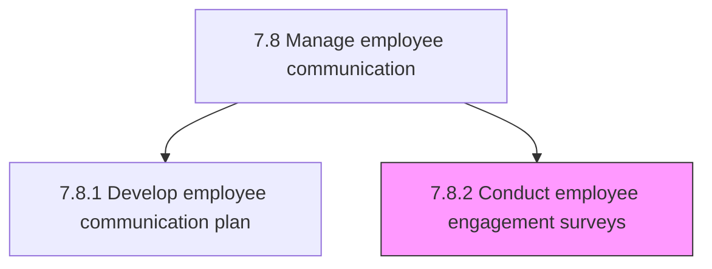
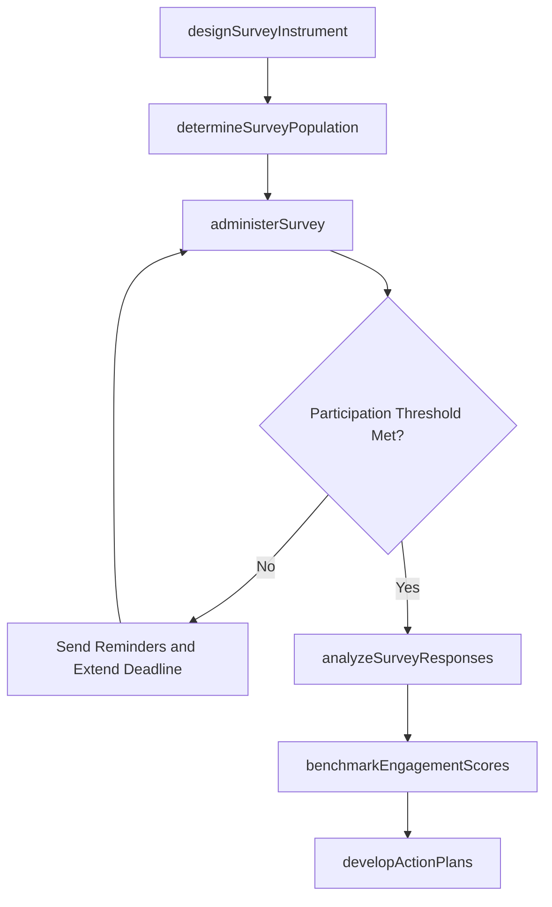

# Conduct employee engagement surveys

> Business-as-Code definition for conducting employee engagement surveys. Models the complete lifecycle of designing survey instruments, administering them to the workforce, analyzing response data, and translating findings into actionable improvement plans.

## Overview

Questioning employees to ascertain overall workplace satisfaction. Design validated survey instruments, administer annual, quarterly, or pulse surveys to the workforce, ensure anonymity and participation, analyze results by demographics and organizational segments, benchmark against industry norms, and drive action planning with leadership to improve engagement, retention, and culture.

## Process Hierarchy



## GraphDL

```yaml
conduct:
  object: Employee Engagement Surveys
  actor: EmployeeEngagementManager
  result: EngagementSurveyReport
```

## Actions

| Action | Description |
|--------|-------------|
| designSurveyInstrument | Select validated question sets, define scales, and configure demographic cuts |
| determineSurveyPopulation | Identify the target employee population, sampling approach, and distribution list |
| administerSurvey | Launch the survey through the selected platform, send reminders, and monitor participation |
| analyzeSurveyResponses | Aggregate response data, calculate engagement indices, and segment results by demographics |
| benchmarkEngagementScores | Compare internal scores against industry and historical benchmarks |
| developActionPlans | Translate survey findings into departmental improvement plans with owners and timelines |

## Events

| Event | Description |
|-------|-------------|
| surveyInstrumentDesigned | Survey questions, scales, and demographic cuts finalized and approved |
| surveyPopulationDetermined | Target audience identified and distribution list generated |
| surveyAdministered | Survey launched and open for employee responses |
| surveyResponsesAnalyzed | Response data aggregated and engagement indices calculated |
| engagementScoresBenchmarked | Internal scores compared against industry and historical norms |
| actionPlansPublished | Improvement plans with owners and deadlines shared with leadership and teams |

## Searches

| Search | Description |
|--------|-------------|
| findSurveys | List engagement surveys filtered by year, frequency type, or status |
| getSurveyResults | Retrieve engagement scores and response data for a specific survey campaign |
| getParticipationRates | Query response rates by department, location, or demographic segment |
| getBenchmarkHistory | Retrieve historical engagement scores for trend and benchmark analysis |

## Process Flow



## RACI Matrix

| Activity | Responsible | Accountable | Consulted | Informed |
|----------|-------------|-------------|-----------|----------|
| designSurveyInstrument | EmployeeEngagementManager | VP HR | ExternalSurveyVendor | HRAnalyst |
| administerSurvey | HRISAnalyst | EmployeeEngagementManager | InternalCommunications | AllEmployees |
| analyzeSurveyResponses | HRAnalyst | EmployeeEngagementManager | PeopleAnalyticsSpecialist | VP HR |
| benchmarkEngagementScores | HRAnalyst | EmployeeEngagementManager | ExternalSurveyVendor | CHRO |
| developActionPlans | HRBusinessPartner | DepartmentManager | EmployeeEngagementManager | AllEmployees |

## Related Processes

| Process | Relationship |
|---------|-------------|
| 7.8.1 Develop employee communication plan | Sibling - communication plan shapes survey messaging and follow-up |
| 7.9 Deliver employee communications | Downstream - survey results communicated through delivery channels |
| 7.7.7 Manage/collect employee suggestions and perform employee research | Related - survey findings complement suggestion and research data |
| 7.8 Manage employee communication | Parent - governing process group |

## Related Departments

| Department | Role |
|-----------|------|
| Human Resources | Designs surveys, analyzes results, and drives action planning |
| Internal Communications | Promotes survey participation and communicates findings |
| Executive Leadership | Sponsors the survey program and commits to follow-through |
| IT | Supports survey platform deployment and data security |

## Related Occupations

| Occupation | Involvement |
|-----------|-------------|
| Employee Engagement Manager | Leads survey strategy, design, and action plan coordination |
| HR Analyst | Performs statistical analysis and generates insights from response data |
| People Analytics Specialist | Conducts advanced modeling on engagement drivers and predictive indicators |

## KPIs

| KPI | Description | Unit |
|-----|-------------|------|
| Survey Participation Rate | Percentage of targeted employees who completed the survey | % |
| Overall Engagement Score | Composite engagement index calculated from survey responses | Score (1-100) |
| Action Plan Completion Rate | Percentage of post-survey improvement actions completed on time | % |
| Score Year-over-Year Change | Change in overall engagement score compared to prior year | Points |

## Usage

```typescript
import { conductEmployeeEngagementSurveys } from '@headlessly/conduct-employee-engagement-surveys'

const surveys = conductEmployeeEngagementSurveys()

// Administer the annual engagement survey to all full-time employees
const campaign = await surveys.administerSurvey({
  surveyId: 'ENG-2026-ANNUAL',
  population: 'full-time',
  launchDate: '2026-03-15',
  closeDate: '2026-04-05',
  anonymityLevel: 'fully-anonymous',
  reminderCadence: 'weekly'
})

// Benchmark engagement scores against industry data
const benchmark = await surveys.benchmarkEngagementScores({
  surveyId: 'ENG-2026-ANNUAL',
  benchmarkSource: 'gallup-q12',
  segmentBy: ['department', 'job-level'],
  includeHistorical: true
})
```
