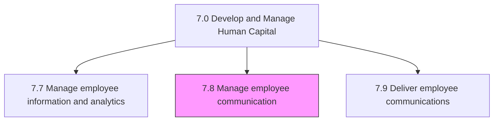
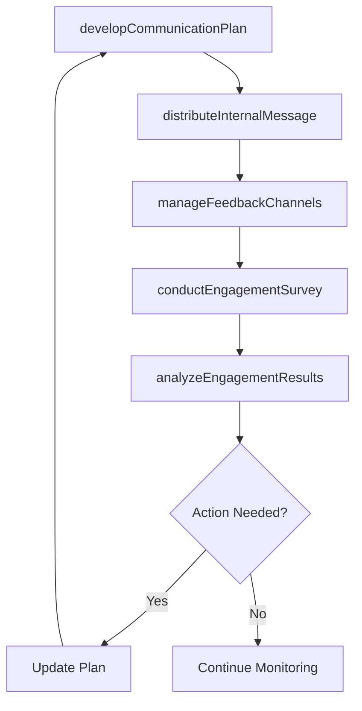

# Manage employee communication

> Business-as-Code definition for employee communication management. Models communication planning, internal messaging, and employee engagement survey programs.

## Overview

Creating an effective plan that initiates and promotes communication and engagement among the employees and between employees and management.

## Process Hierarchy



## GraphDL

```yaml
manage:
  object: Employee Communication
  actor: InternalCommunicationsManager
  result: EmployeeEngagementReport
```

## Actions

| Action | Description |
|--------|-------------|
| developCommunicationPlan | Create an internal communication strategy and calendar |
| distributeInternalMessage | Publish company-wide or targeted communications |
| conductEngagementSurvey | Design and execute employee engagement surveys |
| analyzeEngagementResults | Process survey data to identify trends and action items |
| manageFeedbackChannels | Maintain forums, town halls, and suggestion mechanisms |

## Events

| Event | Description |
|-------|-------------|
| communicationPlanDeveloped | Internal communication strategy and calendar approved |
| internalMessageDistributed | Company communication published to targeted audience |
| engagementSurveyConducted | Employee engagement survey completed and closed |
| engagementResultsAnalyzed | Survey data processed and insights reported |
| feedbackChannelsManaged | Employee feedback mechanisms reviewed and updated |

## Searches

| Search | Description |
|--------|-------------|
| getCommunicationCalendar | Retrieve planned communications by date, audience, or topic |
| getEngagementScores | Query engagement survey scores by department, question, or period |
| getMessageHistory | Retrieve internal communication history by channel or topic |
| getFeedbackSummary | Query aggregated employee feedback by theme or channel |

## Process Flow



## RACI Matrix

| Activity | Responsible | Accountable | Consulted | Informed |
|----------|-------------|-------------|-----------|----------|
| developCommunicationPlan | Internal Communications Manager | VP Human Resources | Executive Team | All Departments |
| distributeInternalMessage | Communications Specialist | Internal Communications Manager | Department Heads | Employees |
| conductEngagementSurvey | HR Analyst | VP Human Resources | External Consultants | All Employees |
| analyzeEngagementResults | People Analytics Analyst | VP Human Resources | Department Heads | Executive Team |

## Sub-Processes

| ID | Name | Description |
|----|------|-------------|
| 7.8.1 | Develop employee communication plan | Creating a plan for managing communication among employees. Inform employees of direction. Counter r |
| 7.8.2 | Conduct employee engagement surveys | Questioning employees to ascertain overall workplace satisfaction. |

## Related Processes

| Process | Relationship |
|---------|-------------|
| 7.4 Manage employee relations | Parallel - communication supports positive employee relations |
| 7.9 Deliver employee communications | Downstream - plan guides communication delivery |
| 7.7 Manage employee information and analytics | Supporting - analytics inform communication strategy |

## Related Departments

| Department | Role |
|-----------|------|
| Internal Communications | Designs and manages employee communication programs |
| Human Resources | Provides content on policies, benefits, and programs |
| Executive Leadership | Sponsors town halls and strategic communications |
| Marketing | Supports internal branding and messaging consistency |

## Related Occupations

| Occupation | Involvement |
|-----------|-------------|
| Internal Communications Manager | Leads communication strategy and planning |
| Employee Engagement Specialist | Designs and analyzes engagement surveys |
| HR Business Partner | Champions communication initiatives within business units |

## KPIs

| KPI | Description | Unit |
|-----|-------------|------|
| Employee Engagement Score | Aggregate score from engagement surveys | Score (1-100) |
| Survey Participation Rate | Percentage of employees completing engagement surveys | % |
| Communication Read Rate | Percentage of employees who open internal communications | % |
| Feedback Response Rate | Percentage of employee feedback receiving follow-up action | % |

## Usage

```typescript
import { manageEmployeeCommunication } from '@headlessly/manage-employee-communication'

const comms = manageEmployeeCommunication()

// Conduct an engagement survey
const survey = await comms.conductEngagementSurvey({
  name: 'Q1 2025 Pulse Check',
  audience: 'all-employees',
  questions: ['overall-satisfaction', 'manager-effectiveness', 'career-growth'],
  deadline: '2025-03-15'
})

// Analyze engagement results
const insights = await comms.analyzeEngagementResults({
  surveyId: survey.id,
  dimensions: ['department', 'tenure', 'location'],
  benchmarkAgainst: 'prior-quarter'
})
```
