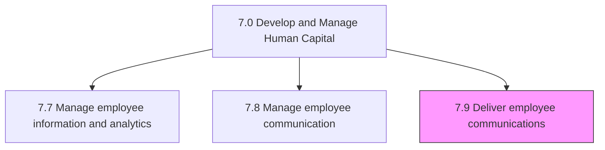
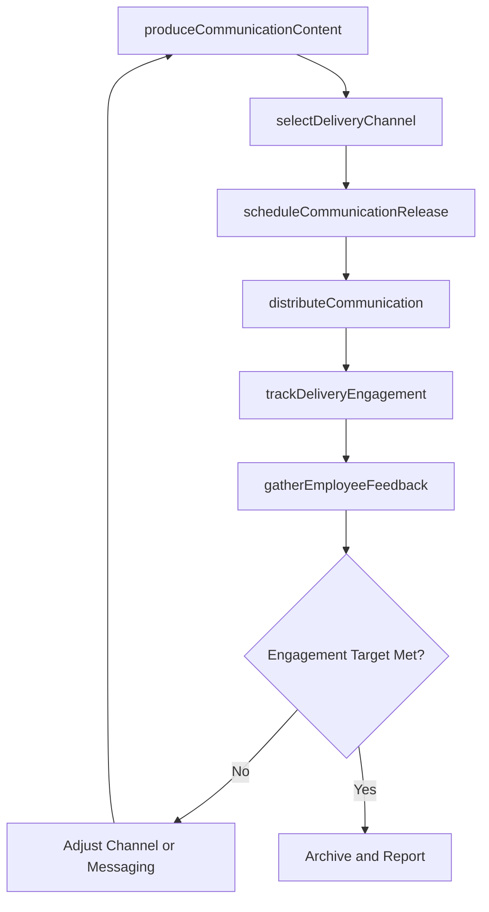

# Deliver employee communications

> Business-as-Code definition for delivering employee communications. Models the complete process of executing the communication plan by producing content, selecting delivery channels, distributing messages, measuring engagement, and continuously refining delivery effectiveness.

## Overview

Implementing the communication plan for employees. Initiate dialogues and engagement by monitoring the exchange of ideas and opinions, the development of personal relationships, etc. Produce and localize content, distribute through the appropriate channel mix (email, intranet, digital signage, town halls, chat platforms), track delivery and engagement metrics, gather employee feedback, and iterate on messaging approach to maximize reach and impact.

## Process Hierarchy



## GraphDL

```yaml
deliver:
  object: Employee Communications
  actor: InternalCommunicationsManager
  result: CommunicationDelivery
```

## Actions

| Action | Description |
|--------|-------------|
| produceCommunicationContent | Author, design, and localize messaging assets for the target audiences |
| selectDeliveryChannel | Choose the optimal channel (email, intranet, town hall, chat, signage) for each message |
| scheduleCommunicationRelease | Set publication dates and times aligned with the messaging calendar and audience availability |
| distributeCommunication | Publish or send the communication through the selected channels to the target audience |
| trackDeliveryEngagement | Monitor open rates, read times, click-throughs, and response metrics per communication |
| gatherEmployeeFeedback | Collect reactions, questions, and suggestions from employees on the delivered content |

## Events

| Event | Description |
|-------|-------------|
| communicationContentProduced | Messaging asset authored, reviewed, and approved for distribution |
| deliveryChannelSelected | Channel assignment confirmed for the communication based on audience and content type |
| communicationReleaseScheduled | Publication date and time locked in the messaging calendar |
| communicationDistributed | Message successfully published or sent to the target audience |
| deliveryEngagementTracked | Engagement metrics captured and available for analysis |
| employeeFeedbackGathered | Employee reactions and questions collected and logged |

## Searches

| Search | Description |
|--------|-------------|
| findCommunications | List delivered or scheduled communications filtered by channel, audience, or date range |
| getCommunicationDetails | Retrieve content, channel, audience, and delivery status for a specific communication |
| getEngagementMetrics | Query open rates, click-throughs, and response metrics for a communication or campaign |
| getFeedbackSummary | Retrieve aggregated employee feedback and sentiment for a communication or topic |

## Process Flow



## RACI Matrix

| Activity | Responsible | Accountable | Consulted | Informed |
|----------|-------------|-------------|-----------|----------|
| produceCommunicationContent | HRCommunicationsSpecialist | InternalCommunicationsManager | ContentOwners | VP HR |
| selectDeliveryChannel | InternalCommunicationsManager | CHRO | ITCollaborationTeam | DepartmentManagers |
| distributeCommunication | HRCommunicationsSpecialist | InternalCommunicationsManager | HRISAnalyst | AllEmployees |
| trackDeliveryEngagement | HRAnalyst | InternalCommunicationsManager | PeopleAnalyticsSpecialist | VP HR |
| gatherEmployeeFeedback | HRCommunicationsSpecialist | InternalCommunicationsManager | EmployeeEngagementManager | Leadership |

## Related Processes

| Process | Relationship |
|---------|-------------|
| 7.8.1 Develop employee communication plan | Upstream - the communication plan defines what to deliver |
| 7.8.2 Conduct employee engagement surveys | Related - survey results inform communication content priorities |
| 7.8 Manage employee communication | Sibling - strategic management of the communication function |
| 7.0 Develop and Manage Human Capital | Parent - governing category |

## Related Departments

| Department | Role |
|-----------|------|
| Internal Communications | Produces and distributes employee communications |
| Human Resources | Provides content on policy, benefits, and organizational changes |
| IT / Digital Workplace | Maintains communication platforms (intranet, email, chat, signage) |
| Executive Leadership | Sponsors and delivers key organizational messages |

## Related Occupations

| Occupation | Involvement |
|-----------|-------------|
| Internal Communications Manager | Oversees delivery strategy and channel optimization |
| HR Communications Specialist | Authors content and manages distribution execution |
| Digital Workplace Specialist | Maintains platform capabilities for communication delivery |

## KPIs

| KPI | Description | Unit |
|-----|-------------|------|
| Delivery Success Rate | Percentage of communications successfully reaching the target audience | % |
| Open / Read Rate | Percentage of recipients who opened or viewed the communication | % |
| Employee Feedback Rate | Percentage of communications generating measurable employee feedback | % |
| Channel Effectiveness Score | Composite score rating each channel on reach, engagement, and sentiment | Score (1-5) |

## Usage

```typescript
import { deliverEmployeeCommunications } from '@headlessly/deliver-employee-communications'

const comms = deliverEmployeeCommunications()

// Distribute a benefits open enrollment reminder via multiple channels
const delivery = await comms.distributeCommunication({
  communicationId: 'COMM-OE-REMINDER-3',
  channels: ['email', 'intranet-banner', 'slack-announcement'],
  audience: 'all-benefits-eligible',
  scheduledDate: '2026-10-25',
  priority: 'high'
})

// Retrieve engagement metrics for the Q1 town hall campaign
const engagement = await comms.getEngagementMetrics({
  campaignId: 'TOWNHALL-2026-Q1',
  metrics: ['attendance-rate', 'question-count', 'post-event-survey-score'],
  segmentBy: 'location'
})
```
