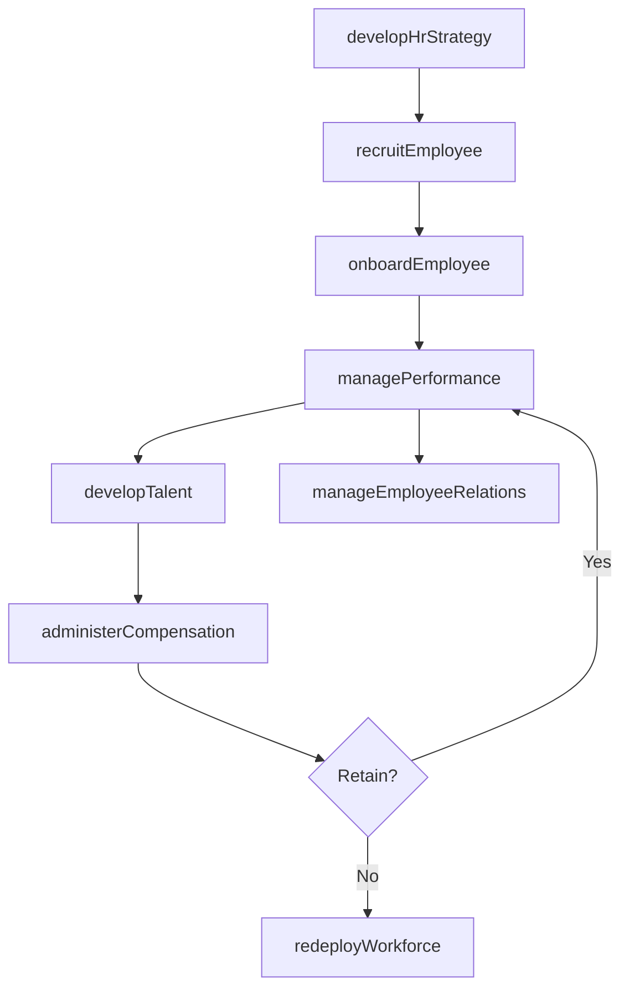

# Develop and Manage Human Capital

> Business-as-Code definition for human capital management across the full employee lifecycle. Models workforce planning, recruitment, onboarding, development, performance management, compensation, and employee relations.

## Overview

Delivering processes traditionally defined as "human resources". Process groups include those related to developing and maintaining workforce strategy, recruiting employees, developing and counseling employees, managing employee relations, rewarding and retaining employees, redeploying and retiring employees, managing employee information, and managing employee communications.

## Process Hierarchy

```mermaid
graph TD
    A[Develop and Manage Human Capital]
    A --> B[Develop and manage human resources (HR) planning, policies, and strategies]
    A --> C[Recruit, source, and select employees]
    A --> D[Manage employee on-boarding, development, and training]
    A --> E[Manage employee relations]
    A --> F[Reward and retain employees]
    A --> G[Redeploy and retire employees]
    A --> H[Manage employee information and analytics]
    A --> I[Manage employee communication]
    A --> J[Deliver employee communications]
```

## GraphDL

```yaml
develop:
  object: And Manage Human Capital
  actor: ChiefHumanResourcesOfficer
  result: WorkforceCapabilityOutcome
```

## Actions

| Action | Description |
|--------|-------------|
| developHrStrategy | Define human resources strategy aligned with business objectives |
| recruitEmployee | Source, screen, and select candidates to fill open positions |
| onboardEmployee | Execute orientation and integration for new hires |
| managePerformance | Set objectives, conduct reviews, and evaluate employee performance |
| developTalent | Deliver training, development, and career path programs |
| administerCompensation | Manage salary, benefits, and rewards programs |
| manageEmployeeRelations | Handle labor relations, grievances, and collective bargaining |
| redeployWorkforce | Manage promotions, transfers, separations, and retirements |

## Events

| Event | Description |
|-------|-------------|
| hrStrategyDeveloped | Human resources strategy approved and communicated |
| employeeRecruited | Candidate selected and offer accepted |
| employeeOnboarded | New hire completed orientation and deployment |
| performanceManaged | Employee performance review cycle completed |
| talentDeveloped | Employee completed training or development program |
| compensationAdministered | Salary and benefits package processed |
| employeeRelationsManaged | Labor relations matter resolved or agreement reached |
| workforceRedeployed | Employee promotion, transfer, or separation processed |

## Searches

| Search | Description |
|--------|-------------|
| findEmployees | Query employees by department, role, location, or skill set |
| getHeadcount | Retrieve headcount data by business unit, period, or category |
| getOpenRequisitions | List open job requisitions filtered by department or role level |
| getTurnoverMetrics | Retrieve employee turnover rates by segment and time period |
| getTrainingRecords | Query employee training completion and certification status |
| getCompensationBenchmarks | Retrieve salary and benefits benchmarking data by role |

## Process Flow



## RACI Matrix

| Activity | Responsible | Accountable | Consulted | Informed |
|----------|-------------|-------------|-----------|----------|
| developHrStrategy | VP Human Resources | CHRO | CFO, CEO | Department Heads |
| recruitEmployee | Talent Acquisition Manager | VP Human Resources | Hiring Managers | IT, Finance |
| onboardEmployee | HR Coordinator | Talent Acquisition Manager | Department Managers | IT, Facilities |
| managePerformance | HR Business Partner | VP Human Resources | Department Managers | Employees |
| administerCompensation | Compensation Manager | VP Human Resources | Finance, Legal | Employees |

## Sub-Processes

| ID | Name | Description |
|----|------|-------------|
| 7.1 | Develop and manage human resources (HR) planning, policies, and strategies | Creating strategies for the HR function. Create and implement strategies for managing the work force |
| 7.2 | Recruit, source, and select employees | Determining and handling employee requirements. Recruit or source the candidates as per the requirem |
| 7.3 | Manage employee on-boarding, development, and training | Assisting employees in developing their capabilities, and providing them counseling services. Handle |
| 7.4 | Manage employee relations | Assisting general management in developing, maintaining, and improving employee relationships. This  |
| 7.5 | Reward and retain employees | Creating frameworks for rewarding and recognizing employees with the objective of retaining them. Cr |
| 7.6 | Redeploy and retire employees | Managing the reassignment and retirement of employees. Manage the process of employee promotion and  |
| 7.7 | Manage employee information and analytics | Managing the employee reporting processes, employee inquiry process, employee information and data,  |
| 7.8 | Manage employee communication | Creating an effective plan that initiates and promotes communication and engagement among the employ |
| 7.9 | Deliver employee communications | Implementing the communication plan for employees. Initiate dialogues and engagement by monitoring t |

## Related Processes

| Process | Relationship |
|---------|-------------|
| 1.0 Develop Vision and Strategy | Upstream - workforce strategy derives from corporate strategy |
| 9.0 Manage Financial Resources | Parallel - payroll, benefits, and HR budgeting |
| 11.0 Manage External Relationships | Supporting - labor relations and regulatory compliance |
| 8.0 Manage Information Technology | Enabling - provides HRIS and workforce management systems |

## Related Departments

| Department | Role |
|-----------|------|
| Human Resources | Primary owner of all HR processes and employee lifecycle management |
| Finance | Manages payroll processing, benefits accounting, and HR budgets |
| Legal | Ensures labor law compliance and supports employment contracts |
| Information Technology | Maintains HRIS, payroll systems, and self-service portals |
| All Business Units | Partners with HR on hiring, performance, and workforce planning |

## Related Occupations

| Occupation | Involvement |
|-----------|-------------|
| Human Resources Manager | Oversees HR operations and strategic workforce initiatives |
| Talent Acquisition Specialist | Manages recruitment pipeline and candidate selection |
| Compensation and Benefits Analyst | Designs and administers pay structures and benefits programs |
| Learning and Development Specialist | Develops and delivers employee training programs |

## KPIs

| KPI | Description | Unit |
|-----|-------------|------|
| Employee Turnover Rate | Percentage of employees leaving the organization annually | % |
| Time to Fill | Average days from job requisition opening to offer acceptance | Days |
| Employee Engagement Score | Aggregate score from annual employee engagement surveys | Score (1-100) |
| Training Hours Per Employee | Average hours of training delivered per employee per year | Hours |
| Cost Per Hire | Total recruitment costs divided by number of hires | USD |

## Usage

```typescript
import { developAndManageHumanCapital } from '@headlessly/develop-and-manage-human-capital'

const hr = developAndManageHumanCapital()

// Recruit a new employee
const requisition = await hr.recruitEmployee({
  department: 'Engineering',
  role: 'Senior Software Engineer',
  location: 'Remote',
  budgetGrade: 'L5'
})

// Get turnover metrics
const turnover = await hr.getTurnoverMetrics({
  businessUnit: 'Product',
  period: '2025-Q4',
  includeVoluntary: true
})
```
