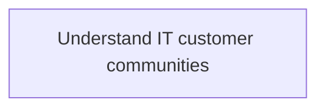
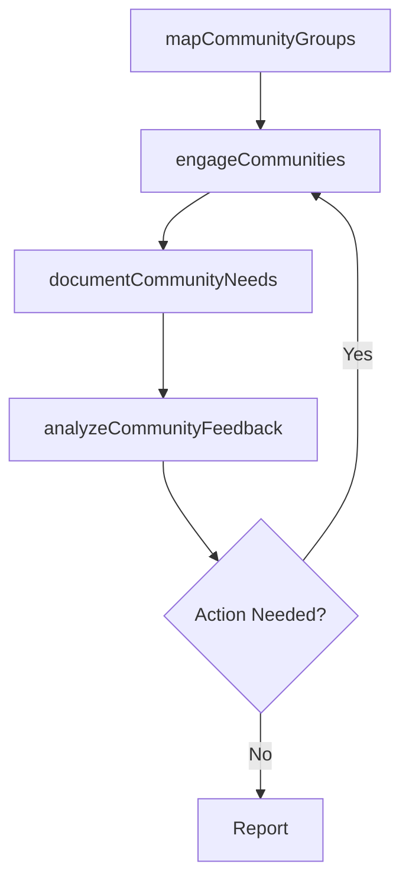

# Understand IT customer communities

> Business-as-Code definition for understanding IT customer communities. Models the process of mapping stakeholder groups, engaging with user communities, and documenting shared IT needs through collaborative interactions.

## Overview

Interacting with IT customers to understand the IT needs through a collaborative community through involvement, connection, and informed communication.

## Process Hierarchy



## GraphDL

```yaml
understand:
  object: IT Customer Communities
  actor: ITBusinessAnalyst
  result: CustomerCommunityProfile
```

## Actions

| Action | Description |
|--------|-------------|
| mapCommunityGroups | Identify and categorize IT customer community groups |
| engageCommunities | Conduct engagement sessions with IT user communities |
| documentCommunityNeeds | Record shared IT needs and priorities from community input |
| analyzeCommunityFeedback | Synthesize community feedback into actionable insights |

## Events

| Event | Description |
|-------|-------------|
| communityGroupsMapped | IT customer community groups identified and categorized |
| communitiesEngaged | Community engagement sessions completed |
| communityNeedsDocumented | IT customer community needs recorded |
| communityFeedbackAnalyzed | Community feedback synthesized into insights |

## Searches

| Search | Description |
|--------|-------------|
| findCommunityGroups | List IT customer community groups by function or department |
| getCommunityProfile | Retrieve profile and needs for a specific community |
| getCommunityFeedback | Get feedback collected from community engagement sessions |

## Process Flow



## RACI Matrix

| Activity | Responsible | Accountable | Consulted | Informed |
|----------|-------------|-------------|-----------|----------|
| mapCommunityGroups | ITBusinessAnalyst | ITRelationshipManager | BusinessUnitLeaders | CIO |
| engageCommunities | ITBusinessAnalyst | ITRelationshipManager | EndUsers | ITServiceManager |
| analyzeCommunityFeedback | ITBusinessAnalyst | ITRelationshipManager | ITServiceManager | CIO |

## Related Processes

| Process | Relationship |
|---------|-------------|
| 8.1.1.2 Assess IT customer operational capabilities | Parallel - community needs inform capability assessment |
| 8.1.2 Identify IT customer transformation needs | Downstream - community insights feed transformation analysis |

## Related Departments

| Department | Role |
|-----------|------|
| IT Service Management | Coordinates community engagement activities |
| Business Units | Primary members of IT customer communities |
| Corporate Communications | Supports community outreach |

## Related Occupations

| Occupation | Involvement |
|-----------|-------------|
| IT Business Analyst | Facilitates community engagement and analysis |
| IT Relationship Manager | Accountable for community understanding |

## KPIs

| KPI | Description | Unit |
|-----|-------------|------|
| Community Engagement Rate | Percentage of IT communities engaged per cycle | % |
| Community Needs Coverage | Percentage of documented needs addressed | % |

## Usage

```typescript
import { understandITCustomerCommunities } from '@headlessly/understand-it-customer-communities'

const communities = understandITCustomerCommunities()

// Map IT customer community groups
const groups = await communities.mapCommunityGroups({
  scope: 'enterprise',
  segmentation: 'by-department'
})

// Engage a specific community
const feedback = await communities.engageCommunities({
  community: 'finance-power-users',
  method: 'focus-group',
  topics: ['reporting-tools', 'data-access']
})
```
