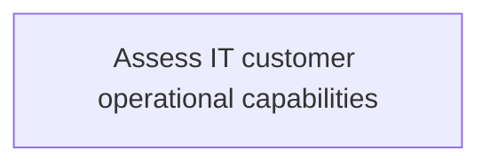
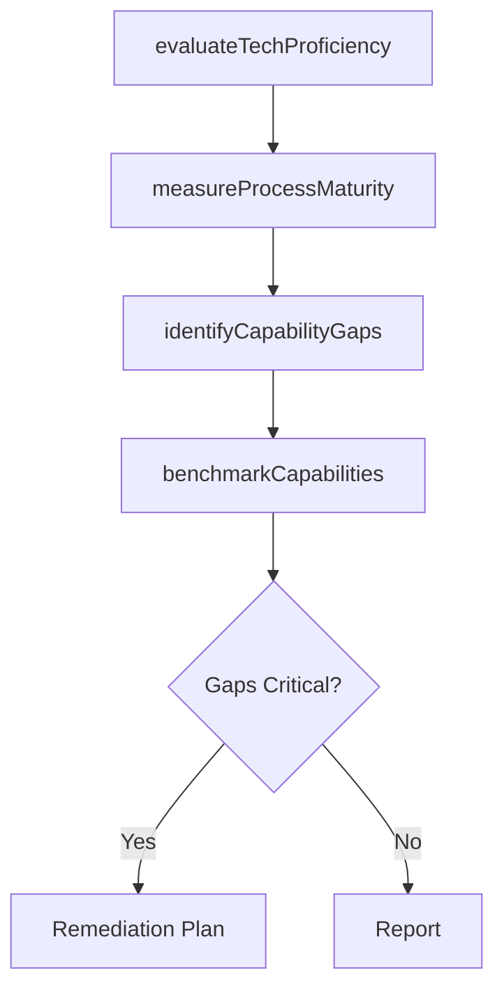

# Assess IT customer operational capabilities

> Business-as-Code definition for assessing IT customer operational capabilities. Models the process of evaluating technology proficiency, measuring process maturity, and identifying capability gaps within business units.

## Overview

Evaluate the ability of the group of staff dependent on information technology, to align resources and critical processes according to organizational vision being able to deliver effectively and efficiently.

## Process Hierarchy



## GraphDL

```yaml
assess:
  object: IT Customer Operational Capabilities
  actor: ITCapabilityAnalyst
  result: OperationalCapabilityAssessment
```

## Actions

| Action | Description |
|--------|-------------|
| evaluateTechProficiency | Assess technology proficiency levels across customer groups |
| measureProcessMaturity | Evaluate IT process maturity within business units |
| identifyCapabilityGaps | Identify gaps between current capabilities and requirements |
| benchmarkCapabilities | Compare capabilities against industry standards or peer organizations |

## Events

| Event | Description |
|-------|-------------|
| techProficiencyEvaluated | Technology proficiency assessment completed |
| processMaturityMeasured | IT process maturity scores calculated |
| capabilityGapsIdentified | Capability gaps documented and prioritized |
| capabilitiesBenchmarked | Capability benchmarking analysis completed |

## Searches

| Search | Description |
|--------|-------------|
| getCapabilityScores | Retrieve operational capability scores by business unit |
| findCapabilityGaps | List capability gaps by severity or domain |
| getBenchmarkResults | Get capability benchmark comparison results |

## Process Flow



## RACI Matrix

| Activity | Responsible | Accountable | Consulted | Informed |
|----------|-------------|-------------|-----------|----------|
| evaluateTechProficiency | ITCapabilityAnalyst | ITRelationshipManager | BusinessUnitLeaders | CIO |
| measureProcessMaturity | ITCapabilityAnalyst | ITRelationshipManager | ITOperations | ITServiceManager |
| identifyCapabilityGaps | ITCapabilityAnalyst | ITRelationshipManager | EnterpriseArchitect | CIO |

## Related Processes

| Process | Relationship |
|---------|-------------|
| 8.1.1.1 Understand IT customer communities | Parallel - community needs inform capability assessment |
| 8.1.2 Identify IT customer transformation needs | Downstream - capability gaps feed transformation planning |

## Related Departments

| Department | Role |
|-----------|------|
| IT Service Management | Coordinates capability assessments |
| Business Units | Subjects of capability evaluation |
| Enterprise Architecture | Provides maturity framework |

## Related Occupations

| Occupation | Involvement |
|-----------|-------------|
| IT Capability Analyst | Executes operational capability assessments |
| IT Business Analyst | Supports data collection and analysis |

## KPIs

| KPI | Description | Unit |
|-----|-------------|------|
| Capability Maturity Score | Average IT operational maturity across business units | Level (1-5) |
| Gap Coverage Rate | Percentage of identified gaps with remediation plans | % |

## Usage

```typescript
import { assessITCustomerOperationalCapabilities } from '@headlessly/assess-it-customer-operational-capabilities'

const capabilities = assessITCustomerOperationalCapabilities()

// Evaluate technology proficiency
const proficiency = await capabilities.evaluateTechProficiency({
  businessUnit: 'operations',
  dimensions: ['infrastructure', 'applications', 'data-literacy']
})

// Identify capability gaps
const gaps = await capabilities.identifyCapabilityGaps({
  businessUnit: 'operations',
  targetMaturity: 4
})
```
