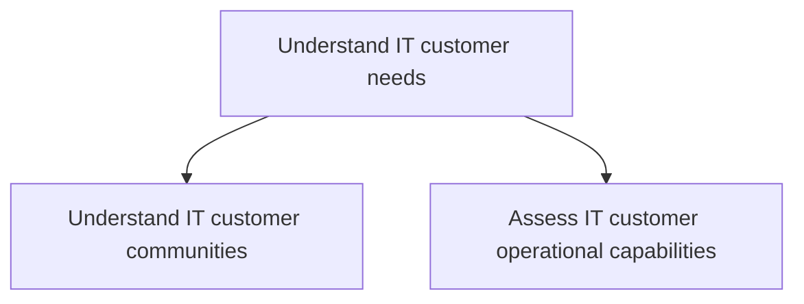
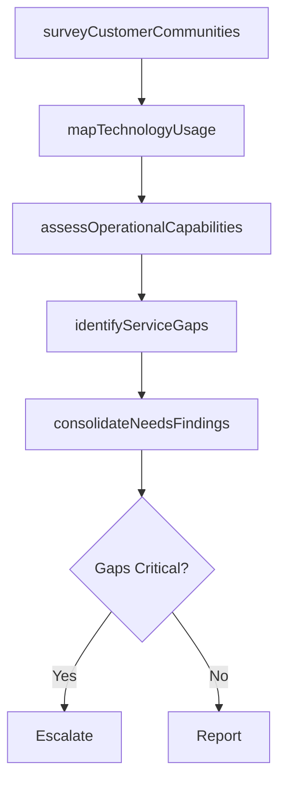

# Understand IT customer needs

> Business-as-Code definition for understanding IT customer needs. Models the process of surveying customer communities and assessing their operational IT capabilities to inform service planning.

## Overview

Assessing the customer communities along with current IT operational capabilities and usage.

## Process Hierarchy



## GraphDL

```yaml
understand:
  object: IT Customer Needs
  actor: ITBusinessAnalyst
  result: CustomerNeedsAssessment
```

## Actions

| Action | Description |
|--------|-------------|
| surveyCustomerCommunities | Engage IT customer groups to gather requirements and pain points |
| assessOperationalCapabilities | Evaluate current IT operational maturity across business units |
| mapTechnologyUsage | Document current technology usage patterns and adoption levels |
| identifyServiceGaps | Compare existing IT capabilities against customer expectations |
| consolidateNeedsFindings | Aggregate findings into a prioritized customer needs assessment |

## Events

| Event | Description |
|-------|-------------|
| customerCommunitiesSurveyed | Customer community engagement sessions completed |
| operationalCapabilitiesAssessed | IT operational capability assessment finalized |
| technologyUsageMapped | Technology usage inventory documented |
| serviceGapsIdentified | Gaps between IT capabilities and customer needs cataloged |
| needsFindingsConsolidated | Customer needs assessment report produced |

## Searches

| Search | Description |
|--------|-------------|
| findCustomerCommunities | List IT customer communities by business unit or function |
| getCapabilityAssessment | Retrieve operational capability scores for a business unit |
| getServiceGaps | List identified service gaps by priority or category |

## Process Flow



## RACI Matrix

| Activity | Responsible | Accountable | Consulted | Informed |
|----------|-------------|-------------|-----------|----------|
| surveyCustomerCommunities | ITBusinessAnalyst | ITRelationshipManager | BusinessUnitLeaders | CIO |
| assessOperationalCapabilities | ITBusinessAnalyst | ITRelationshipManager | ITOperations | ServiceDeliveryManager |
| identifyServiceGaps | ITBusinessAnalyst | ITRelationshipManager | EnterpriseArchitect | ITServiceManager |

## Sub-Processes

| ID | Name | Description |
|----|------|-------------|
| 8.1.1.1 | Understand IT customer communities | Interacting with IT customers to understand the IT needs through a collaborative community through i |
| 8.1.1.2 | Assess IT customer operational capabilities | Evaluate the ability of the group of staff dependent on information technology, to align resources a |

## Related Processes

| Process | Relationship |
|---------|-------------|
| 8.1.2 Identify IT customer transformation needs | Downstream - needs inform transformation planning |
| 8.1.5 Develop and manage IT service levels | Downstream - needs drive SLA definitions |

## Related Departments

| Department | Role |
|-----------|------|
| IT Service Management | Coordinates needs assessment activities |
| Business Units | Primary source of IT requirements and feedback |
| Enterprise Architecture | Advises on technology capability mapping |

## Related Occupations

| Occupation | Involvement |
|-----------|-------------|
| IT Business Analyst | Primary executor of needs assessment |
| IT Relationship Manager | Accountable for customer engagement |
| Business Unit Manager | Provides domain context and priorities |

## KPIs

| KPI | Description | Unit |
|-----|-------------|------|
| Needs Assessment Coverage | Percentage of business units assessed in current cycle | % |
| Customer Engagement Frequency | Number of formal engagement sessions per quarter | Count/Quarter |
| Gap Identification Rate | Number of service gaps identified per assessment | Count |

## Usage

```typescript
import { understandITCustomerNeeds } from '@headlessly/understand-it-customer-needs'

const needs = understandITCustomerNeeds()

// Survey customer communities
const communities = await needs.surveyCustomerCommunities({
  businessUnit: 'finance',
  method: 'structured-interviews'
})

// Identify service gaps
const gaps = await needs.identifyServiceGaps({
  businessUnit: 'finance',
  compareAgainst: 'industry-benchmarks'
})
```
