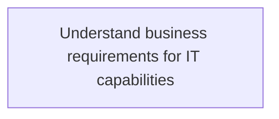
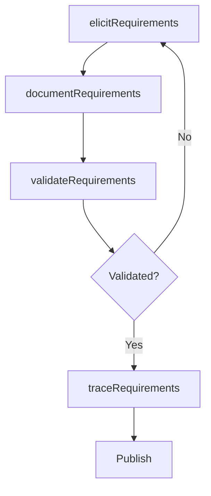

# Understand business requirements for IT capabilities

> Business-as-Code definition for understanding business requirements for IT capabilities. Models the process of eliciting, documenting, and validating business requirements that drive IT capability investments.

## Overview

Understanding business requirements for the existing IT environment as well as future IT needs. This process involves engaging with business stakeholders to elicit, document, and validate the capabilities they require from IT services, both to support current operations and to enable future strategic initiatives. Requirements are gathered through structured interviews, workshops, and analysis of business process documentation, then mapped to existing IT capabilities to identify gaps and investment priorities.

## Process Hierarchy



## GraphDL

```yaml
understand:
  object: Business Requirements For IT Capabilities
  actor: ITBusinessAnalyst
  result: BusinessRequirementsDocument
```

## Actions

| Action | Description |
|--------|-------------|
| elicitRequirements | Gather business requirements through interviews and workshops |
| documentRequirements | Record IT capability requirements in structured format |
| validateRequirements | Confirm requirements with business stakeholders |
| traceRequirements | Map requirements to existing and planned IT capabilities |

## Events

| Event | Description |
|-------|-------------|
| requirementsElicited | Business requirements for IT capabilities gathered |
| requirementsDocumented | IT capability requirements formally documented |
| requirementsValidated | Requirements confirmed with business stakeholders |
| requirementsTraced | Requirements mapped to IT capabilities |

## Searches

| Search | Description |
|--------|-------------|
| findRequirements | List business requirements by priority or business unit |
| getRequirementStatus | Retrieve fulfillment status for specific requirements |
| getTraceabilityMatrix | Get requirements-to-capabilities traceability matrix |

## Process Flow



## RACI Matrix

| Activity | Responsible | Accountable | Consulted | Informed |
|----------|-------------|-------------|-----------|----------|
| elicitRequirements | ITBusinessAnalyst | ITTransformationConsultant | BusinessUnitLeaders | CIO |
| documentRequirements | ITBusinessAnalyst | ITTransformationConsultant | EnterpriseArchitect | ITServiceManager |
| validateRequirements | ITBusinessAnalyst | ITTransformationConsultant | BusinessUnitLeaders | Finance |

## Related Processes

| Process | Relationship |
|---------|-------------|
| 8.1.2.2 Understand IT landscape | Parallel - IT landscape context shapes requirement feasibility |
| 8.1.4 Provide IT transformation guidance | Downstream - requirements drive transformation planning |

## Related Departments

| Department | Role |
|-----------|------|
| IT Business Analysis | Primary owner of requirements elicitation |
| Business Units | Source of business requirements |
| Enterprise Architecture | Validates technical feasibility |

## Related Occupations

| Occupation | Involvement |
|-----------|-------------|
| IT Business Analyst | Leads requirements gathering and documentation |
| Business Unit Manager | Provides domain requirements context |

## KPIs

| KPI | Description | Unit |
|-----|-------------|------|
| Requirements Completeness | Percentage of requirements fully documented and validated | % |
| Requirement Cycle Time | Average time from elicitation to validation | Days |

## Usage

```typescript
import { understandBusinessRequirementsForITCapabilities } from '@headlessly/understand-business-requirements-for-it-capabilities'

const requirements = understandBusinessRequirementsForITCapabilities()

// Elicit requirements from a business unit
const reqs = await requirements.elicitRequirements({
  businessUnit: 'human-resources',
  method: 'structured-workshop',
  scope: 'talent-management-system'
})

// Validate gathered requirements
const validation = await requirements.validateRequirements({
  requirementIds: reqs.map(r => r.id),
  stakeholders: ['hr-director', 'recruiting-manager']
})
```
