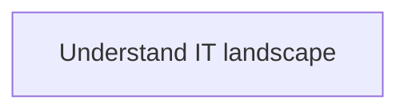
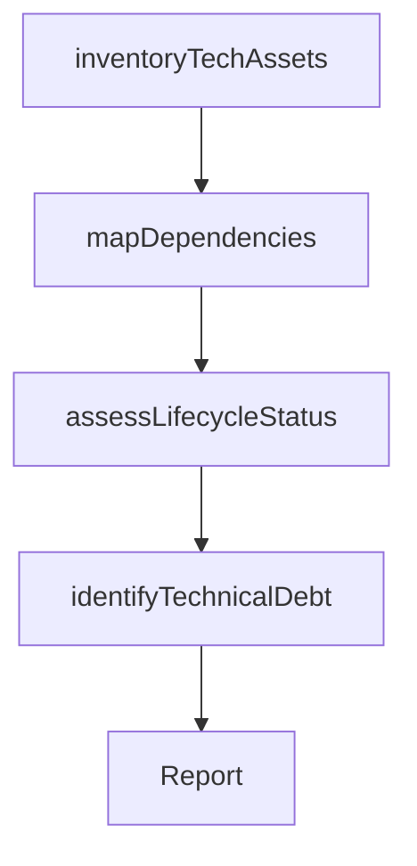

# Understand IT landscape

> Business-as-Code definition for understanding the IT landscape. Models the process of inventorying technology assets, mapping system dependencies, and assessing the health and lifecycle status of the technology estate.

## Overview

Understanding the complete logical structure and working of the organization's IT landscape. Assess the configuration of hardware and software (IT Assets) across the organization that supports overall business operations.

## Process Hierarchy



## GraphDL

```yaml
understand:
  object: IT Landscape
  actor: EnterpriseArchitect
  result: ITLandscapeAssessment
```

## Actions

| Action | Description |
|--------|-------------|
| inventoryTechAssets | Catalog all technology assets across the enterprise |
| mapDependencies | Document system integrations and dependencies |
| assessLifecycleStatus | Evaluate the lifecycle health of IT systems and platforms |
| identifyTechnicalDebt | Discover areas of accumulated technical debt |

## Events

| Event | Description |
|-------|-------------|
| techAssetsInventoried | Technology asset catalog updated |
| dependenciesMapped | System dependency map documented |
| lifecycleStatusAssessed | IT system lifecycle health evaluated |
| technicalDebtIdentified | Technical debt areas cataloged |

## Searches

| Search | Description |
|--------|-------------|
| getTechInventory | Retrieve technology asset inventory by category or owner |
| getDependencyMap | Get system dependency and integration map |
| getLifecycleReport | Retrieve lifecycle status report for IT systems |

## Process Flow



## RACI Matrix

| Activity | Responsible | Accountable | Consulted | Informed |
|----------|-------------|-------------|-----------|----------|
| inventoryTechAssets | ITAssetAnalyst | EnterpriseArchitect | ITOperations | CIO |
| mapDependencies | EnterpriseArchitect | CTO | DevelopmentTeams | ITOperations |
| assessLifecycleStatus | EnterpriseArchitect | CTO | ITOperations | ITPortfolioManager |

## Related Processes

| Process | Relationship |
|---------|-------------|
| 8.1.2.1 Understand business requirements for IT capabilities | Parallel - landscape context informs requirement feasibility |
| 8.2.3 Define and maintain enterprise architecture | Upstream - architecture standards inform landscape evaluation |

## Related Departments

| Department | Role |
|-----------|------|
| Enterprise Architecture | Primary owner of IT landscape assessment |
| IT Operations | Provides operational data on system health |
| IT Asset Management | Maintains technology asset records |

## Related Occupations

| Occupation | Involvement |
|-----------|-------------|
| Enterprise Architect | Leads landscape assessment and dependency mapping |
| IT Asset Analyst | Maintains technology inventory |

## KPIs

| KPI | Description | Unit |
|-----|-------------|------|
| Asset Inventory Accuracy | Percentage of IT assets accurately cataloged | % |
| Technical Debt Index | Composite measure of accumulated technical debt | Score (1-100) |

## Usage

```typescript
import { understandITLandscape } from '@headlessly/understand-it-landscape'

const landscape = understandITLandscape()

// Inventory technology assets
const assets = await landscape.inventoryTechAssets({
  scope: 'enterprise',
  categories: ['applications', 'infrastructure', 'middleware']
})

// Assess lifecycle status
const lifecycle = await landscape.assessLifecycleStatus({
  systems: assets.map(a => a.id),
  includeSupportDates: true
})
```
