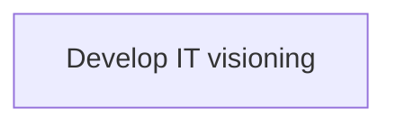
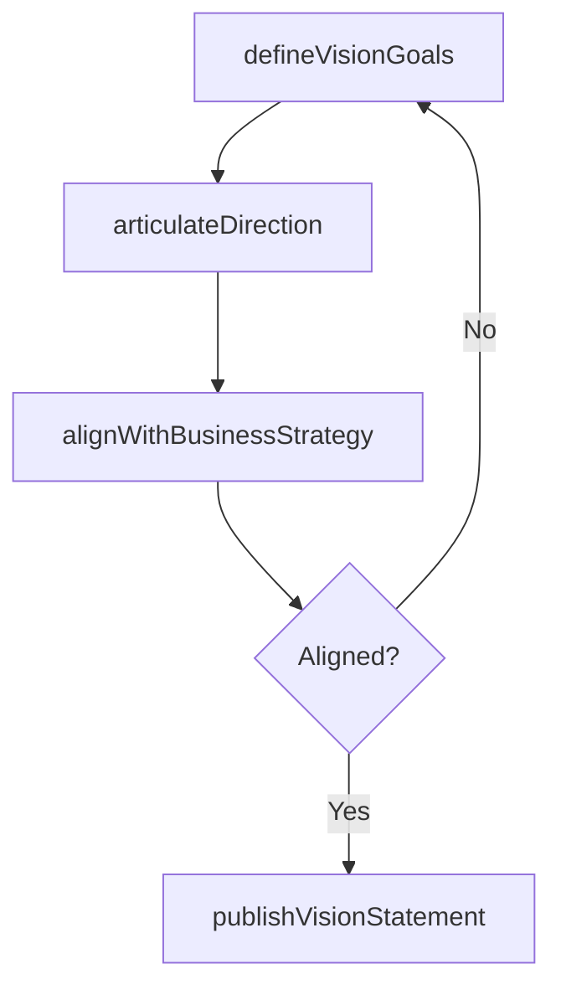

# Develop IT visioning

> Business-as-Code definition for IT visioning development. Models the process of defining IT vision goals, aligning technology direction with business strategy, and documenting the future-state IT architecture.

## Overview

Developing goals to define IT vision. Define and document ideas, direction, and activities which enable information technology to reach these goals.

## Process Hierarchy



## GraphDL

```yaml
develop:
  object: IT Visioning
  actor: ITStrategyDirector
  result: ITVisionStatement
```

## Actions

| Action | Description |
|--------|-------------|
| defineVisionGoals | Establish IT vision goals aligned to business strategy |
| articulateDirection | Document the strategic direction for IT capabilities |
| alignWithBusinessStrategy | Ensure IT vision supports enterprise strategic objectives |
| publishVisionStatement | Communicate the IT vision to all stakeholders |

## Events

| Event | Description |
|-------|-------------|
| visionGoalsDefined | IT vision goals established |
| directionArticulated | IT strategic direction documented |
| alignmentConfirmed | IT vision aligned with business strategy |
| visionStatementPublished | IT vision communicated to stakeholders |

## Searches

| Search | Description |
|--------|-------------|
| getITVision | Retrieve the current IT vision statement and goals |
| getVisionAlignment | Get alignment status between IT vision and business strategy |

## Process Flow



## RACI Matrix

| Activity | Responsible | Accountable | Consulted | Informed |
|----------|-------------|-------------|-----------|----------|
| defineVisionGoals | ITStrategyDirector | CIO | CEO | Board |
| alignWithBusinessStrategy | ITStrategyDirector | CIO | BusinessUnitLeaders | ExecutiveTeam |

## Related Processes

| Process | Relationship |
|---------|-------------|
| 8.1.2.1 Understand business requirements for IT capabilities | Upstream - business requirements inform vision |
| 8.1.2.4 Outline IT service expectations | Downstream - vision drives service expectations |

## Related Departments

| Department | Role |
|-----------|------|
| IT Strategy and Planning | Primary owner of IT visioning |
| Executive Leadership | Approves and champions IT vision |

## Related Occupations

| Occupation | Involvement |
|-----------|-------------|
| IT Strategy Director | Leads IT vision development |
| CIO | Sponsors and approves the IT vision |

## KPIs

| KPI | Description | Unit |
|-----|-------------|------|
| Vision Alignment Score | Degree of alignment between IT vision and business strategy | Score (1-10) |
| Stakeholder Awareness | Percentage of stakeholders aware of IT vision | % |

## Usage

```typescript
import { developITVisioning } from '@headlessly/develop-it-visioning'

const visioning = developITVisioning()

// Define vision goals
const goals = await visioning.defineVisionGoals({
  horizon: '5-year',
  themes: ['cloud-native', 'data-driven', 'ai-augmented']
})

// Publish vision statement
const statement = await visioning.publishVisionStatement({
  audience: 'all-employees',
  format: 'executive-brief'
})
```
